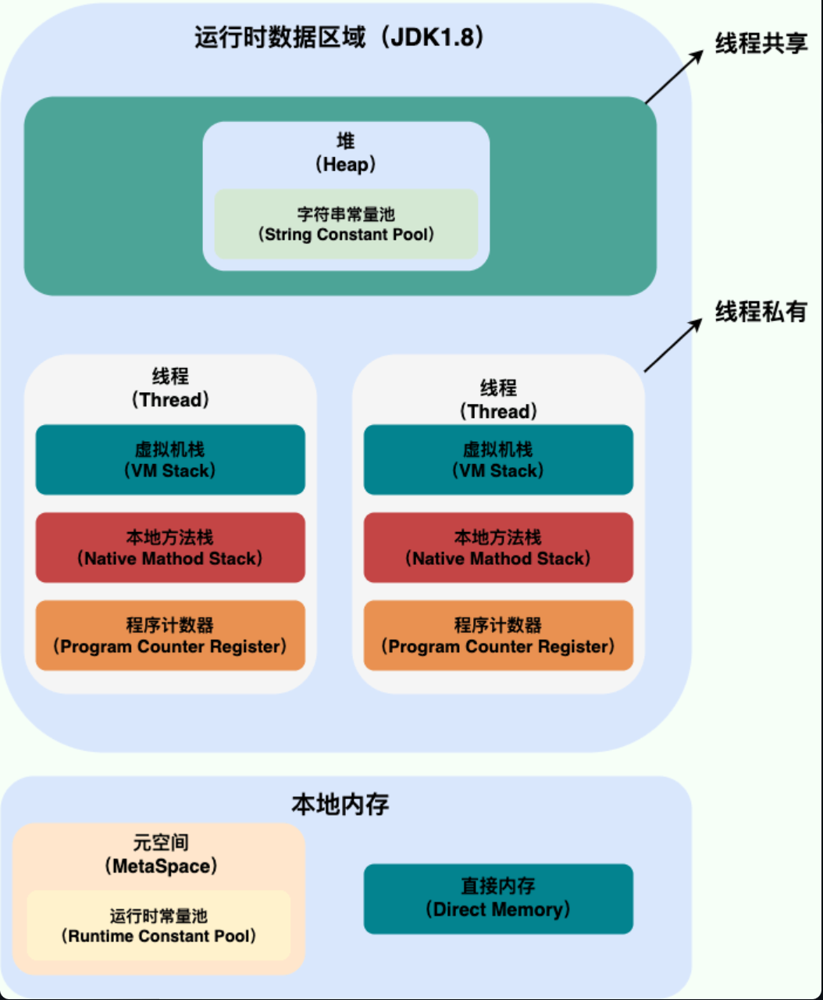
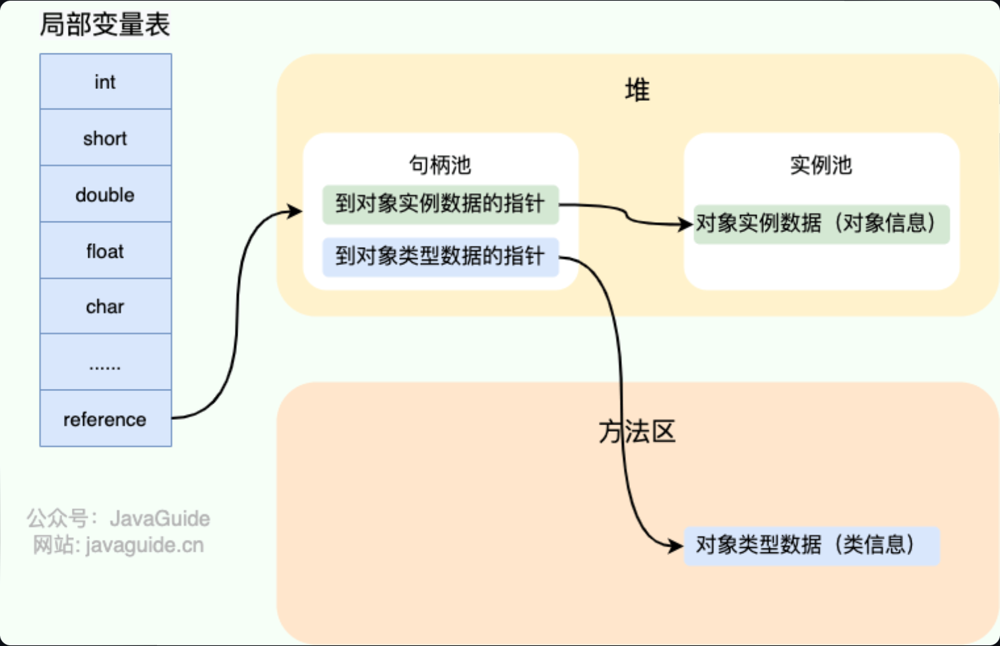
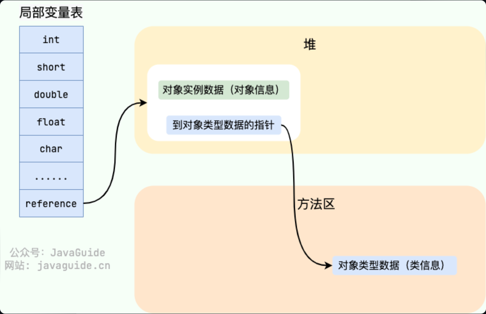
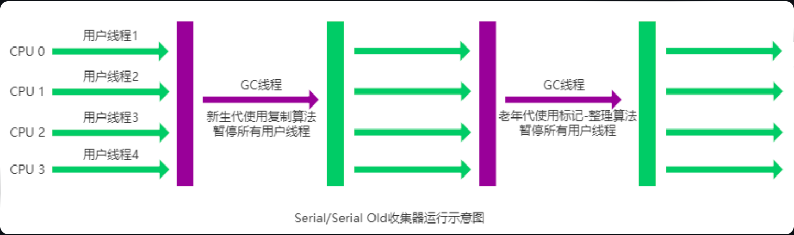
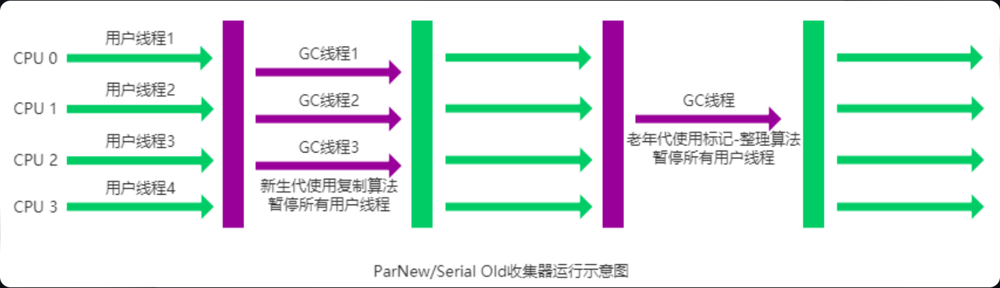
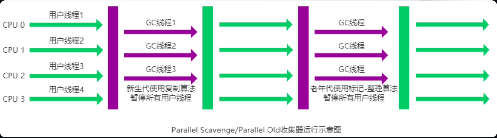
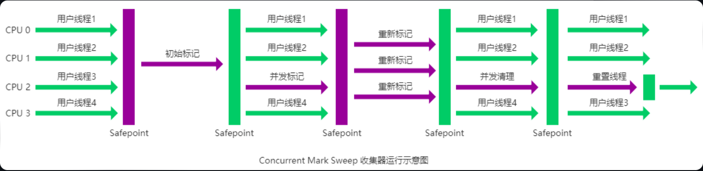
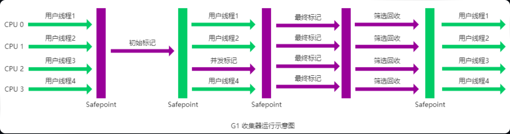
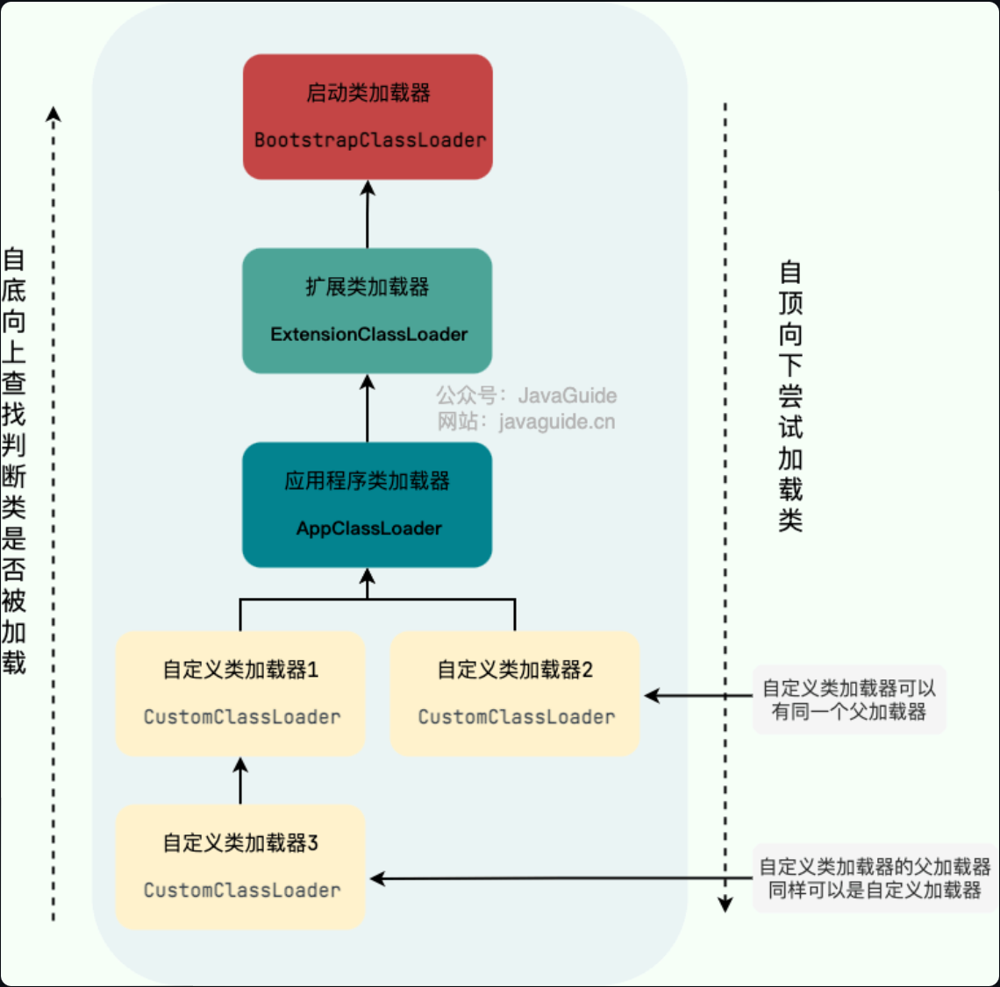

# 内存区域



## 线程私有

### 程序计数器

程序计数器是唯一一个不会出现 `OutOfMemoryError` 的内存区域，它的生命周期随着线程的创建而创建，随着线程的结束而死亡。**线程都有一个独立的程序计数器**

### 虚拟机栈

除了一些 Native 方法调用是通过本地方法栈实现的(后面会提到)，其他所有的 **Java 方法调用都是通过栈来实现的**方法调用的数据需要通过栈进行传递，每一次方法调用都会有一个对应的栈帧被压入栈中，每一个方法调用结束后，都会有一个栈帧被弹出。

栈由一个个**栈帧**组成，而每个栈帧中都拥有：**局部变量表、操作数栈、动态链接、方法返回地址**。和数据结构上的栈类似，两者都是先进后出的数据结构，只支持出栈和入栈两种操作

+ **局部变量表** 主要存放了**编译期可知的各种数据类型**（boolean、byte、char、short、int、float、long、double）、对象引用（reference 类型，它不同于对象本身，可能是一个指向对象起始地址的引用指针，也可能是指向一个代表对象的句柄或其他与此对象相关的位置）
+ **操作数栈**：中转站，用于存放方法执行过程中产生的中间计算结果
+ **动态链接** 主要服务一个方法需要调用其他方法的场景（动态链接的作用就是为了将符号引用转换为调用方法的直接引用，这个过程也被称为 **动态连接** 。）

### 本地方法栈

**虚拟机栈为虚拟机执行 Java 方法 （也就是字节码）服务，而本地方法栈则为虚拟机使用到的 Native 方法服务**（HotSpot 虚拟机中和 Java 虚拟机栈合二为一）

## 线程共享

### 堆

**存放对象实例，几乎所有的对象实例以及数组都在这里分配内存**

1. 运行时常量池
2. 字符串常量池

> Java1.7之前属于方法区的永久代。但永久代GC回收效率太低，常不能及时回收。

### 方法区

方法区会存储已被虚拟机加载的 **类信息、字段信息、方法信息、常量、静态变量、即时编译器编译后的代码缓存等数据**。

**方法区和永久代以及元空间是什么关系呢**：永久代是 JDK 1.8 之前的方法区实现，JDK 1.8 及以后方法区的实现变成了元空间

```java
//java1.7及以前
-XX:PermSize=N //方法区 (永久代) 初始大小
-XX:MaxPermSize=N //方法区 (永久代) 最大大小,超过这个值将会抛出 OutOfMemoryError 异常:java.lang.OutOfMemoryError: PermGen

//java8 元空间
-XX:MetaspaceSize=N //设置 Metaspace 的初始（和最小大小）
-XX:MaxMetaspaceSize=N //设置 Metaspace 的最大大小
```


### 直接内存

直接内存并不是虚拟机运行时数据区的一部分，也不是虚拟机规范中定义的内存区域，但是这部分内存也被频繁地使用。而且也可能导致 `OutOfMemoryError` 错误出现

直接内存的分配**不会受到 Java 堆的限制**，但是，既然是内存就会受到本机总内存大小以及处理器寻址空间的限制。

### **为什么要将永久代 (PermGen) 替换为元空间 (MetaSpace)** 

1. 整个永久代有一个 JVM 本身设置的固定大小上限，无法进行调整（也就是受到 JVM 内存的限制），而元空间使用的是本地内存，受本机可用内存的限制，虽然元空间仍旧可能溢出，但是比原来出现的几率会更小。即**不易溢出**

   > 元空间溢出时会得到如下错误：`java.lang.OutOfMemoryError: MetaSpace`。

2. 元空间里面存放的是类的元数据，这样加载多少类的元数据就不由 `MaxPermSize` 控制了, 而由系统的实际可用空间来控制，这样**能加载的类就更多**了

3. 永久代会为 GC 带来不必要的复杂度，并且回收效率偏低

## Java对象的创建

### 类加载检查

虚拟机遇到一条 new 指令时，**首先去检查**这个指令的参数**是否能在常量池中定位到这个类的符号引用**，并且**检查**这个符号引用代表的**类是否已被加载过、解析和初始化过**。如果没有，那必须先执行相应的类加载过程。

### 分配内存

**分配方式**有 **“指针碰撞”**和 **“空闲列表”** 两种，选择哪种分配方式由 Java **堆是否规整**决定，而 Java 堆是否规整又由所采用的垃圾收集器是否带有压缩整理功能决定。

> 复制算法内存也是规整的。
>
> 内存分配的的并发问题：
>
> 1. **CAS+失败重试**：**虚拟机采用 CAS 配上失败重试的方式保证更新操作的原子性。**
> 2. **TLAB**：JVM 在给线程中的对象分配内存时，首先在 TLAB 分配，当对象大于 TLAB 中的剩余内存或 TLAB 的内存已用尽时，再采用上述的 CAS 进行内存分配

指针碰撞： 

- 适用场合：堆内存规整（即**没有内存碎片**）的情况下。
- 原理：用过的内存全部整合到一边，没有用过的内存放在另一边，中间有一个分界指针，只需要向着没用过的内存方向将该指针移动对象内存大小位置即可。
- 使用该分配方式的 GC 收集器：Serial, ParNew

空闲列表： 

- 适用场合：堆内存不规整的情况下。
- 原理：**虚拟机维护一个列表**，该列表中会记录哪些内存块是可用的，在分配的时候，找一块儿足够大的内存块儿来划分给对象实例，最后更新列表记录。
- 使用该分配方式的 GC 收集器：CMS

#### 内存并发分配

1. CAS：**虚拟机采用 CAS 配上失败重试的方式保证更新操作的原子性**
2. TLAB：为每一个线程预先在 Eden 区分配一块儿内存，JVM 在给线程中的对象分配内存时，首先在 TLAB 分配，当对象大于 TLAB 中的剩余内存或 TLAB 的内存已用尽时，再采用上述的 CAS 进行内存分配

### 初始化零值

### 设置对象头

**对对象进行必要的设置**，例如这个对象是<u>哪个类的实例</u>、如何才能找到类的元数据信息、<u>对象的哈希码</u>、对象的 <u>GC 分代年龄</u>等信息

### 执行init方法

## 对象的内存布局

### 对象头

1. **用于存储对象自身的运行时数据**（哈希码、GC 分代年龄、锁状态标志等等），

2. **类型指针**（对象指向它的类元数据的指针，虚拟机通过这个指针来确定这个对象是哪个类的实例）

### 实例数据

**真正存储的有效信息**

### 对齐填充

## 对象的访问

### 使用句柄



### 直接指针



**使用句柄**来访问的最大好处是 reference 中存储的是稳定的句柄地址，在**对象被移动时只会改变句柄中的实例数据指针，而 reference 本身不需要修改**。使用**直接指针**访问方式最大的好处就是速度快，它**节省了一次指针定位的时间开销。**

# JVM垃圾回收

## 内存分配和回收原则

1. 对象优先在Eden区分配

   当 Eden 区没有足够空间进行分配时，虚拟机将发起一次 Minor GC

2. 大对象直接进入老年代

   G1垃圾回收器：`-XX:G1HeapRegionSize` 参数设置的堆区域大小和 `-XX:G1MixedGCLiveThresholdPercent` 参数设置的阈值，来决定哪些对象会直接进入老年代

   Parallel Scavenge 垃圾回收器：没有一个固定的阈值

3. 长期存活对象进入老年代

   对象在 Survivor 中每熬过一次 MinorGC,年龄就增加 1 岁，**默认晋升年龄并不都是 15，要看垃圾收集器，CMS 就是 6**。对象晋升到老年代的年龄阈值，可以通过参数 `-XX:MaxTenuringThreshold` 来设置。

4. 主要进行GC的区域

   - **新生代收集**（Minor GC / Young GC）：**只对新生代**进行垃圾收集；
   - **老年代收集**（Major GC / Old GC）：**只对老年代**进行垃圾收集。需要注意的是 Major GC 在有的语境中也用于指代整堆收集；
   - **混合收集**（Mixed GC）：对**整个新生代和部分老年代**进行垃圾收集。

   + **整堆收集 (Full GC)**：收集**整个 Java 堆和方法区**。

5. 空间分配担保

   空间分配担保是为了确保在 Minor GC 之前老年代本身还有容纳新生代所有对象的剩余空间

## 对象死亡的判定

### 引用计数法

这个方法实现简单，效率高，但是目前主流的虚拟机中并没有选择这个算法来管理内存，其最主要的原因是它**很难解决对象之间循环引用的问题**。

### 可达性分析法

**GC Roots”** 的对象作为起点，从这些节点开始向下搜索，节点所走过的路径称为引用链，当一个对象到 GC Roots 没有任何引用链相连的话，则证明此对象是不可用的，需要被回收

#### 可作为GC Roots的对象

1. 虚拟机栈(栈帧中的**局部变量表**)中引用的对象
2. 本地方法栈(**Native 方法**)中引用的对象
3. 方法区中**类静态属性**引用的对象
4. 方法区中**常量**引用的对象
5. 所有被**同步锁**持有的对象
6. JNI（Java Native Interface）引用的对象

+ 对象可被回收不一定会被回收，宣告一个对象的死亡至少要经历两次标记过程

## 引用类型总结

1. 强引用

   **必不可少的生活用品**。宁愿抛出 OutOfMemoryError 错误，使程序异常终止，也不会靠随意回收具有强引用的对象来解决内存不足问题

2. 软引用

   如果一个对象只具有软引用，那就类似于**可有可无的生活用品**。内存空间足够，垃圾回收器就不会回收它，如果内存空间不足了，就会回收这些对象的内存。**可用来实现内存敏感的高速缓存**

   软引用**可以和一个引用队列（ReferenceQueue）联合使用**，如果软引用所引用的对象被垃圾回收，JAVA 虚拟机就会把这个软引用加入到与之关联的引用队列中。

3. 弱引用

   **一旦发现**了只具有弱引用的对象，不管当前内存空间足够与否，都会**回收**它的内存。不过，由于垃圾回收器是一个优先级很低的线程， 因此**不一定会很快发现那些只具有弱引用的对象**

   弱引用可以和一个引用队列（ReferenceQueue）**联合使用**，如果弱引用所引用的对象被垃圾回收，Java 虚拟机就会把这个弱引用加入到与之关联的引用队列中

4. 虚引用

   跟没有引用一样，在任何时候都可能被垃圾回收。**虚引用主要用来跟踪对象被垃圾回收的活动**。

   **虚引用<u>必须</u>和引用队列（ReferenceQueue）联合使用**

在程序设计中一般很少使用弱引用与虚引用，**使用软引用的情况较多**，这是因为**软引用可以加速 JVM 对垃圾内存的回收速度，可以维护系统的运行安全，防止内存溢出（OutOfMemory）等问题的产生**。

## 如何判断无用的类

同时满足以下三个条件才可以被回收：

1. 该类**所有的实例都已经被回收**，也就是 Java 堆中不存在该类的任何实例。

2. **加载该类的 `ClassLoader` 已经被回收**。

3. 该**类对应的 `java.lang.Class` 对象没有在任何地方被引用**，无法在任何地方通过反射访问该类的方法。

## 垃圾收集算法

### 标记-清除算法

首先标记出所有不需要回收的对象，在标记完成后统一回收掉所有没有被标记的对象。但缺点如下

1. **效率问题**：标记和清除两个过程效率都不高。
2. **空间问题**：标记清除后会产生大量不连续的内存**碎片**。

### 标记-复制算法

将内存分为大小相同的两块，每次使用其中的一块。当这一块的内存使用完后，就将还存活的对象复制到另一块去，然后再把使用的空间一次清理掉。但是

- **可用内存变小**：可用**内存缩小为原来的一半**。
- **不适合老年代**：如果存活对象数量比较大，**复制性能会变得很差**。

### 标记-整理算法

标记过程仍然与“标记-清除”算法一样，但后续步骤不是直接对可回收对象回收，而是**让所有存活的对象向一端移动**，然后**直接清理**掉端边界以外的内存

+ 效率也不高，适合老年代这种垃圾回收频率不是很高的场景

### 分代收集算法

**当前虚拟机的垃圾收集都采用分代收集算法**，根据对象存活周期的不同将内存分为几块。一般将 Java 堆分为新生代和老年代，根据各个年代的特点选择合适的垃圾收集算法。

1. **新生代**中，每次收集都会有大量对象死去，所以可以选择”**标记-复制**“算法，只需要付出少量对象的复制成本就可以完成每次垃圾收集
2. **老年代**的对象存活几率是比较高的，而且没有额外的空间对它进行分配担保，所以我们必须选择“**标记-清除**”或“**标记-整理**”算法进行垃圾收集

## 垃圾收集器

JDK 默认垃圾收集器（使用 `java -XX:+PrintCommandLineFlags -version` 命令查看）：

- JDK **8**：Parallel Scavenge（新生代）+ Parallel Old（老年代）
- JDK **9** ~ JDK **20**: G1

### Serial收集器

单线程收集器，**它在进行垃圾收集工作的时候必须暂停其他所有的工作线程。新生代采用标记-复制算法，老年代采用标记-整理算法。**

它简单而高效。Serial 收集器由于没有线程交互的开销，自然可以获得很高的单线程收集效率。Serial 收集器对于运行在 **Client 模式下的虚拟机来说是个不错的选择**



### ParNew收集器

Serial 收集器的多线程版本。但注意，**GC时用户线程也是无法工作的**。

运行在 Server 模式下的虚拟机的首要选择，除了 Serial 收集器外，只有它能与 CMS 收集器（真正意义上的并发收集器）配合工作



### Paralel Scavenge 收集器

**Java1.8默认的收集器**。它的关注点是吞吐量（而CMS等关注用户线程暂停时间）。

> Parallel Scavenge 收集器提供了很多参数供用户找到最合适的停顿时间或最大吞吐量，如果对于收集器运作不太了解，**手工优化存在困难的时候**，使用 Parallel Scavenge **收集器配合自适应调节策略**，把内存管理优化交给虚拟机去完成也是一个不错的选择



### Serial Old 收集器

Serial 收集器的老年代版本，JDK1.5及以前的版本中与 Parallel Scavenge 收集器搭配使用，另一种用途是**作为 CMS 收集器的后备方案**

### Parallel Old 收集器

Parallel Scavenge 收集器的老年代版本

### CMS收集器

一种以获取**最短回收停顿时间为目标**的收集器（注重用户体验的应用上使用）。**真正意义上的并发收集器**（它第一次实现了让垃圾收集线程与用户线程（基本上）同时工作）

+ 使用**标记-清除”算法**（导致大量碎片）。JDK9后弃用

#### 过程

1. **初始标记：** **暂停所有的其他线程**，并记录下直接与 root 相连的对象，速度很快 ；

2. **并发标记：** **同时开启 GC 和用户线程**，用一个闭包结构去记录可达对象。但在这个阶段结束，这个闭包结构并不能保证包含当前所有的可达对象。因为用户线程可能会不断的更新引用域，所以 GC 线程无法保证可达性分析的实时性。所以这个算法里会**跟踪记录这些发生引用更新的地方**。

3. **重新标记：** **暂停用户线程**，重新标记阶段就是为了**修正并发标记期间**因为用户程序继续运行而导致标记产生**变动的**那一部分对象的标记记录，<u>这个阶段的停顿时间一般会**比初始标记阶段的时间稍长**，远远比并发标记阶段时间短</u>

4. **并发清除：** 开启用户线程，同时 GC 线程开始**对未标记的区域做清扫**。



+ **对 CPU 资源敏感**
+ **无法处理浮动垃圾**
+ **使用的回收算法-“标记-清除”算法会导致收集结束时会有大量空间碎片产生**

### G1收集器

针对配备**多颗处理器及大容量内存**的机器。以极高概率满足 GC 停顿时间要求的同时,还具备高吞吐量性能特征.

+ 从JDK9后成为**默认收集器**

1. **并行与并发**：G1 能充分利用 CPU、多核环境下的硬件优势，使用多个 CPU（CPU 或者 CPU 核心）来缩短 Stop-The-World 停顿时间。部分其他收集器原本需要停顿 Java 线程执行的 GC 动作，G1 收集器仍然可以通过并发的方式让 java 程序继续执行。

2. **分代收集**：虽然 G1 可以不需要其他收集器配合就能独立管理整个 GC 堆，但是还是保留了分代的概念。

3. **空间整合**：与 CMS 的“标记-清除”算法不同，G1 从**整体来看**是基于**“标记-整理”**算法实现的收集器；从**局部上**来看是基于**“标记-复制”**算法实现的。

4. **可预测的停顿**：这是 G1 相对于 CMS 的另一个大优势，降低停顿时间是 G1 和 CMS 共同的关注点，但 G1 除了追求低停顿外，还能建立可预测的停顿时间模型，**能让使用者明确**指定在一个长度为 M 毫秒的时间片段内，消耗在垃圾收集上的时间**不超过 N 毫秒**。



**G1 收集器在后台维护了一个优先列表，每次根据允许的收集时间，优先选择回收价值最大的 Region(这也就是它的名字 Garbage-First 的由来)** 。这种使用 Region 划分内存空间以及有优先级的区域回收方式，保证了 G1 收集器在有限时间内可以尽可能高的收集效率（把内存化整为零）

### ZGC收集器

ZGC 也采用**标记-复制**算法。ZGC 可以将暂停时间控制在几毫秒以内，且**暂停时间不受堆内存大小的影响**。出现 Stop The World 的情况会更少，但代价是<u>牺牲了一些吞吐量</u>。ZGC **最大支持 16TB** 的堆内存。

ZGC 在 Java11 中引入，在 Java15 已经可以正式使用，在 Java21 中，引入了分代 ZGC，暂停时间可以缩短到 1 毫秒以内。

# 类加载器

**类加载器是**一个负责加载类的**对象**，**每个 Java 类**都有一个引用指向加载它的 **`ClassLoader`**。**数组**类不是通过 `ClassLoader` 创建的（数组类没有对应的二进制字节流），是**由 JVM 直接生成**的。

**类加载器**的主要作用就是**加载 Java 类的字节码**（ `.class` 文件）**到 JVM** 中（在内存中生成一个代表该类的 `Class` 对象）

JVM 启动的时候，并不会一次性加载所有的类，而是**根据需要去动态加载**(对于一个类加载器来说，相同二进制名称的类只会被加载一次)

> 类加载器还可以加载 Java 应用所需的资源如文本、图像、配置文件、视频等等文件资源.

- 类加载过程：**加载->连接->初始化**。
- 连接过程又可分为三步：**验证->准备->解析**。

## 三个重要的类加载器

1. **`BootstrapClassLoader`(启动类加载器)**：最顶层的加载类，由 C++实现，通常表示为 null，并且没有父级，主要用来加载 JDK 内部的核心类库。`%JAVA_HOME%/lib`目录下的 `rt.jar`、`resources.jar`、`charsets.jar`等 jar 包和类）以及被 `-Xbootclasspath`参数指定的路径下的所有类。

   > **`rt.jar`**：rt 代表“RunTime”，`rt.jar`是 Java 基础类库，包含 Java doc 里面看到的所有的类的类文件。也就是说，我们常用内置库 `java.xxx.*`都在里面，比如`java.util.*`、`java.io.*`、`java.nio.*`、`java.lang.*`、`java.sql.*`、`java.math.*`。

2. **`ExtensionClassLoader`(扩展类加载器)**：主要负责加载 `%JRE_HOME%/lib/ext` 目录下的 jar 包和类以及被 `java.ext.dirs` 系统变量所指定的路径下的所有类

3. **`AppClassLoader`(应用程序类加载器)**：**面向用户**的加载器，负责加载当前应用 classpath 下的所有 jar 包和类



### 补充

1. 除了 `BootstrapClassLoader` 是 JVM 自身的一部分之外，其他所有的类加载器都是在 JVM 外部实现的，并且全都继承自 `ClassLoader`抽象类

   > `ClassLoader` 类有两个关键的方法：
   >
   > - `protected Class loadClass(String name, boolean resolve)`：**加载指定二进制名称的类**，**实现了双亲委派机制** 。`name` 为类的二进制名称，`resolve` 如果为 true，在加载时调用 `resolveClass(Class<?> c)` 方法解析该类。
   > - `protected Class findClass(String name)`：根据类的二进制名称来**查找类**，默认实现是空方法

2. `ClassLoader` 可以通过`getParent()`获取其父 `ClassLoader`，如果获取到 `ClassLoader` 为`null`的话，那么该类是通过 `BootstrapClassLoader` 加载的

## 双亲委派模型

`ClassLoader` 类使用委托模型来搜索类和资源。

双亲委派模型要求除了顶层的启动类加载器外，其余的类加载器都应有自己的父类加载器。

`ClassLoader` 实例会在**试图**亲自查找类或资源之前，**将**搜索类或资源的**任务委托给其父类加载器**。

+ 类加载器之间的父子关系一般不是以继承的关系来实现的，而是通常使用**组合关系来复用父加载器的代码**

+ 每当一个类加载器接收到加载请求时，它会先将请求转发给父类加载器。在父类加载器没有找到所请求的类的情况下，该类加载器才会尝试去加载。

### 流程

1. 在类加载的时候，系统会首先**判断当前类是否被加载过**。已经被加载的类会直接返回，否则才会尝试加载（每个父类加载器都会走一遍这个流程）。

2. 类加载器在进行类加载的时候，它首先不会自己去尝试加载这个类，而是把这个请求委派给父类加载器去完成（**调用父加载器 `loadClass()`方法来加载类**）。这样的话，<u>所有的请求最终都会传送到顶层的启动类加载器</u> `BootstrapClassLoader` 中。

3. 只有当**父加载器**反馈自己无法完成这个加载请求（它的搜索范围中**没有找到所需的类**）时，**子加载器**才会尝试自己去加载（**调用自己的 `findClass()` 方法来加载类**）。

4. 如果子类加载器也无法加载这个类，那么它会抛出一个 `ClassNotFoundException` 异常

> **JVM 判定两个 Java 类是否相同的具体规则**：JVM **不仅要看类的全名**是否相同，**还要看加载此类的类加载器**是否一样。只有两者都相同的情况，才认为两个类是相同的。即使两个类来源于同一个 `Class` 文件，被同一个虚拟机加载，只要加载它们的类加载器不同，那这两个类就必定不相同

### 双亲委派模型优点

1. 避免类的重复加载
2. 保证了 Java 的核心 API 不被篡改

自定义加载器的话，需要继承 `ClassLoader` 。如果我们**不想打破双亲委派模型，就重写 `ClassLoader` 类中的 `findClass()` 方法**即可，无法被父类加载器加载的类最终会通过这个方法被加载。但是，如果**想打破双亲委派模型则需要重写 `loadClass()` 方法。**

# Maven

1. **自动化项目构建**：提供**标准的、跨平台的**自动化项目构建方式。
2. **依赖管理**：方便快捷的管理项目依赖的资源（jar 包），避免资源间的版本冲突问题。
3. **统一开发结构**：提供标准的、统一的项目结构。

## 坐标

**groupId**(必须): 定义了当前 Maven 项目隶属的组织或公司。groupId 一般分为多段，通常情况下，第一段为域，第二段为公司名称。域又分为 org、com、cn 等，其中 org 为非营利组织，com 为商业组织，cn 表示中国。以 apache 开源社区的 tomcat 项目为例，这个项目的 groupId 是 org.apache，它的域是 org（因为 tomcat 是非营利项目），公司名称是 apache，artifactId 是 tomcat。

**artifactId**(必须)：定义了当前 Maven 项目的名称，项目的唯一的标识符，对应项目根目录的名称。

**version**(必须)：定义了 Maven 项目当前所处版本。

**packaging**（可选）：定义了 Maven 项目的打包方式（比如 jar，war...），默认使用 jar。

**classifier**(可选)：常用于区分从同一 POM 构建的具有不同内容的构件，可以是任意的字符串，附加在版本号之后。

## 依赖

- dependencies：一个 pom.xml 文件中只能存在一个这样的标签，是用来管理依赖的总标签。
- dependency：包含在 dependencies 标签中，可以有多个，每一个表示项目的一个依赖。
- groupId,artifactId,version(必要)：依赖的基本坐标，对于任何一个依赖来说，基本坐标是最重要的，Maven 根据坐标才能找到需要的依赖。我们在上面解释过这些元素的具体意思，这里就不重复提了。
- type(可选)：依赖的类型，对应于项目坐标定义的 packaging。大部分情况下，该元素不必声明，其默认值是 jar。
- scope(可选)：依赖的范围，默认值是 compile。
- optional(可选)：标记依赖是否可选
- exclusions(可选)：用来排除传递性依赖,例如 jar 包冲突

### 依赖范围

**classpath** 用于指定 `.class` 文件存放的位置，类加载器会从该路径中加载所需的 `.class` 文件到内存中。

Maven 在编译、执行测试、实际运行有着三套不同的 classpath：

- **compile**：编译主代码有效
- **test**：编译、运行测试代码有效，典型的是 JUnit
- **runtime**：对于测试和运行有效，但是在编译主代码时无效
- **provided**：此依赖范围，对于编译和测试有效，而对运行时无效

## 依赖传递性

1. **对于 Maven 而言，同一个 groupId 同一个 artifactId 下，只能使用一个 version**。如果冲突，只会引入「后」一个声明的依赖

   ```xml
   <dependency>
       <groupId>in.hocg.boot</groupId>
       <artifactId>mybatis-plus-spring-boot-starter</artifactId>
       <version>1.0.48</version>
   </dependency>
   <!-- 只会使用 1.0.49 这个版本的依赖 -->
   <dependency>
       <groupId>in.hocg.boot</groupId>
       <artifactId>mybatis-plus-spring-boot-starter</artifactId>
       <version>1.0.49</version>
   </dependency>
   ```

2. **项目的两个依赖同时引入了某个依赖。**

   ```java
   依赖链路一：A -> B -> C -> X(1.0)
   依赖链路二：A -> D -> X(2.0)  //路径更短，使用它
     //如果路径长度也相同，则使用先声明的那个
     //但也可以使用exclude标签排除不想要的那个（一般保留高版本）
   ```

   遵循 **路径最短优先** 和 **声明顺序优先** 两大原则。解决这个问题的过程也被称为 **Maven 依赖调解** 。


