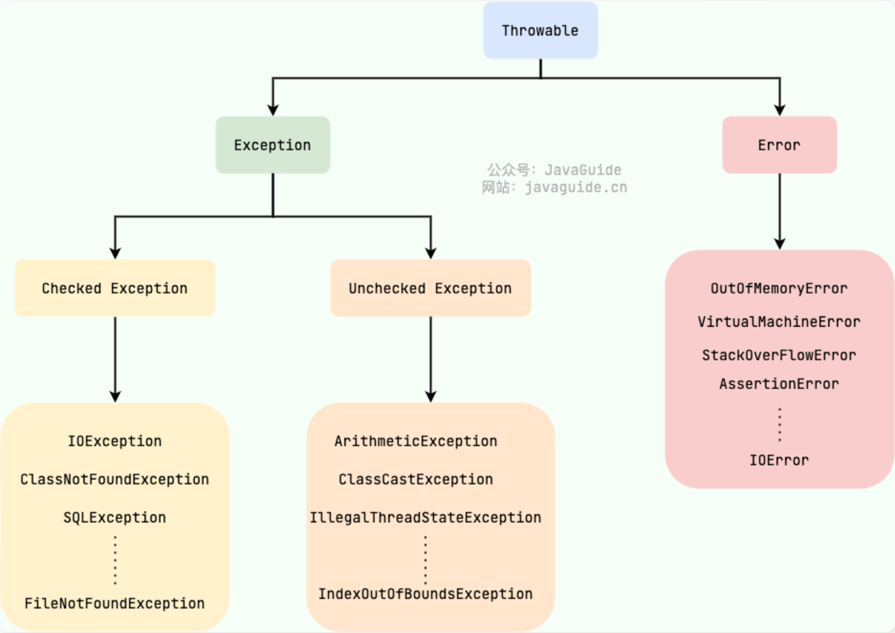
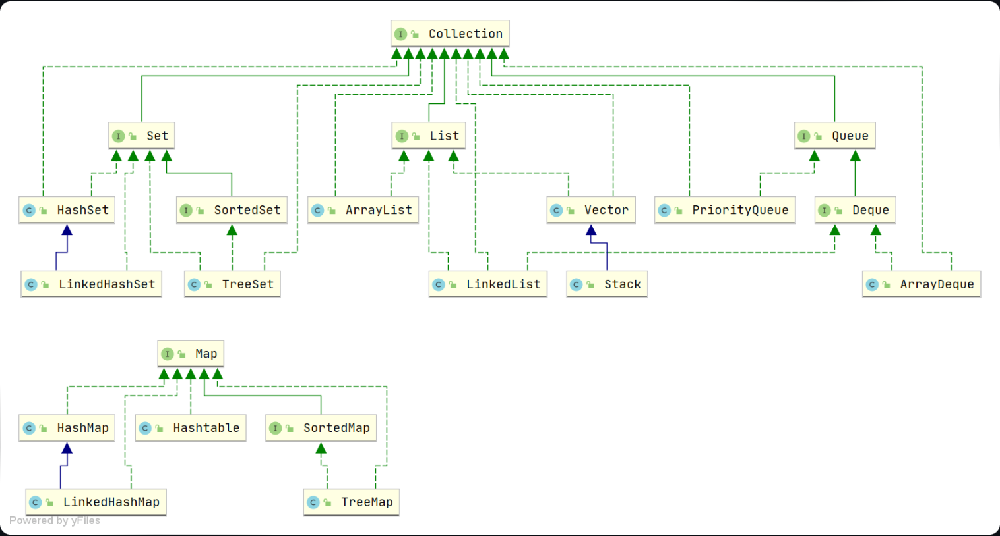
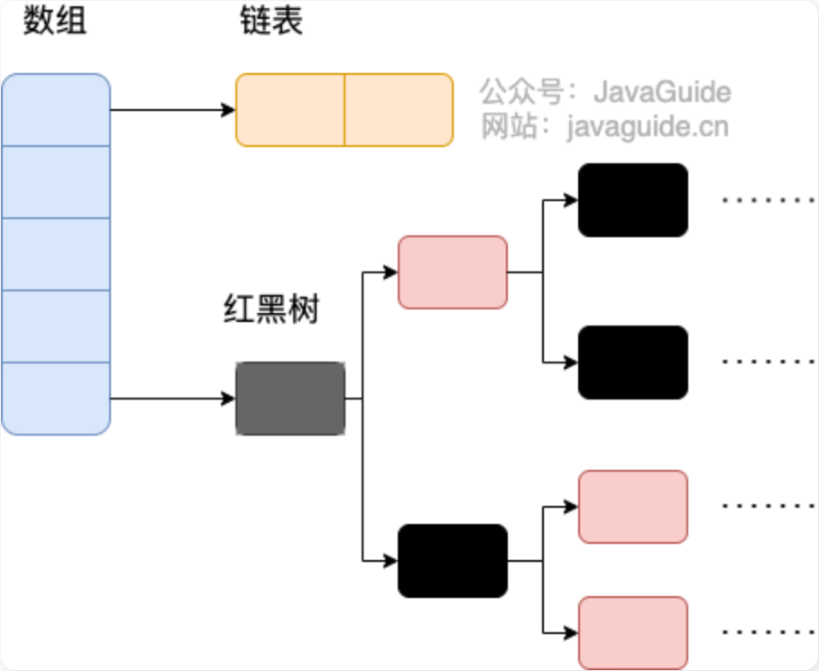

## JDK/JRE/JVM三者的关系

JVM：虚拟机

JRE：运行时环境

JDK：开发工具包

+ Java这种语言，它的**源代码**会先通过javac编译成**字节码**，再通过jvm将字节码转换成**机器码**执行，即**解释运行和编译运行配合使用**，所以可以称为混合型或者半编译型。

## 面向对象

封装继承多态抽象

- **静态多态**性：通过**重载**实现，**相同的方法有不同的參数列表**，可以根据参数的不同，做出不同的处理。
- **动态多态**性：在子类中**重写**父类的方法。运行期间判断所引用对象的实际类型，根据其实际类型调用相应的方法。

### 六大原则

1. 单一对象职责：对象必须职责明确
2. 里氏替换原则：子类可以完全替代父类
3. 迪米特法则（最小原则；最小耦合）：
4. 开闭原则：开放拓展、封闭修改（尽量不改代码）
5. 依赖倒置原则：
6. 接口隔离原则

## 基本数据类型

不要用浮点数表示金额，建议使用**BigDecimal**或者**Long**来表示金额。

## 值传递、引用传递

值传递是对基本型变量而言的，改变副本不影响原变量。

**Java里只有值传递**。即便参数的是对象，传递也只是这个对象的地址。传递的是数组即数组的起始地址。（基本类型是副本）

## 包装类Integer

Java 是一种面向对象语言，很多地方都需要使用对象而不是基本数据类型。比如，在集合类中，我们是无法将 int 、double 等类型放进去的。因为集合的容器要求元素是 Object 类型。

| 原始类型 | 包装类型  |
| -------- | --------- |
| boolean  | Boolean   |
| byte     | Byte      |
| char     | Character |
| float    | Float     |
| int      | Integer   |
| long     | Long      |
| short    | Short     |
| double   | Double    |

如下情况，编译器会**自动**帮我们进行装箱或拆箱：

- 赋值操作（装箱或拆箱）
- 进行加减乘除混合运算 （拆箱）
- 进行>,<,==比较运算（拆箱）
- 调用equals进行比较（装箱）
- ArrayList、HashMap等集合类添加基础类型数据时（装箱）

# String

## 为什么String不可变

使用了final

```java
public final class String
    implements java.io.Serializable, Comparable<String>, CharSequence {
    /** The value is used for character storage. */
    private final char value[];

    /** Cache the hash code for the string */
    private int hash; // Default to 0
}
```

1. **线程安全**。同一个字符串实例可以被多个线程共享，因为字符串不可变，本身就是线程安全的。
2. **支持hash映射和缓存**。因为String的hash值经常会使用到，比如作为 Map 的键，不可变的特性使得 hash 值也不会变，不需要重新计算。
3. **出于安全考虑**。网络地址URL、文件路径path、密码通常情况下都是以String类型保存，假若String不是固定不变的，将会引起各种安全隐患。比如将密码用String的类型保存，那么它将一直留在内存中，直到垃圾收集器把它清除。假如String类不是固定不变的，那么这个密码可能会被改变，导致出现安全隐患。
4. **字符串常量池优化**。String对象创建之后，会缓存到字符串常量池中，下次需要创建同样的对象时，可以直接返回缓存的引用。

**1. 可变性**

- String 不可变
- StringBuffer 和 StringBuilder 可变

**2. 线程安全**

- String 不可变，因此是线程安全的
- StringBuilder 不是线程安全的
- StringBuffer 是线程安全的，内部使用 synchronized 进行同步

### StringJoiner

基于 StringBuilder 实现，用于实现对字符串之间通过分隔符拼接的场景。

```java
//分隔符，前缀，后缀
//StringJoiner(CharSequence delimiter, CharSequence prefix, CharSequence suffix)
StringJoiner sj = new StringJoiner(",", "(", ")");
sj.add(value.toString());//用for循环包围即可实现(1,2,3,4)这种。不需要前后append("")
//分隔符
StringJoiner(CharSequence delimiter)
```


## 为何JDK9要将String的底层实现由char[]改成byte[]?

+ 为了节约String占用的内存。Latin-1字符只需要1个字节就够了。而char需要2字节
  + 对于中文字符串，用的是UTF16编码（两个字节），所以用byte[]和char[]实现没什么区别。

## 常用方法

- indexOf()：返回指定字符的索引。
- charAt()：返回指定索引处的字符。
- replace()：字符串替换。
- trim()：去除字符串两端空白。
- split()：分割字符串，返回一个分割后的字符串数组。
- getBytes()：返回字符串的 byte 类型数组。
- length()：返回字符串长度。
- toLowerCase()：将字符串转成小写字母。
- toUpperCase()：将字符串转成大写字符。
- substring()：截取字符串。
- equals()：字符串比较。
- intern();保存到常量池

## new String("dabin")会创建几个对象？

两个（前提是字符串常量池中没有 "dabin" 这个字符串对象）

- "dabin" 属于字符串字面量，因此编译时期会在字符串常量池中创建一个字符串对象，指向这个 "dabin" 字符串字面量；
- 使用 new 的方式会在堆中创建一个字符串对象。

## String最大长度

String类提供了length方法，返回int值。故$ 2^{31} -1$​。

## 存储位置

String对象，存储在JVM堆栈中，

**字符串常量**，存储在常量池中。最大长度65534（来源于$2^{16}-1$，但要小于）

# Object

Object常用方法有：`toString()`、`equals()`、`hashCode()`、`clone()`等

1. `equals`默认比较两个引用变量**是否指向同一个对象（内存地址）**,但可以重写

   **equals和==有什么区别**

   - 对于基本数据类型，==比较的是他们的值。基本数据类型没有equal方法；
   - 对于复合数据类型，**==比较的是它们的存放地址**(是否是同一个对象)。**`equals()`默认比较地址值**，重写的话按照重写逻辑去比较。

2. `clone`得到对象的副本（**Java的普通赋值是对象引用**）

   ```java
   protected native Object clone() throws CloneNotSupportedException;
   //但它默认是protected类型的
   ```

   1. 但需要`implements Cloneable`才可以使用，否则抛异常
   2. 覆盖clone方法，可见性提升为public

3. `getClass` 

   ```java
   public static void main(String[] args) {
       Person p = new Person("程序员大彬");
       Class clz = p.getClass();//getClass得到的是Class
       System.out.println(clz);
       //获取类名
       System.out.println(clz.getName());
   }
   ```

4. `wait`调用后当前线程会释放对象锁，进入等待状态

5. `notify` 唤醒在此对象上等待的单个线程，选择是任意的；`notifyAll`唤醒在此对象上等待的所有线程

## 重写 equals 时一定要重写 hashCode

之所以重写`equals()`要重写`hashcode()`，是为了保证`equals()`方法返回true的情况下hashcode值也要一致。

## 创建对象有几种方式

- 用**new**语句创建对象。
- 使用反射，使用**Class.newInstance()**创建对象。
- 调用对象的**clone()**方法。
- 运用**反序列化手段**，调用java.io.ObjectInputStream对象的readObject()方法。

### 实例化的顺序

1. 静态属性，静态代码块。
2. 普通属性，普通代码块。
3. 构造方法。

>  **静态内部类**，在静态方法里，使用**⾮静态内部类依赖于外部类的实例**，也就是说需要先创建外部类实例，才能用这个实例去创建非静态内部类。**⽽静态内部类不需要**。

## final

1. **基本数据**类型用final修饰，则不能修改，是常量；**对象引用**用final修饰，则引用只能指向该对象，不能指向别的对象，但是对象本身可以修改。
2. final修饰的方法**不能被子类重写**
3. final修饰的**类不能被继承**。

## 接口与抽象类

1、**语法层面**上的区别

- **抽象类可以有方法实现**，而**接口的方法中只能是抽象方法**（Java **8 之后接口方法可以有默认**实现）；
- 抽象类中的成员变量可以是各种类型的，**接口中的成员变量只能是public static final类型**；
- **接口中不能含有静态代码块**，而抽象类可以有静态代码块和静态方法（Java **8之后接口可以有静态方法**）；
- 一个类只能继承一个抽象类，而**一个类却可以实现多个接口**。

2、**设计层面**上的区别

- 抽象层次不同。抽象类是对整个类整体进行抽象，包括属性、行为，但是接口只是对类行为进行抽象。继承抽象类是一种"是不是"的关系，而接口实现则是 "有没有"的关系。如果一个类继承了某个抽象类，则子类必定是抽象类的种类，而接口实现则是具备不具备的关系，比如鸟是否能飞。
- 继承抽象类的是具有相似特点的类，而实现接口的却可以不同的类。

## Error和Exception的区别

**Error**：JVM 无法解决的严重问题，如栈溢出`StackOverflowError`、内存溢出`OOM`等。程序无法处理的错误。

**Exception**：其它因编程错误或偶然的外在因素导致的一般性问题。可以在代码中进行处理。如：空指针异常、数组下标越界等。

## 运行时异常和非运行时异常（checked）的区别？

`unchecked exception`包括`RuntimeException`和`Error`类，其他所有异常称为检查（checked）异常。

1. `RuntimeException`由程序错误导致，应该修正程序避免这类异常发生。
2. `checked Exception`由具体的环境（读取的文件不存在或文件为空或sql异常）导致的异常。必须进行处理，不然**编译不通过**，可以catch或者throws。

## throw和throws的区别？

- **throw**：用于**抛出一个具体的异常**对象。
- **throws**：用在方法签名中，用于**声明该方法可能抛出的异常**。子类方法抛出的异常范围更加小，或者根本不抛异常。

## BIO/NIO/AIO区别的区别

**同步阻塞IO** : 用户进程发起一个IO操作以后，必须等待IO操作的真正完成后，才能继续运行。

**同步非阻塞IO**: 客户端与服务器通过Channel连接，采用多路复用器轮询注册的`Channel`。提高吞吐量和可靠性。用户进程发起一个IO操作以后，可做其它事情，但**用户进程需要轮询IO操作是否完成**，这样造成不必要的CPU资源浪费。

**异步非阻塞IO**: 非阻塞异步通信模式，NIO的升级版，采用异步通道实现异步通信，其read和write方法均是异步方法。用户进程发起一个IO操作，然后立即返回，等**IO操作真正的完成以后，应用程序会得到IO操作完成的通知**。类似Future模式。

# Java8特性

- Lambda 表达式：Lambda允许把函数作为一个方法的参数
- Stream API ：新添加的Stream API（java.util.stream） 把真正的函数式编程风格引入到Java中
- 默认方法：默认方法就是一个在<u>接口里面有了一个实现的方法</u>。
- Optional 类 ：Optional 类已经成为 Java 8 类库的一部分，用来解决空指针异常。
- Date Time API ：加强对日期与时间的处理。

## 实现 Serializable 接口之后，为什么还要显示指定 serialVersionUID 的值

如果不显示指定 serialVersionUID，JVM 在序列化时会根据属性自动生成一个 serialVersionUID，然后与属性一起序列化，再进行持久化或网络传输. 在反序列化时，JVM 会再根据属性自动生成一个新版 serialVersionUID。

序列化是否成功依赖于UID的比较，如果我们的类写完后不再修改，那么不指定serialVersionUID，不会有问题，但这在实际开发中是不可能的。

## static 属性为什么不会被序列化

序列化是针对对象而言的，而 static 属性优先于对象存在，随着类的加载而加载，所以不会被序列化。

>  transient关键字的作用:
>
> 被transient修饰的成员变量，在序列化的时候其值会被忽略，在被反序列化后， transient 变量的值被设为初始值

## 什么是反射？

**动态获取**的信息以及动态**调用对象的方法**的功能称为Java语言的反射机制。

在运行状态中，对于任意一个类，能够知道这个类的所有属性和方法。对于任意一个对象，能够调用它的任意一个方法和属性。

### 应用场景

1. JDBC连接数据库时使用`Class.forName()`通过反射加载数据库的驱动程序
2. Eclispe、IDEA等开发工具利用反射动态解析对象的类型与结构，动态提示对象的属性和方法
3. Web服务器中利用反射调用了Sevlet的`service`方法
4. JDK动态代理底层依赖反射实现

## 过滤器和拦截器有什么区别？

1、**实现原理不同**。

过滤器和拦截器底层实现不同。**过滤器是基于函数回调的，拦截器是基于Java的反射机制（动态代理）实现的**。一般自定义的过滤器中都会实现一个doFilter()方法，这个方法有一个FilterChain参数，而实际上它是一个回调接口。

2、**使用范围不同**。

过滤器实现的是 javax.servlet.Filter 接口，而这个接口是在Servlet规范中定义的，也就是说**过滤器Filter的使用要依赖于Tomcat等容器，导致它只能在web程序中使用**。而拦截器是一个Spring组件，并由Spring容器管理，并不依赖Tomcat等容器，是可以单独使用的。拦截器不仅能应用在web程序中，也可以用于Application、Swing等程序中。

3、**使用的场景不同**。

因为**拦截器更接近业务**系统，所以拦截器主要用来实现项目中的业务判断的，比如：日志记录、权限判断等业务。而**过滤器通常是用来实现通用功能过滤**的，比如：敏感词过滤、响应数据压缩等功能。

4、**触发时机不同**。

**过滤器Filter是在请求进入容器后**，但在**进入servlet之前**进行预处理，请求结束是在servlet处理完以后。

**拦截器 Interceptor 是在请求进入servlet后**，在**进入Controller之前**进行预处理的，Controller 中渲染了对应的视图之后请求结束。

> 即：先过滤器处理，再拦截器处理

5、**拦截的请求范围不同**。

**请求的执行顺序是：请求进入容器 -> 进入过滤器 -> 进入 Servlet -> 进入拦截器 -> 执行控制器**。可以看到过滤器和拦截器的执行时机也是不同的，过滤器会先执行，然后才会执行拦截器，最后才会进入真正的要调用的方法。

# 后端优化

主要是数据库方面：

**优化索引、优化sql语句、避免大事务、异步处理**、降低锁粒度、加缓存、分库分表、避免在循环中查询数据库

1. 池化

   如果你每次需要用到线程，都去创建，就会有增加一定的耗时，而线程池可以**重复利用**线程，避免不必要的耗时。比如`TCP`三次握手，它为了减少性能损耗，引入了`Keep-Alive长连接`，避免频繁的创建和销毁连接。

2. 拒绝阻塞等待

3. 锁粒度细化

4. 耗时操作考虑放到异步执行

5. 加缓存

6. 前提初始化到缓存

7. 传输内容压缩

# 基础

## 基础概念与常识

### AOT和JIT

AOT 编译无法支持 Java 的一些动态特性，如反射、动态代理、动态加载、JNI（Java Native Interface）等

### 数据类型

成员变量**包装类**型不赋值就是 `null` ，而**基本类**型**有默认值**且不是 `null`

 基本数据类型来说，`==` 比较的是值。对于包装数据类型来说，`==` 比较的是对象的内存地址。所有整型包装类对象之间值的比较，全部使用 `equals()` 方法

> **对象**存在于**堆**，**局部变量**存在于**栈**，**成员变量要有默认值**（局部变量不会自动赋值）

基本数据类型如果是：**局部变量，那么它们会存放在栈**中；如果它们是**成员变量，那么它们会存放在堆**中。

`Byte`,`Short`,`Integer`,`Long` 这 4 种包装类默认创建了数值 **[-128，127]** 的相应类型的**缓存数据**，`Character` 创建了数值在 **[0,127]** 范围的缓存数据，`Boolean` 直接返回 `True` or `False`。`float` `double` 未使用缓存

### 方法

#### 静态方法不能调用非静态成员

静态方法是属于类的，在类加载的时候就会分配内存，可以通过类名直接访问。而非静态成员属于实例对象，只有在对象实例化之后才存在，需要通过类的实例对象去访问。在**类的非静态成员不存在的时候静态方法就已经存在了**，此时调用在内存中还不存在的非静态成员，属于非法操作。

#### 静态方法和实例方法

**调用静态方法可以无需创建对象**（使用 `类名.方法名` ，也可以`对象.方法名`但不推荐）

静态方法在访问本类的成员时，只允许访问静态成员（即静态成员变量和静态方法）

#### 重载重写

重载：参数不同

重写：参数列表必须一致(子覆盖父)

#### 可变长参数

只能作为最后一个参数 `String... args`。重载情况下，固定参数的方法匹配度更高

### 类

#### 接口和抽象类

1. 共同点
   + 都不能被实例化
   + 都可以包含抽象方法
   + 都可以有默人实现的方法
2. 区别
   + 接口中的**成员变量**只能是 `public static final` 类型的。抽象类的成员变量默认 default，可在子类中被重新定义，也可被重新赋值
   + 只能继承一个类，可实现多个接口

#### 深浅拷贝、引用拷贝

+ 浅拷贝会在堆上**创建一个新的对象**，如果原对象内部的属性是引用类型的话，浅拷贝**会直接复制内部对象的引用地址**。

- 深拷贝会完全复制整个对象，包括这个对象所包含的内部对象。

#### StringBuffer线程安全、StringBuilder非线程安全

StringBuilder性能稍高一些。

#### equals

`Object` 的 `equals` 方法是比较的对象的内存地址。`String` 中的 `equals` 方法比较的是 String 字符串的值是否相等

## 异常



#### try-catch-final

**不要在 finally 语句块中使用 return**，当 try 语句和 finally 语句中都有 return 语句时，try 语句块中的 return 语句会被忽略。

## I/O流


##动态代理

> 只能代理实现了接口的类

+ 用途：
  + AOP（面向切面编程）
  + 远程代理
  + 性能监控与日志记录
  + 延迟加载
  + 安全控制
+ 

## BigDecimal

比较不能用`equals`，这是因为 `equals()` 方法不仅仅会比较值的大小（value）还会比较精度（scale），而 `compareTo()` 方法比较的时候会忽略精度。

## unsafe

# 集合

Java 集合， 也叫作容器，主要是由两大接口派生而来：

+ 一个是 `Collection`接口，主要用于存放单一元素；
+ 另一个是 `Map` 接口，主要用于存放键值对

>  我们需要根据键值获取到元素值时就选用 `Map` 接口下的集合，需要排序时选择 `TreeMap`,不需要排序时就选择 `HashMap`,需要保证线程安全就选用 `ConcurrentHashMap`。

>  我们只需要存放元素值时，就选择实现`Collection` 接口的集合，需要保证元素唯一时选择实现 `Set` 接口的集合比如 `TreeSet` 或 `HashSet`，不需要就选择实现 `List` 接口的比如 `ArrayList` 或 `LinkedList`，然后再根据实现这些接口的集合的特点来选用。



## List

元素是有序的、可重复的。

### ArrayList

`ArrayList` 继承于 `AbstractList` ，实现了 `List`, `RandomAccess`, `Cloneable`, `java.io.Serializable` 这些接口。

> `List` : 表明它是一个列表，支持添加、删除、查找等操作，并且可以通过下标进行访问。
>
> `RandomAccess` ：这是一个标志接口，表明实现这个接口的 `List` 集合是支持 **快速随机访问** 的。在 `ArrayList`中，我们即可以通过元素的序号快速获取元素对象，这就是快速随机访问。
>
> `Cloneable` ：表明它具有拷贝能力，可以进行深拷贝或浅拷贝操作。
>
> `Serializable` : 表明它可以进行序列化操作，也就是可以将对象转换为字节流进行持久化存储或网络传输，非常方便。

**ArrayList 每次扩容之后容量都会变为原来的 1.5 倍左右**（使用右移位来实现/2功能）

> `ArrayList` 中大量调用了`System.arraycopy()`和`Arrays.copyOf()` 这两个方法。比如：我们上面讲的扩容操作以及`add(int index, E element)`、`toArray()` 等方法中都用到了该方法。
>
> `copyOf()`内部实际调用了 `System.arraycopy()` 方法，`arraycopy()` 需要目标数组，将原数组拷贝到你自己定义的数组里或者原数组，而且可以选择拷贝的起点和长度以及放入新数组中的位置 `copyOf()` 是系统自动在内部新建一个数组，并返回该数组。

> 以无参数构造方法创建 `ArrayList` 时，实际上**初始化赋值的是一个空数组**。当真正对数组进行添加元素操作时，才真正分配容量。即向数组中添加第一个元素时，数组容量扩为 10

#### 和Array的区别

`ArrayList` 内部基于**动态数组**实现，比 `Array`（静态数组） 使用起来更加灵活：

- `ArrayList`会根据实际存储的元素**动态地扩容或缩容**，而 `Array` 被创建之后就不能改变它的长度了。
- `ArrayList` 允许你使用**泛型**来确保类型安全，`Array` 则不可以。
- `ArrayList` 中**只能存储对象**。对于基本类型数据，需要使用其对应的包装类（如 Integer、Double 等）。`Array` 可以直接存储基本类型数据，也可以存储对象。
- `ArrayList` 支持插入、删除、遍历等常见操作，并且提供了丰富的 API 操作方法，比如 `add()`、`remove()`等。`Array` 只是一个固定长度的数组，只能按照下标访问其中的元素，不具备动态添加、删除元素的能力。
- `ArrayList`**创建时不需要指定大小**，而`Array`创建时必须指定大小。

#### 和Vector的区别

- `ArrayList` 是 `List` 的主要实现类，底层使用 `Object[]`存储，适用于频繁的查找工作，**线程不安全** 。
- `Vector` 是 `List` 的古老实现类，底层使用`Object[]` 存储，**线程安全**。

### CopyOnWriteArrayList

`CopyOnWriteArrayList` 中的读取操作是完全无需加锁的。更加厉害的是，写入操作也不会阻塞读取操作，**只有写写才会互斥**

> 当需要修改（ `add`，`set`、`remove` 等操作） `CopyOnWriteArrayList` 的内容时，不会直接修改原数组，而是会先创建底层数组的副本，**对副本数组进行修改**，修改完之后再将修改后的数组赋值回去.
>
> 内存占用、写操作开销、数据一致性问题

+ **没有**类似于 `ArrayList` 的 `grow()` 方法扩容的操作。

+ `get`方法是弱一致性的，在某些情况下可能读到旧的元素值。

+ `CopyOnWriteArrayList`中的`array`数组每次复制都**刚好能够容纳下所有元素**，并不像`ArrayList`那样会预留一定的空间。因此并没有`size`属性`CopyOnWriteArrayList`的底层数组的长度就是元素个数，因此`size()`方法只要返回数组长度就可以了。

### LinkedList

+ 一般来说，能用LinkedList的地方都可以用ArrayList，甚至性能更好

`ArrayList` 和 `LinkedList` 都是不同步的，也就是**不保证线程安全**.

> `LinkedList` 实现了以下接口：
>
> - `List` : 表明它是一个列表，支持添加、删除、查找等操作，并且可以通过下标进行访问。
> - `Deque` ：继承自 `Queue` 接口，具有双端队列的特性，支持从两端插入和删除元素，方便实现栈和队列等数据结构。需要注意，`Deque` 的发音为 "deck" [dɛk]，这个大部分人都会读错。
> - `Cloneable` ：表明它具有拷贝能力，可以进行深拷贝或浅拷贝操作。
> - `Serializable` : 表明它可以进行序列化操作，也就是可以将对象转换为字节流进行持久化存储或网络传输，非常方便。

### Vector

#### Vector和Stack

- `Vector` 和 `Stack` 两者**都是线程安全**的，都是使用 `synchronized` 关键字进行同步处理。
- `Stack` 继承自 `Vector`，是一个后进先出的栈，而 `Vector` 是一个列表

## Set

`HashSet`、`LinkedHashSet` 和 `TreeSet` 都是 `Set` 接口的实现类，都能保证**元素唯一**，并且**都不是线程安全**的。

`HashSet`、`LinkedHashSet` 和 `TreeSet` 的主要区别在于底层数据结构不同。**`HashSet` 的底层数据结构是哈希表（基于 `HashMap` 实现）**。`LinkedHashSet` 的底层数据结构是链表和哈希表，元素的插入和取出顺序满足 FIFO。**`TreeSet` 底层数据结构是红黑树**，元素是有序的，排序的方式有自然排序和定制排序。

底层数据结构不同又导致这三者的应用场景不同。`HashSet` 用于不需要保证元素插入和取出顺序的场景，`LinkedHashSet` 用于保证元素的插入和取出顺序满足 FIFO 的场景，`TreeSet` 用于支持对元素自定义排序规则的场景

## Queue

Queue是单端队列，Deque双端队列

### ArrayDeque和LinkedList

`ArrayDeque` 不支持存储 `NULL` 数据，但 `LinkedList` 支持

`ArrayDeque` 插入时可能存在扩容过程, 不过均摊后的插入操作依然为 O(1)。虽然 `LinkedList` 不需要扩容，但是每次插入数据时均需要申请新的堆空间，均摊性能相比更慢。

从性能的角度上，选用 `ArrayDeque` 来实现队列要比 `LinkedList` 更好。此外，`ArrayDeque` 也可以用于实现栈

###  PriorityQueue

`PriorityQueue` 是在 JDK1.5 中被引入的, 其与 `Queue` 的区别在于元素出队顺序是与优先级相关的，即总是优先级最高的元素先出队。

这里列举其相关的一些要点：

- `PriorityQueue` 利用了**二叉堆**的数据结构来实现的，**底层使用可变长的数组**来存储数据
- `PriorityQueue` 通过堆元素的上浮和下沉，实现了在 O(logn) 的时间复杂度内插入元素和删除堆顶元素。
- `PriorityQueue` 是**非线程安全**的，且不支持存储 `NULL` 和 `non-comparable` 的对象。
- `PriorityQueue` **默认是小顶堆**，但可以接收一个 `Comparator` 作为构造参数，从而来自定义元素优先级的先后。

### BlockingQueue

继承自 `Queue`。`BlockingQueue`阻塞的原因是其支持当队列没有元素时一直阻塞，直到有元素；还支持如果队列已满，一直等到队列可以放入新元素时再放入。常用于生产者-消费者模型中

> 常用的阻塞队列实现类有以下几种：
>
> 1. `ArrayBlockingQueue`：使用数组实现的有界阻塞队列。在创建时需要指定容量大小，并**支持公平和非公平**两种方式的锁访问机制。
> 2. `LinkedBlockingQueue`：使用单向链表实现的可选有界阻塞队列。在创建时可以指定容量大小，如果不指定则默认为`Integer.MAX_VALUE`。和`ArrayBlockingQueue`不同的是， 它仅支持**非公平的锁访问**机制。
> 3. `PriorityBlockingQueue`：支持优先级排序的无界阻塞队列。元素必须实现`Comparable`接口或者在构造函数中传入`Comparator`对象，并且不能插入 null 元素。
> 4. `SynchronousQueue`：同步队列，是一种不存储元素的阻塞队列。每个插入操作都必须等待对应的删除操作，反之删除操作也必须等待插入操作。因此，`SynchronousQueue`通常用于线程之间的直接传递数据。
> 5. `DelayQueue`：延迟队列，其中的元素只有到了其指定的延迟时间，才能够从队列中出队

### ArrayBlockingQueue

`ArrayBlockingQueue` 内部维护一个**定长的数组用于存储**元素。（`ArrayBlockingQueue` 的容量有限，**一旦创建，容量不能改变**。）

通过**使用 `ReentrantLock` 锁**对象对读写操作进行同步，即通过锁机制来实现线程安全。支持公平和非公平两种方式的锁访问机制，默认是非公平锁。

通过 **`Condition` 实现线程间的等待和唤醒**操作。

> 这里再详细介绍一下**线程间的等待和唤醒**具体的实现（不需要记具体的方法，面试中回答要点即可）：
>
> - 当队列已满时，生产者线程会调用 `notFull.await()` 方法让生产者进行等待，等待队列非满时插入（非满条件）。
> - 当队列为空时，消费者线程会调用 `notEmpty.await()`方法让消费者进行等待，等待队列非空时消费（非空条件）。
> - 当有新的元素被添加时，生产者线程会调用 `notEmpty.signal()`方法唤醒正在等待消费的消费者线程。
> - 当队列中有元素被取出时，消费者线程会调用 `notFull.signal()`方法唤醒正在等待插入元素的生产者线程。

> `ArrayBlockingQueue` 阻塞式获取和新增元素的方法为：
>
> - `put(E e)`：将元素插入队列中，如果队列已满，则该方法会一直阻塞，直到队列有空间可用或者线程被中断。
> - `take()` ：获取并移除队列头部的元素，如果队列为空，则该方法会一直阻塞，直到队列非空或者线程被中断。
> - `offer(E e)`：将元素插入队列尾部。如果队列已满，则该方法会直接返回 false，不会等待并阻塞线程。
>
>   `poll()`：获取并移除队列头部的元素，如果队列为空，则该方法会直接返回 null，不会等待并阻塞线程。

+ `ArrayBlockingQueue` 的容量有限，一旦创建，容量不能改变
+ 还支持公平（按照顺序）和非公平两种方式的锁访问机制，默认是非公平锁。
+ 虽名为阻塞队列，但也支持非阻塞获取和新增元素（例如 `poll()` 和 `offer(E e)`方法）

#### ArrayBlockingQueue 和 LinkedBlockingQueue 有什么区别？

`ArrayBlockingQueue` 和 `LinkedBlockingQueue` 是 Java 并发包中常用的两种阻塞队列实现，它们都是线程安全的。不过，不过它们之间也存在下面这些区别：

- **底层实现**：`ArrayBlockingQueue` 基于数组实现，而 `LinkedBlockingQueue` 基于链表实现。
- **是否有界**：**`ArrayBlockingQueue` 是有界队列**，必须在创建时指定容量大小。`LinkedBlockingQueue` 创建时可以不指定容量大小，默认是`Integer.MAX_VALUE`，也就是无界的。但也可以指定队列大小，从而成为有界的。
- **锁是否分离**： **`ArrayBlockingQueue`中的锁是没有分离的**，即**生产和消费用的是同一个锁**；`LinkedBlockingQueue`中的锁是分离的，即生产用的是`putLock`，消费是`takeLock`，这样可以防止生产者和消费者线程之间的锁争夺。
- **内存占用**：`ArrayBlockingQueue` 需要提前分配数组内存，而 `LinkedBlockingQueue` 则是动态分配链表节点内存。这意味着，`ArrayBlockingQueue` 在创建时就会占用一定的内存空间，且往往申请的内存比实际所用的内存更大，而`LinkedBlockingQueue` 则是根据元素的增加而逐渐占用内存空间。

#### ArrayBlockingQueue 和 ConcurrentLinkedQueue 有什么区别？

`ArrayBlockingQueue` 和 `ConcurrentLinkedQueue` 是 Java 并发包中常用的两种队列实现，它们**都是线程安全**的。不过，不过它们之间也存在下面这些区别：

- **底层实现**：`ArrayBlockingQueue` 基于数组实现，而 `ConcurrentLinkedQueue` 基于链表实现。
- **是否有界**：`ArrayBlockingQueue` 是有界队列，必须在创建时指定容量大小，而 `ConcurrentLinkedQueue` 是无界队列，可以动态地增加容量。
- **是否阻塞**：`ArrayBlockingQueue` **支持阻塞和非阻塞**两种获取和新增元素的方式（一般只会使用前者）， `ConcurrentLinkedQueue` 是无界的，**仅支持非阻塞式**获取和新增元素

### DelayQueue

延迟队列，常用于实现订单过期这种功能

```java
//可重入锁，实现线程安全的关键
private final transient ReentrantLock lock = new ReentrantLock();
//延迟队列底层存储数据的集合,确保元素按照到期时间升序排列
private final PriorityQueue<E> q = new PriorityQueue<E>();

//指向准备执行优先级最高的线程
private Thread leader = null;
//实现多线程之间等待唤醒的交互
private final Condition available = lock.newCondition();
```

`DelayQueue` 添加元素的方法无论是 `add`、`put` 还是 `offer`,本质上就是调用一下 `offer` ,所以了解延迟队列的添加逻辑我们只需阅读 offer 方法即可。

`offer` 方法的整体逻辑为:

1. 尝试获取 `lock` 。
2. 如果上锁成功,则调 `q` 的 `offer` 方法将元素存放到优先队列中。
3. 调用 `peek` 方法看看当前队首元素是否就是本次入队的元素,如果是则说明当前这个元素是即将到期的任务(即优先级最高的元素)，于是将 `leader` （指向即将到期任务）设置为空,通知因为队列为空时调用 `take` 等方法导致阻塞的线程来争抢元素。
4. 上述步骤执行完成，释放 `lock`。
5. 返回 true。

+ `DelayQueue` 底层是使用优先队列 `PriorityQueue` 来存储元素，而 `PriorityQueue` 采用二叉小顶堆的思想确保值小的元素排在最前面

+ 同时 `DelayQueue` 为了保证线程安全还用到了可重入锁 `ReentrantLock`,确保单位时间内只有一个线程可以操作延迟队列。（线程安全）

+ 为了实现多线程之间等待和唤醒的交互效率，`DelayQueue` 还用到了 `Condition`，通过 `Condition` 的 `await` 和 `signal` 方法完成多线程之间的等待唤醒

+ `Delayed` 接口定义了元素的剩余延迟时间(`getDelay`)和元素之间的比较规则(该接口继承了 `Comparable` 接口)。若希望元素能够存放到 `DelayQueue` 中，就必须实现 `Delayed` 接口的 `getDelay()` 方法和 `compareTo()` 方法，否则 `DelayQueue` 无法得知当前任务剩余时长和任务优先级的比较

+ ```java
  @Override
  public int compareTo(Delayed o) {
      return (int) (this.executeTime - ((Task) o).executeTime);
  }//大概是通过重载此函数来实现排序的
  ```

#### DelayOueue 和 Timer /TimerTask 的区别是什么？

**都可以用于实现定时任务调度**。`DelayQueue` 是**基于优先级队列和堆排序算法**实现的，可以实现**多个任务按照时间先后顺序执行**；而 `Timer/TimerTask` 是**基于单线程**实现的，只能按照任务的执行顺序依次执行，<u>如果某个任务执行时间过长，会影响其他任务的执行</u>。另外，`DelayQueue` 还支持动态添加和移除任务，而 `Timer/TimerTask` 只能在创建时指定任务。

## Map

### HashMap

`HashMap` 默认的初始化大小为 16。之后每次扩充，**容量变为原来的 2 倍**。（注意，变为1.5倍的是ArrayList）。

+ 装填因子=0.75时比较好

#### HashMap和Hashtable

常用的阻塞队列实现类有以下几种：

+ **线程是否安全：** **`HashMap` 是非线程安全的，`Hashtable` 是线程安全**的,因为 `Hashtable` 内部的方法基本都经过`synchronized` 修饰。（如果你要保证线程安全的话就使用 `ConcurrentHashMap` 吧！）；

+ **效率：** 因为线程安全的问题，`HashMap` 要比 `Hashtable` 效率高一点。另外，**`Hashtable` 基本被淘汰**，不要在代码中使用它；

+ **对 Null key 和 Null value 的支持：** <u>`HashMap` 可以存储 null 的 key 和 value，但 null 作为键只能有一个，null 作为值可以有多个</u>；Hashtable 不允许有 null 键和 null 值，否则会抛出 `NullPointerException`。

+ **初始容量大小和每次扩充容量大小的不同：** ① 创建时如果不指定容量初始值，`Hashtable` 默认的初始大小为 11，之后每次扩充，容量变为原来的 2n+1。**`HashMap` 默认的初始化大小为 16。之后每次扩充，容量变为原来的 2 倍**。② 创建时如果给定了容量初始值，那么 `Hashtable` 会直接使用你给定的大小，而 `HashMap` 会将其扩充为 2 的幂次方大小（`HashMap` 中的`tableSizeFor()`方法保证，下面给出了源代码）。也就是说 `HashMap` 总是使用 2 的幂作为哈希表的大小,后面会介绍到为什么是 2 的幂次方。

+ **底层数据结构：** JDK1.8 以后的 `HashMap` 在解决哈希冲突时有了较大的变化，**当链表长度大于阈值（默认为 8）时，将链表转化为红黑树**（将链表转换成红黑树前会判断，如果当前数组的长度小于 64，那么会选择先进行数组扩容，而不是转换为红黑树），以减少搜索时间（后文中我会结合源码对这一过程进行分析）。`Hashtable` 没有这样的机制

#### HashMap和HashSet

`HashSet` 底层就是基于 `HashMap` 实现的

#### HashMap的实现（1.8之前）

JDK1.8 之前 `HashMap` 底层是 **数组和链表** 结合在一起使用也就是 **链表散列**。冲突解决：如果相同的话，直接覆盖，不相同就通过拉链法解决冲突

#### HashMap的实现（1.8之后）

当**链表长度大于阈值（默认为 8）**（将链表转换成红黑树前会判断，<u>**如果当前映射数组的长度小于 64，那么会选择先进行数组扩容，而不是转换为红黑树**</u>）时，**将链表转化为红黑树**，以减少搜索时间。



+ HashMap 的长度为什么是2的幂次方

​	便于进行取余运算（计算机二进制）。hashmap在计算索引和扩容时重新计算索引时，是通过位与运算实现的，效率更高，但是这种运算必须在数组长度为2的n次方的时候才能取得正确的结果。

> - 旧索引计算公式：`oldIndex = hash & (oldCapacity - 1)`。
> - 新索引计算公式：`newIndex = hash & (newCapacity - 1)`
>
> 计算新的索引主要通过查看最后newIndex相对于oldIndex的新增一位来决定（0说明不动，1说明移动）

JDK1.8 版本的 HashMap 采用了**尾插法**而不是头插法来避免链表倒置，使得插入的节点永远都是放在链表的末尾，避免了链表中的环形结构。并发环境下，推荐使用 `ConcurrentHashMap`

> 多线程下：时间片切换导致的数据覆盖、size的值不正确导致的数据覆盖

> JDK1.7 及之前版本的 `HashMap` 在多线程环境下扩容操作可能存在死循环问题，这是由于当一个桶位中有多个元素需要进行扩容时，多个线程同时对链表进行操作，头插法可能会导致链表中的节点指向错误的位置，从而形成一个环形链表，进而使得查询元素的操作陷入死循环无法结束。

#### HashMap的七大遍历方式

使用迭代器（Iterator）**EntrySet** 的方式进行遍历；

```java
Iterator<Map.Entry<Integer, String>> iterator = map.entrySet().iterator();
while (iterator.hasNext()) {//hasNext
    Map.Entry<Integer, String> entry = iterator.next();//.next
    System.out.println(entry.getKey());// .getKey
    System.out.println(entry.getValue());// .getValue
}
```

使用迭代器（Iterator）KeySet 的方式进行遍历；

```java
Iterator<Integer> iterator = map.keySet().iterator();
while (iterator.hasNext()) {
  Integer key = iterator.next();
  System.out.println(key);
  System.out.println(map.get(key));
}
```

使用 For Each EntrySet 的方式进行遍历；

```java
for (Map.Entry<Integer, String> entry : map.entrySet()) {
  System.out.println(entry.getKey());
  System.out.println(entry.getValue());
}
```

使用 For Each KeySet 的方式进行遍历；

```java
for (Integer key : map.keySet()) {
  System.out.println(key);
  System.out.println(map.get(key));
}
```

使用 **Lambda 表达式的方式**进行遍历；

```java
map.forEach((key, value) -> {
  System.out.println(key);
  System.out.println(value);
});
```

使用 Streams API 单线程的方式进行遍历；

```java
map.entrySet().stream().forEach((entry) -> {
  System.out.println(entry.getKey());
  System.out.println(entry.getValue());
});//此处是stream
```

使用 Streams API 多线程的方式进行遍历。

```java
map.entrySet().parallelStream().forEach((entry) -> {
  System.out.println(entry.getKey());
  System.out.println(entry.getValue());
});//结果是乱序的，此处是 parallelStream
//存在阻塞时 parallelStream 性能最高, 非阻塞时 parallelStream 性能最低
```

> **`entrySet` 的性能比 `keySet` 的性能高出了一倍之多。我们应该尽量<u>使用迭代器（Iterator）来遍历 `EntrySet` 的遍历方式</u>来操作 Map 集合，这样就会既安全又高效**
>
> 在使用迭代器或者 for 循环时，其实已经遍历了一遍 Map 集合了，但KeySet方式会使用 `map.get(key)` 查询时，相当于遍历了两遍

```java
Set<String> keys=map.keySet();
Collection<String> values=map.values();
```

### LinkedHashMap

继承自 `HashMap`，在 `HashMap` 基础上维护一条双向链表，使得具备如下特性:

> `LinkedHashMap` 可以通过构造函数中的 `accessOrder` 参数指定按照访问顺序迭代元素。**当 `accessOrder` 为 true 时，每次访问一个元素时，该元素会被移动到链表的末尾**，因此下次访问该元素时，它就会成为链表中的最后一个元素，从而实现按照访问顺序迭代元素

1. **支持**遍历时可**按照插入顺序**有序进行迭代（遍历）。

   ```java
   LinkedHashMap<Integer, String> map = new LinkedHashMap<>(16, 0.75f, true);//最后的true代表被访问元素会被移动到末尾
   for (Map.Entry < String, String > entry: map.entrySet()) {
       System.out.println(entry.getKey() + ":" + entry.getValue());
   }
   //比如put[1,2,3,4,5] 。 get[2,3]  此时再遍历就是 [1,4,5,2,3]
   ```

2. **支持按照元素访问顺序排序**,适用于封装 **LRU** 缓存工具。

3. 因为内部使用双向链表维护各个节点，所以遍历时的效率和元素个数成正比，相较于和容量成正比的 HashMap 来说，迭代**效率会高**很多。

## ConcurrentHashMap

### ConcurrentHashMap 和 Hashtable 的区别

主要体现在实现线程安全的方式上不同

+ **底层数据结构：**  `ConcurrentHashMap` 底层采用**数组+链表/红黑二叉树**的方式实现。`Hashtable`  **数组+链表** 的形式

+ 实现线程安全的方式（重要）：

  - `ConcurrentHashMap`并发控制使用 `synchronized` 和 CAS 来操作（锁粒度更细）。整个看起来就像是优化过且线程安全的 `HashMap`。但仍可兼容segment旧版本

    > CAS 机制是一种乐观并发控制的方式，它通过比较当前值与预期值是否相等来确定是否更新共享资源，从而实现了无锁并发编程的效果

  - **`Hashtable`(同一把锁)** :使用 `synchronized` 来保证线程安全，效率非常低下。当一个线程访问同步方法时，其他线程也访问同步方法，可能会进入阻塞或轮询状态，如使用 put 添加元素，另一个线程不能使用 put 添加元素，也不能使用 get，竞争会越来越激烈效率越低

### JDK 1.7 和 JDK 1.8 的 ConcurrentHashMap 实现有什么不同？

- **线程安全实现方式**：JDK 1.7 采用 `Segment` 分段锁来保证安全， `Segment` 是继承自 `ReentrantLock`。JDK1.8 放弃了 `Segment` 分段锁的设计，采用 `Node + CAS + synchronized` 保证线程安全，**锁粒度更细**，`synchronized` **只锁定当前链表或红黑二叉树的首节点**。
- **Hash 碰撞解决方法** : JDK 1.7 采用拉链法，JDK1.8 采用拉链法结合红黑树（链表长度超过一定阈值时，将链表转换为红黑树）。
- **并发度**：JDK 1.7 最大并发度是 Segment 的个数，默认是 16。JDK 1.8 最大并发度是 Node 数组的大小，并发度更大。

### ConcurrentHashMap 为什么 key 和 value 不能为 null？

> HashMap的value可以为null，但key不可以

`ConcurrentHashMap` 的 key 和 value 不能为 null 主要是为了避免二义性。null 是一个特殊的值，表示没有对象或没有引用。如果你用 null 作为键，那么你就无法区分这个键是否存在于 `ConcurrentHashMap` 中，还是根本没有这个键。同样，如果你用 null 作为值，那么你就无法区分这个值是否是真正存储在 `ConcurrentHashMap` 中的，还是因为找不到对应的键而返回的

### 如何保证 `ConcurrentHashMap` 复合操作的原子性

`ConcurrentHashMap` 提供了一些原子性的复合操作，**如 `putIfAbsent`、`compute`、`computeIfAbsent` 、`computeIfPresent`、`merge`等**。这些方法都可以接受一个函数作为参数，根据给定的 key 和 value 来计算一个新的 value，并且将其更新到 map 中。

> Java8中使用的Synchronized锁加CAS的机制（CAS依赖于硬件原子指令）
>
> 变量 `sizeCtl` （sizeControl 的缩写），它的值决定着当前的初始化状态。
>
> 1. -1 说明正在初始化，其他线程需要自旋等待
> 2. -N 说明 table 正在进行扩容，高 16 位表示扩容的标识戳，低 16 位减 1 为正在进行扩容的线程数
> 3. 0 表示 table 初始化大小，如果 table 没有初始化
> 4. \>0 表示 table 扩容的阈值，如果 table 已经初始化

## 总结与对比

1. ArrayList和LinkedList和HashMap都是线程不安全
   + Array是数组实现、Link是链表实现(双向)
   + Array支持随机访问，Linked不支持

2. HashMap在1.8后变红黑树了。扩充一次为2倍
3. LinkedHashMap支持按照元素访问顺序排序，适用于封装LRU缓存工具
