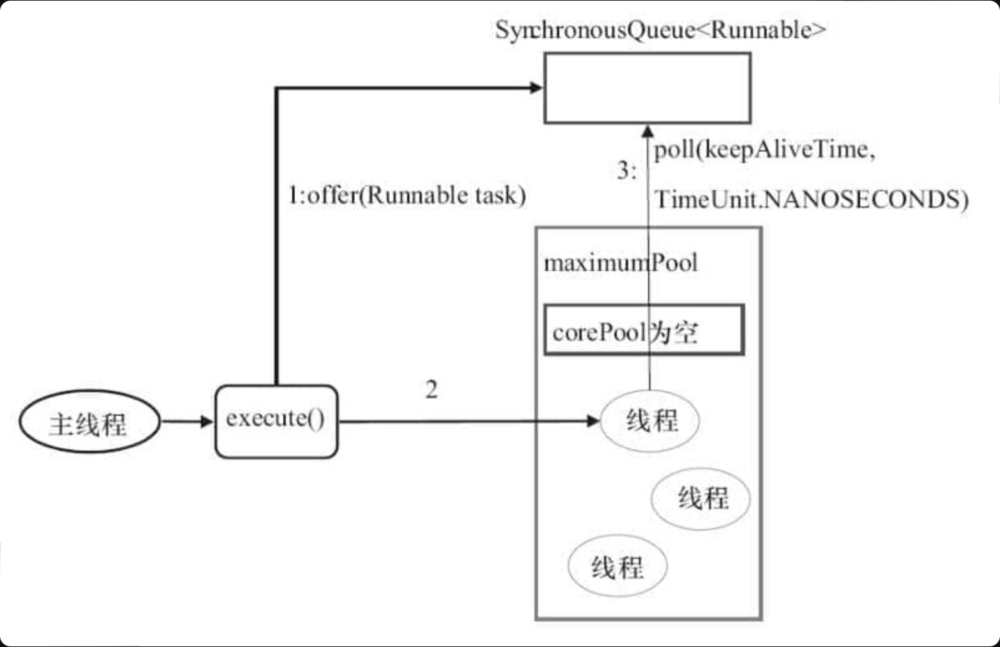

### Java 线程和操作系统的线程

在 Windows 和 Linux 等主流操作系统中，Java 线程采用的是一对一的线程模型，也就是一个 Java 线程对应一个系统内核线程。


### 虚拟机栈和本地方法栈为什么是私有的?

- **虚拟机栈：** 每个 Java 方法在执行之前会创建一个**栈帧用于存储局部变量表、操作数栈、常量池引用等信息**。从方法调用直至执行完成的过程，就对应着一个栈帧在 Java 虚拟机栈中入栈和出栈的过程。
- **本地方法栈：** 和虚拟机栈所发挥的作用非常相似，区别是：**虚拟机栈为虚拟机执行 Java 方法 （也就是字节码）服务，而本地方法栈则为虚拟机使用到的 Native 方法服务。** 在 HotSpot 虚拟机中和 Java 虚拟机栈合二为一。

### 如何创建线程

创建线程有很多种方式，例如**继承`Thread`类、实现`Runnable`接口、实现`Callable`接口、使用线程池、使用`CompletableFuture`类**等等。但严格来说，Java 就只有一种方式可以创建线程，那就是通过`new Thread().start()`创建。**不管是哪种方式，最终还是依赖于`new Thread().start()`**。

### 生命周期

- **NEW**: 初始状态，线程被创建出来但没有被调用 `start()` 。
- **RUNNABLE**: 运行状态，线程被调用了 `start()`等待运行的状态。
- **BLOCKED**：阻塞状态，需要<u>等待**锁**</u>释放。
- **WAITING**：等待状态，表示该线程需要<u>等待**其他线程**做出一些特定动作</u>（通知或中断）。
- **TIME_WAITING**：**超时等待状态**，<u>可以在指定的时间后自行返</u>回而不是像 WAITING 那样一直等待。
- **TERMINATED**：终止状态，表示该线程已经运行完毕。


### Sleep和wait

- **`sleep()` 方法没有释放锁，而 `wait()` 方法释放了锁** 。

- `wait()` 通常被用于线程间交互/通信，`sleep()`通常被用于暂停执行。

- **`wait()` 方法被调用后，线程不会自动苏醒**，需要别的线程调用同一个对象上的 `notify()`或者 `notifyAll()` 方法。**`sleep()`方法执行完成后，线程会自动苏醒**，或者也可以使用 `wait(long timeout)` 超时后线程会自动苏醒。

- `sleep()` 是 `Thread` 类的静态本地方法，`wait()` 则是 `Object` 类的本地方法。

  > 为什么wait方法不定义在 Thread 中？**`wait()` 是让获得对象锁的线程实现等待**，会自动释放当前线程占有的对象锁。每个对象（`Object`）都拥有对象锁，既然要释放当前线程占有的对象锁并让其进入 WAITING 状态，自然是要操作对应的对象（`Object`）而非当前的线程（`Thread`）
  >
  > `sleep()` 是让当前线程暂停执行，不涉及到对象类，也不需要获得对象锁。所以可以定义在Thread中

### 可以直接用调Thread中的run方法吗？

new 一个 `Thread`，线程进入了新建状态。调用 `start()`方法，会启动一个线程并使线程进入了就绪状态，当分配到时间片后就可以开始运行了。 <u>**`start()` 会执行线程的相应准备工作，然后自动执行 `run()` 方法的内容**</u>，这是真正的多线程工作。 但是，**直接执行 `run()` 方法，会把 `run()` 方法当成一个 main 线程下的普通方法去执行，并不会在某个线程中**执行它，所以这并不是多线程工作。

## 关键字

### volatile关键字

+ `volatile` 关键字可以保证变量的可见性。如果我们将变量声明为 **`volatile`** ，这就指示 JVM，这个变量是**共享且不稳定的，每次使用它都到主存中进行读取**。

+ `volatile` 关键字能**保证数据的可见性**，但**不能保证数据的原子性**。`synchronized` 关键字两者都能保证。

+ `volatile` 关键字除了可以保证变量的可见性，还有一个重要的作用就是**防止 JVM 的指令重排序**

  > 指令重排在单线程环境下不会出现问题，但是在多线程环境下会导致一个线程获得还没有初始化的实例（单例模式下）。

### synchronized 关键字

+ 只能实现**非公平锁**

#### 如何使用synchronized

1. 修饰实例方法：锁当前对象实例（通过此对象实例来调用的方法）

   ```java
   synchronized void method() {
       //业务代码
   }
   ```

2. 修饰静态方法：锁当前类，作用于类的所有对象

   ```java
   synchronized static void method() {
       //业务代码
   }
   ```

3. 修饰代码块

   ```java
   synchronized(this) {
       //业务代码
   }
   //synchronized(object) 表示进入同步代码库前要获得 给定对象的锁。
   //synchronized(类.class) 表示进入同步代码前要获得 给定 Class 的锁
   ```

+ **构造方法不能使用 synchronized 关键字修饰**（因为构造函数本身是线程安全的）

#### 底层原理

`synchronized` 同步语句块的实现使用的是 `monitorenter` 和 `monitorexit` 指令，其中 `monitorenter` 指令指向同步代码块的开始位置，`monitorexit` 指令则指明同步代码块的结束位置。

`synchronized` 修饰的方法并没有 `monitorenter` 指令和 `monitorexit` 指令，取得代之的确实是 `ACC_SYNCHRONIZED`标识，该标识指明了该方法是一个同步方法。

**不过两者的本质都是对对象监视器 monitor 的获取。**

### synchronized 和volatile 有什么区别？

`synchronized` 关键字和 `volatile` 关键字是两个互补的存在，而不是对立的存在！

- **`volatile`** 关键字是线程同步的**轻量级**实现，所以 `volatile`**性能**肯定比`synchronized`关键字要**好** 。但是 `volatile` 关键字**只能用于变量**而 **`synchronized` 关键字可以修饰方法以及代码块** 。
- **`volatile`** 关键字能保证数据的可见性，但**不能保证数据的原子性**。`synchronized` 关键字两者都能保证。
- **`volatile`**关键字主要用于解决变量在多个线程之间的**可见性**，而 `synchronized` 关键字解决的是多个线程之间访问资源的**同步性**。

### ReentrantLock

和 `synchronized` 关键字类似。不过，`ReentrantLock` 更灵活、更强大，增加了轮询、超时、中断、公平锁和非公平锁等高级功能

+ `ReentrantLock` 默认使用非公平锁

#### synchronized 和 ReentrantLock 有什么区别？

+ 都是**可重入锁**（也叫递归锁，指的是<u>线程可以再次获取自己的内部锁</u>）

  ```java
  public class SynchronizedDemo {
      public synchronized void method1() {
          System.out.println("方法1");
          method2();
      }
  
      public synchronized void method2() {
          System.out.println("方法2");
      }
    	//如果不可重入，method1需要method2.而2又进不去。导致死锁
  }
  ```

+ **synchronized 依赖于JVM** ，而 ReentrantLock 依赖于 API（`ReentrantLock` 是 JDK 层面实现的，也就是 API 层面，需要 lock() 和 unlock() 方法配合 try/finally 语句块来完成，所以我们可以通过查看它的源代码，来看它是如何实现的）

#### Reentrantlock 比svnchronized 增加了一些高级功能

+ **等待可中断** : `ReentrantLock`提供了一种能够中断等待锁的线程的机制，通过 `lock.lockInterruptibly()` 来实现这个机制。也就是说**正在等待的线程可以选择放弃等待**，改为处理其他事情。

+ **可实现公平锁** : `ReentrantLock`可以指定是公平锁还是非公平锁。而`synchronized`只能是非公平锁。所谓的公平锁就是先等待的线程先获得锁。`ReentrantLock`默认情况是非公平的，可以通过 `ReentrantLock`类的`ReentrantLock(boolean fair)`构造方法来指定是否是公平的。

+ **可实现选择性通知（锁可以绑定多个条件）**: `synchronized`关键字与`wait()`和`notify()`/`notifyAll()`方法相结合可以实现等待/通知机制。`ReentrantLock`类当然也可以实现，但是需要借助于`Condition`接口与`newCondition()`方法。

## StampedLock

性能更好的读写锁，不可重入且不支持条件变量

`StampedLock` 提供了**三种模式**的读写控制模式：读锁、写锁和乐观读。

- **写锁**：独占锁，一把锁只能被一个线程获得。当一个线程获取写锁后，其他请求读锁和写锁的线程必须等待。类似于 `ReentrantReadWriteLock` 的写锁，不过这里的写锁是不可重入的。
- **读锁** （悲观读）：共享锁，没有线程获取写锁的情况下，多个线程可以同时持有读锁。如果己经有线程持有写锁，则其他线程请求获取该读锁会被阻塞。类似于 `ReentrantReadWriteLock` 的读锁，不过这里的读锁是不可重入的。
- **乐观读**：允许多个线程获取乐观读以及读锁。同时允许一个写线程获取写锁

#### 为什么性能好

相比于传统读写锁多出来的乐观读是`StampedLock`比 `ReadWriteLock` 性能更好的关键原因。`StampedLock` 的乐观读允许一个写线程获取写锁，所以不会导致所有写线程阻塞，也就是当**读多写少**的时候，写线程有机会获取写锁，减少了线程饥饿的问题，吞吐量大大提高

#### 适合场景


## 乐观锁和悲观锁

### 应用场景

+ 悲观锁多用于「写」比较多的场景。（如果解决了频繁失败和重试的话也可以乐观锁）
+ 乐观锁多用于「写」比较少的场景，主要针对的对象是单个共享变量

### 悲观锁

悲观锁总是假设最坏的情况，认为共享资源每次被访问的时候就会出现问题(比如共享数据被修改)，所以<u>**每次**在获取资源操作的时候都会上锁</u>，这样其他线程想拿到这个资源就会阻塞直到锁被上一个持有者释放。也就是说，**共享资源每次只给一个线程使用，其它线程阻塞，用完后再把资源转让给其它线程**

+ Java 中`synchronized`和`ReentrantLock`等独占锁就是悲观锁思想的实现

### 乐观锁

乐观锁总是假设最好的情况，认为共享资源每次被访问的时候不会出现问题，线程可以不停地执行，<u>无需加锁也无需等待</u>，**只是在提交修改的时候去验证对应的资源（也就是数据）是否被其它线程修改了**（具体方法可以使用**版本号**机制或 **CAS** 算法）

+ Java 中`java.util.concurrent.atomic`包下面的原子变量类（比如`AtomicInteger`、`LongAdder`）就是使用了乐观锁的一种实现方式 **CAS** 实现

#### 版本号

当线程 A 要更新数据值时，在读取数据的同时也会读取 `version` 值，在提交更新时，若刚才读取到的 version 值为当前数据库中的 `version` 值相等时才更新，否则重试更新操作，直到更新成功。

#### CAS算法

全称是 **Compare And Swap（比较与交换）**，思想很简单，就是用一个预期值和要更新的变量值进行比较，两值相等才会进行更新。CAS 是一个原子操作，底层依赖于一条 CPU 的原子指令。

CAS 涉及到三个操作数：当且仅当 **V 的值等于 E** 时，CAS 通过原子方式**用新值 N 来更新 V** 的值。如果不等，说明已经有其它线程更新了 V，则当前线程放弃更新

- **V**：要更新的变量值(Var)
- **E**：预期值(Expected)
- **N**：拟写入的新值(New)

> 线程 A 要修改变量 i 的值为 6，i 原值为 1（V = 1，E=1，N=6）。

+ CAS存在 **ABA问题**（修改后改回会被认为没修改），解决思路是在变量前面追加上**版本号或者时间戳**

+ CAS 经常会用到自旋操作来进行重试，也就是不成功就一直循环执行直到成功。如果长时间不成功，会给 CPU 带来非常大的执行开销

  > 如果 JVM 能支持处理器提供的 pause 指令那么效率会有一定的提升，pause 指令有两个作用：
  >
  > 1. 可以延迟流水线执行指令，使 CPU 不会消耗过多的执行资源，延迟的时间取决于具体实现的版本，在一些处理器上延迟时间是零。
  > 2. 可以避免在退出循环的时候因内存顺序冲突而引起 CPU 流水线被清空，从而提高 CPU 的执行效率。

+ CAS **只对单个共享变量有效**，当操作涉及跨多个共享变量时 CAS 无效

  > 从 JDK 1.5 开始，提供了`AtomicReference`类来保证引用对象之间的原子性，你可以把多个变量放在一个对象里来进行 CAS 操作.所以我们可以使用锁或者利用`AtomicReference`类把多个共享变量合并成一个共享变量来操作

## 可中断锁和不可中断锁

- **可中断锁**：获取锁的过程中可以被中断，不需要一直等到获取锁之后 才能进行其他逻辑处理。`ReentrantLock` 就属于是可中断锁。
- **不可中断锁**：一旦线程申请了锁，就只能等到拿到锁以后才能进行其他的逻辑处理。 `synchronized` 就属于是不可中断锁。

## 共享锁和独占锁

- **共享锁**：一把锁可以被多个线程同时获得。
- **独占锁**：一把锁只能被一个线程获得。

## 读锁和写锁

- 在线程**持有读锁**的情况下，该线程**不能取得写锁**(因为获取写锁的时候，如果发现当前的读锁被占用，就马上获取失败，不管读锁是不是被当前线程持有)。
- 在线程**持有写锁**的情况下，该线程**可以继续获取读锁**（获取读锁时如果发现写锁被占用，只有写锁没有被当前线程占用的情况才会获取失败）

**写锁可以被降级为读锁，但不能反向**

## TreadLocal

### TreadLocal内存泄漏是如何发生的

`ThreadLocalMap` 中使用的 key 为 `ThreadLocal` 的弱引用（垃圾回收器不管当前内存空间是否足够都会回收），而 value 是强引用。如果 `ThreadLocal` 没有被外部强引用的情况下，在垃圾回收的时候，key 会被清理掉，而 value 不会被清理掉。`ThreadLocalMap` 实现中已经考虑了这种情况，在调用 `set()`、`get()`、`remove()` 方法的时候，会清理掉 key 为 null 的记录。使用完 `ThreadLocal`方法后最好手动调用`remove()`方法

## 线程池

- **降低资源消耗**。通过重复利用已创建的线程**降低线程创建和销毁造成的消耗**。
- **提高响应速度**。当任务到达时，任务可以不需要等到线程创建就能立即执行。
- **提高线程的可管理性**。线程是稀缺资源，如果无限制的创建，不仅会消耗系统资源，还会降低系统的稳定性，使用线程池可以进行统一的分配，调优和监控。

### 创建线程池

1. 推荐TreadPoolExecutor的构造函数

2. Executor框架的工具类

   1. FixedThreadPool：固定线程数量，当线程满时任务会被暂存。LinkedBlockingQueue是**无界队列**永远不会放满。到能导致OOM

      

   2. SingleThreadExecutor：只有一个线程的线程池

      只是corePool容量变为1了而已

   3. CachedThreadPool：不固定数量的线程池

      corePoolSize=0，maximumPoolSize实际无界。可能到耗尽cpu和内存资源。可能导致OOM

      

      > 1. 首先执行 `SynchronousQueue.offer(Runnable task)` 提交任务到任务队列。如果当前 `maximumPool` 中有闲线程正在执行 `SynchronousQueue.poll(keepAliveTime,TimeUnit.NANOSECONDS)`，那么主线程执行 offer 操作与空闲线程执行的 `poll` 操作配对成功，主线程把任务交给空闲线程执行，`execute()`方法执行完成，否则执行下面的步骤 2；
      > 2. 当初始 `maximumPool` 为空，或者 `maximumPool` 中**没有空闲线程时**，将没有线程执行 `SynchronousQueue.poll(keepAliveTime,TimeUnit.NANOSECONDS)`。这种情况下，步骤 1 将失败，此时 **`CachedThreadPool` 会创建新线程执行任务，execute 方法执行完成**；

   4. ScheduledThreadPool：定期执行任务/延迟后执行任务：基本不会用到

### Executor

有助于避免this逃逸问题：*this 逃逸是指在构造函数返回之前其他线程就持有该对象的引用，调用尚未构造完全的对象的方法可能引发令人疑惑的错误。*

> 主线程首先要创建实现 `Runnable` 或者 `Callable` 接口的任务对象。
>
> 把创建完成的实现 `Runnable`/`Callable`接口的 对象直接交给 `ExecutorService` 执行: **`ExecutorService.execute（Runnable command）`**）或者也可以把 `Runnable` 对象或`Callable` 对象提交给 `ExecutorService` 执行（**`ExecutorService.submit（Runnable task）`**或 `ExecutorService.submit（Callable <T> task）`）。
>
> 如果执行 `ExecutorService.submit（…）`，`ExecutorService` 将返回一个实现`Future`接口的对象（我们刚刚也提到过了执行 `execute()`方法和 `submit()`方法的区别，**`submit()`会返回一个 `FutureTask`对象**）。由于 `FutureTask` 实现了 `Runnable`，我们也可以创建 `FutureTask`，然后直接**交给 `ExecutorService` 执行**。
>
> 最后，主线程可以执行 **`FutureTask.get()`方法来等待任务执行完成（结果）**。主线程也可以执行 `FutureTask.cancel（boolean mayInterruptIfRunning）`来取消此任务的执行

#### 任务：Runnable/Callable

**`Runnable` 接口**或 **`Callable` 接口** 实现类都可以被 **`ThreadPoolExecutor`** 或 **`ScheduledThreadPoolExecutor`** 执行

#### 任务的执行：Executor

任务执行机制的核心接口 **`Executor`** ，以及继承自 `Executor` 接口的 **`ExecutorService` 接口**

#### 异步计算的结果：Future

**`Future`** 接口以及 `Future` 接口的实现类 **`FutureTask`** 类都可以代表异步计算的结果。

### 线程池流程


### 线程池大小的设置

+ 线程池的大小设置不宜太小或太大

**CPU 密集型任务(N+1)：** 这种任务消耗的主要是 CPU 资源，可以将线程数设置为 N（CPU 核心数）+1。比 CPU 核心数多出来的一个线程是为了防止线程偶发的缺页中断，或者其它原因导致的任务暂停而带来的影响。一旦任务暂停，CPU 就会处于空闲状态，而在这种情况下多出来的一个线程就可以充分利用 CPU 的空闲时间。

**I/O 密集型任务(2N)：** 这种任务应用起来，系统会用大部分的时间来处理 I/O 交互，而线程在处理 I/O 的时间段内不会占用 CPU 来处理，这时就可以将 CPU 交出给其它线程使用。因此在 I/O 密集型任务的应用中，我们可以多配置一些线程，具体的计算方法是 2N

> 线程数更严谨的计算的方法应该是：`最佳线程数 = N（CPU 核心数）∗（1+WT（线程等待时间）/ST（线程计算时间））`，其中 `WT（线程等待时间）=线程运行总时间 - ST（线程计算时间）`。
>
> **线程等待时间所占比例越高，需要越多线程**。线程计算时间所占比例越高，需要越少线程。

### 动态修改线程池的参数

**`corePoolSize`**  、**`workQueue`**、**`maximumPoolSize`**

> 1. 新任务到来时，首先会尝试满足 `corePoolSize`，如果当前线程数小于 `corePoolSize`，则会创建新的线程来处理任务，直到达到 `corePoolSize`。
> 2. 如果当前线程数已经达到了 `corePoolSize`，则新任务会尝试放入 `workQueue` 中，等待空闲线程来处理。
> 3. 如果 `workQueue` 已满，但是当前线程数小于 `maximumPoolSize`，则会创建新的线程来处理任务，直到达到 `maximumPoolSize`。
> 4. 如果 `workQueue` 和线程池都已满，并且达到了 `maximumPoolSize`，则会根据设置的拒绝策略来处理新提交的任务，可能会抛出拒绝执行异常或者执行其他拒绝策略。

### 根据任务优先级只执行的线程池

+ FixedThreadPool使用的是LinkedBlockingQueue（无界队列）。因为它永远不会满，所以FiexedThreadPool最多只能创建核心线程数的线程

+ 如果要实现优先级任务线程池的话考虑：PriorityBlockingQueue（优先级阻塞队列）作为任务队列。

  > 方法一：提交到线程池的任务实现 `Comparable` 接口，并重写 `compareTo` 方法来指定任务之间的优先级比较规则。
  >
  > 方法二：创建 `PriorityBlockingQueue` 时传入一个 `Comparator` 对象来指定任务之间的排序规则(推荐)

​	对于 OOM 这个问题的解决比较简单粗暴，就是继承`PriorityBlockingQueue` 并重写一下 `offer` 方法(入队)的逻辑，当插入的元素数量超过指定值就返回 false 

​	饥饿问题这个可以通过优化设计来解决（比较麻烦），比如等待时间过长的任务会被移除并重新添加到队列中，但是优先级会被提升。

## Future

等我们的事情干完后，我们再通过 `Future` 类获取到耗时任务的执行结果。主要包括4个功能

- 取消任务；cancel
- 判断任务是否被取消; isCancelled
- 判断任务是否已经执行完成; isDone
- 获取任务执行结果。get

#### Callable和Future

FutureTask 提供了 Future 接口的基本实现，常用来封装 Callable 和 Runnable。`FutureTask` 不光实现了 `Future`接口，还实现了`Runnable` 接口。`FutureTask` 有两个构造函数，可传入 `Callable` 或者 `Runnable` 对象。

### CompleteableFuture

`Future` 在实际使用过程中存在一些局限性比如<u>不支持异步任务的编排组合</u>、获取计算结果的 `get()` 方法为阻塞调用。

## AQS

AQS 就是一个抽象类，主要用来构建锁和同步器。

AQS 核心思想是，如果**被请求的共享资源空闲，则将当前请求资源的线程设置为有效的工作线程，并且将共享资源设置为锁定状态**。如果**被请求的共享资源被占用，那么就需要一套线程阻塞等待以及被唤醒时锁分配的机制**，这个机制 AQS 是用 **CLH 队列锁** 实现的，即将暂时获取不到锁的线程加入到队列中。

> CLH(Craig,Landin,and Hagersten) 队列是一个虚拟的双向队列（虚拟的双向队列即不存在队列实例，仅存在结点之间的关联关系）。AQS 是将每条请求共享资源的线程封装成一个 CLH 锁队列的一个结点（Node）来实现锁的分配。在 CLH 同步队列中，一个节点表示一个线程，它保存着线程的引用（thread）、 当前节点在队列中的状态（waitStatus）、前驱节点（prev）、后继节点（next）

AQS 使用 **int 成员变量 `state` 表示同步状态**，通过内置的 **线程等待队列** 来完成获取资源线程的排队工作


`state` 变量由 `volatile` 修饰，用于展示当前临界资源的获锁情况。

> **以 `ReentrantLock` 为例**，`state` 初始值为 **0，表示未锁定状态**。A 线程 `lock()` 时，会调用 `tryAcquire()` 独占该锁并将 `state+1` 。此后，其他线程再 `tryAcquire()` 时就会失败，<u>直到 A 线程 `unlock()` 到 `state=`0（即释放锁）为止，其它线程才有机会获取该锁</u>。当然，释放锁之前，**A 线程自己是可以重复获取此锁的**（`state` 会累加），这就是可重入的概念。**但要注意，获取多少次就要释放多少次**，这样才能保证 state 是能回到零态的。
>
> 再**以 `CountDownLatch` 以例**，任务分为 N 个子线程去执行，**`state` 也初始化为 N**（注意 N 要与线程个数一致）。这 N 个子线程是并行执行的，每个子线程执行完后`countDown()` 一次，state 会 CAS(Compare and Swap) 减 1。等到所有子线程都执行完后(即 `state=0` )，会 `unpark()` 主调用线程，然后主调用线程就会从 `await()` 函数返回，继续后余动作

## Semaphore

`synchronized` 和 `ReentrantLock` 都是**一次只允许一个线程**访问某个资源，而`Semaphore`(信号量)可以用来控制同时访问特定资源的线程数量。`Semaphore` 通常用于那些资源有明确访问数量限制的场景比如限流（但实际场景一般用Redis+Lua)

Semaphore 是共享锁的一种实现，它**默认构造 AQS 的 state 值为 permits**。

调用`semaphore.acquire()` ，线程尝试获取许可证，如果 `state >= 0` 的话，则表示可以获取成功。如果获取成功的话，使用 CAS 操作去修改 `state` 的值 `state=state-1`。如果 `state<0` 的话，则表示许可证数量不足。此时会创建一个 Node 节点加入阻塞队列，挂起当前线程。

调用`semaphore.release();` ，线程尝试释放许可证，并使用 CAS 操作去修改 `state` 的值 `state=state+1`。释放许可证成功之后，同时会 *唤醒同步队列中的一个线程* 。被唤醒的线程会重新尝试去修改 `state` 的值 `state=state-1`，如果 `state>=0` 则获取令牌成功，否则重新进入阻塞队列，挂起线程。

`Semaphore` 有两种模式：

- **公平模式：** 调用 `acquire()` 方法的顺序就是获取许可证的顺序，遵循 FIFO；
- **非公平模式：** 默认的，抢占式的。

> ```java
> public Semaphore(int permits) {
>     sync = new NonfairSync(permits);
> }
> 
> public Semaphore(int permits, boolean fair) {
>     sync = fair ? new FairSync(permits) : new NonfairSync(permits);
> }
> 
> ```

## CountDownLatch

`CountDownLatch` 允许 `count` 个线程阻塞在一个地方，直至所有线程的任务都执行完毕。是一次性的，计数器的值只能在构造方法中初始化一次。

CountDownLatch 是共享锁的一种实现,它默认构造 AQS 的 state 值为 count。

当线程使用 `countDown()` 方法时,其实使用了`tryReleaseShared`方法以 CAS 的操作来减少 `state`,直至 `state` 为 0 。当调用 `await()` 方法的时候，如果 `state` 不为 0，那就证明任务还没有执行完毕，`await()` 方法就会一直阻塞。

#### 一个读取多个文件的使用场景

```java
public class CountDownLatchExample1 {
    // 处理文件的数量
    private static final int threadCount = 6;

    public static void main(String[] args) throws InterruptedException {
        // 创建一个具有固定线程数量的线程池对象（推荐使用构造方法创建）
        ExecutorService threadPool = Executors.newFixedThreadPool(10);
        final CountDownLatch countDownLatch = new CountDownLatch(threadCount);
      
        for (int i = 0; i < threadCount; i++) {
            final int threadnum = i;
            threadPool.execute(() -> {
                try {
                    //处理文件的业务操作
                    //......
                } catch (InterruptedException e) {
                    e.printStackTrace();
                } finally {
                    //表示一个文件已经被完成
                    countDownLatch.countDown();
                }

            });
        }
        countDownLatch.await();
      
        threadPool.shutdown();
        System.out.println("finish");
    }
}
```

## CompleteableFuture

对上面的代码进行优化

```java
CompletableFuture<Void> task1 =
    CompletableFuture.supplyAsync(()->{
        //自定义业务操作
    });
......
CompletableFuture<Void> task6 =
    CompletableFuture.supplyAsync(()->{
    //自定义业务操作
    });
......
//headerFuture实例会在其中的所有任务都执行完成后变为已完成状态。
CompletableFuture<Void> headerFuture=CompletableFuture.allOf(task1,.....,task6);
try {
    headerFuture.join();//join() 方法会阻塞当前线程，直到headerFuture实例变为已完成状态。
} catch (Exception ex) {
    //......
}
System.out.println("all done. ");

```

继续优化代码

```java
//文件夹位置
List<String> filePaths = Arrays.asList(...)
// 异步处理所有文件
List<CompletableFuture<String>> fileFutures = filePaths.stream()
    .map(filePath -> doSomeThing(filePath))
    .collect(Collectors.toList());
// 将他们合并起来
CompletableFuture<Void> allFutures = CompletableFuture.allOf(
    fileFutures.toArray(new CompletableFuture[fileFutures.size()])
);

```

## CyclicBarrier

类似于CountDownLatch，但更强大。应用场景也类似

> `CountDownLatch` 的实现是基于 AQS 的，而 `CycliBarrier` 是基于 `ReentrantLock`(`ReentrantLock` 也属于 AQS 同步器)和 `Condition` 的。

#### 原理

`CyclicBarrier` 内部通过一个 `count` 变量作为计数器，`count` 的初始值为 `parties` 属性的初始化值，每当一个线程到了栅栏这里了，那么就将计数器减 1。如果 count 值为 0 了，表示这是这一代最后一个线程到达栅栏，就尝试执行我们构造方法中输入的任务。（常常是同步多个线程一起开始执行后续操作）（和CountDownLatch基本一致）

## ThreadPoolExecutor

+ 阿里开发手册强制使用此方式，而禁止了Executors去创建进程

三个最重要的参数：corePoolSize、maximumPoolSize、workQueue

其他常见参数：keepAliveTime、unit、threadFactory、handler

### 饱和时策略

`ThreadPoolExecutor.AbortPolicy`：**抛出异常** `RejectedExecutionException`来**拒绝新任务的处理**。

`ThreadPoolExecutor.CallerRunsPolicy`：**调用执行自己的线程运行任务**，也就是直接在调用`execute`方法的线程中运行(`run`)被拒绝的任务，**如果执行程序已关闭，则会丢弃该任务**。因此这种策略会降低对于新任务提交速度，影响程序的整体性能。如果您的应用程序可以承受此延迟并且你要求任何一个任务请求都要被执行的话，你可以选择这个策略。（举例A生成B线程，但满了，此时B占用A线程来完成任务）

`ThreadPoolExecutor.DiscardPolicy`：不处理新任务，**直接丢弃掉**。

`ThreadPoolExecutor.DiscardOldestPolicy`：此策略将**丢弃最早的未处理的任务请求**。

## 几个常见对比

### Runnable和Callable

**`Runnable` 接口**不会返回结果或抛出检查异常，但是 **`Callable` 接口**可以。

工具类 `Executors` 可以实现将 `Runnable` 对象转换成 `Callable` 对象。

> `Executors.callable(Runnable task)` 或 `Executors.callable(Runnable task, Object result)`

### execute()和submit()

1. `execute()`方法用于提交不需要返回值的任务，所以无法判断任务是否被线程池执行成功与否；

2. `submit()`方法用于提交需要返回值的任务。线程池会返回一个 `Future` 类型的对象，通过这个 `Future` 对象可以判断任务是否执行成功，并且可以通过 `Future` 的 `get()`方法来获取返回值，`get()`方法会阻塞当前线程直到任务完成，而使用 `get（long timeout，TimeUnit unit）`方法的话，如果在 `timeout` 时间内任务还没有执行完，就会抛出 `java.util.concurrent.TimeoutException`。

### shutdown()和shutdownNow()

- **`shutdown（）`** :关闭线程池，线程池的状态变为 `SHUTDOWN`。线程池不再接受新任务了，但是**队列里的任务得执行完毕。**
- **`shutdownNow（）`** :关闭线程池，线程池的状态变为 `STOP`。线程池**会终止当前正在运行的任务**，并停止处理排队的任务并**返回正在等待执行的 List**。

#### isTerminated() 和isShutdown()

- **`isShutDown`** 当调用 `shutdown()` 方法后返回为 true。
- **`isTerminated`** 当调用 `shutdown()` 方法后，并且**所有提交的任务完成后返回为 true**

#### ScheduledThreadPoolExecutor 和 Timer 对比（不太重要）

- `Timer` 对系统时钟的变化敏感，`ScheduledThreadPoolExecutor`不是；
- `Timer` 只有一个执行线程，因此长时间运行的任务可以延迟其他任务。 `ScheduledThreadPoolExecutor` 可以配置任意数量的线程。 此外，如果你想（通过提供 `ThreadFactory`），你可以完全控制创建的线程;
- 在`TimerTask` 中抛出的运行时异常会杀死一个线程，从而导致 `Timer` 死机即计划任务将不再运行。`ScheduledThreadExecutor` 不仅捕获运行时异常，还**允许您在需要时处理它们**（通过重写 `afterExecute` 方法`ThreadPoolExecutor`）。**抛出异常的任务将被取消，但其他任务将继续运行**。

## 线程池最佳实践

### 正确声明线程池

**线程池必须手动通过 `ThreadPoolExecutor` 的构造函数来声明，避免使用`Executors` 类创建线程池，会有 OOM 风险**

### 监测线程池运行状态

```java
public static void printThreadPoolStatus(ThreadPoolExecutor threadPool) {
    ScheduledExecutorService scheduledExecutorService = new ScheduledThreadPoolExecutor(1, createThreadFactory("print-images/thread-pool-status", false));
    scheduledExecutorService.scheduleAtFixedRate(() -> {
        log.info("=========================");
        log.info("ThreadPool Size: [{}]", threadPool.getPoolSize());
        log.info("Active Threads: {}", threadPool.getActiveCount());
        log.info("Number of Tasks : {}", threadPool.getCompletedTaskCount());
        log.info("Number of Tasks in Queue: {}", threadPool.getQueue().size());
        log.info("=========================");
    }, 0, 1, TimeUnit.SECONDS);
}
```

### 建议不同类别的业务用不同的线程池

### 线程池命名

1. 利用guava的ThreadFactoryBuilder

   ```java
   ThreadFactory threadFactory = new ThreadFactoryBuilder()
                           .setNameFormat(threadNamePrefix + "-%d")
                           .setDaemon(true).build();
   ExecutorService threadPool = new ThreadPoolExecutor(corePoolSize, maximumPoolSize, keepAliveTime, TimeUnit.MINUTES, workQueue, threadFactory)
   ```

2. 自己实现ThreadFactory

   ```java
   import java.util.concurrent.ThreadFactory;
   import java.util.concurrent.atomic.AtomicInteger;
   
   /**
    * 线程工厂，它设置线程名称，有利于我们定位问题。
    */
   public final class NamingThreadFactory implements ThreadFactory {
   
       private final AtomicInteger threadNum = new AtomicInteger();
       private final String name;
   
       /**
        * 创建一个带名字的线程池生产工厂
        */
       public NamingThreadFactory(String name) {
           this.name = name;
       }
   
       @Override
       public Thread newThread(Runnable r) {
           Thread t = new Thread(r);
           t.setName(name + " [#" + threadNum.incrementAndGet() + "]");
           return t;
       }
   }
   
   ```

### 正确配置线程池参数

**CPU 密集型任务(N+1)**、**I/O 密集型任务(2N)**

### 关闭线程池

调用完 `shutdownNow` 和 `shuwdown` 方法后，并不代表线程池已经完成关闭操作，它只是异步的通知线程池进行关闭处理。如果要同步等待线程池彻底关闭后才继续往下执行，需要调用`awaitTermination`方法进行同步等待。调用 `awaitTermination()` 方法时，应该设置合理的超时时间，以避免程序长时间阻塞而导致性能问题

### 线程池不要放耗时任务

应该尽量避免将耗时任务提交到线程池中执行。对于一些**比较耗时的操作**，如网络请求、文件读写等，可以**采用异步操作的方式来处理**，以避免阻塞线程池中的线程

### 坑

1. 线程池可以重复使用，不需要重复创建（比如一个请求创建一个线程池）

2. 使用 Spring 内部线程池时，一定要手动自定义线程池，配置合理的参数，不然会出现生产问题（一个请求创建一个线程）

3. **线程池和 `ThreadLocal`共用，可能会导致线程从`ThreadLocal`获取到的是旧值/脏数据**。这是因为线程池会复用线程对象，与线程对象绑定的类的静态属性 `ThreadLocal` 变量也会被重用，这就导致一个线程可能获取到其他线程的`ThreadLocal` 值。

   不要以为代码中没有显示使用线程池就不存在线程池了，像**常用的 Web 服务器 Tomcat 处理任务为了提高并发量，就使用到了线程池**，并且使用的是基于原生 Java 线程池改进完善得到的自定义线程池

## 常见并发容器

### ConcurrentHashMap

1. Java1.7：`ConcurrentHashMap` 对整个桶数组进行了分割分段(`Segment`，分段锁)，每一把锁只锁容器其中一部分数据（下面有示意图），多线程访问容器里不同数据段的数据，就不会存在锁竞争，提高并发访问率。
2. 到了 JDK1.8 的时候，`ConcurrentHashMap` 已经摒弃了 `Segment` 的概念，而是直接用 **`Node` 数组+链表+红黑树**的数据结构来实现，并发控制使用 `synchronized` 和 CAS 来操作。（JDK1.6 以后 `synchronized` 锁做了很多优化） 整个看起来就像是优化过且线程安全的 `HashMap`，虽然在 JDK1.8 中还能看到 `Segment` 的数据结构，但是已经简化了属性，只是为了兼容旧版本

### CopyOn WriteArrayList

Vector性能十分低下，CopyOn WriteArrayList是JUC唯一线程安全的实现：读读不互斥、读写互斥、写写互斥。

实现策略：写时复制（创建副本、修改副本、赋值回去）

## ConcurrentLinkedQueue和BlockingQueue

Java 提供的线程安全的 `Queue` 可以分为**阻塞队列**和**非阻塞队列**，其中阻塞队列的典型例子是 `BlockingQueue`，非阻塞队列的典型例子是 `ConcurrentLinkedQueue`。**阻塞队列可以通过加锁来实现，非阻塞队列可以通过 CAS（比较与交换）操作实现**

### 3 个常见的 `BlockingQueue` 的实现类

`ArrayBlockingQueue`、`LinkedBlockingQueue`、`PriorityBlockingQueue` 。

#### ArrayBlockingQueue

有界队列实现，底层使用数组。`ArrayBlockingQueue` 一旦创建，容量不能改变

默认非公平，如果保证公平性，通常会降低吞吐量。如果需要获得公平性的 `ArrayBlockingQueue`。

### LinkedBlockingQueue

基于单向链表，可以当做无界队列也可以当做有界队列来使用。

与 `ArrayBlockingQueue` 相比起来具有更高的吞吐量

为了防止 `LinkedBlockingQueue` 容量迅速增，损耗大量内存。通常在创建 `LinkedBlockingQueue` 对象时，会指定其大小。

#### PriorityBlockingQueue

默认情况下元素采用自然顺序进行排序，也可以通过自定义类实现 `compareTo()` 方法来指定元素排序规则。

采用的策略是可重入锁（ReentrantLock）。空间不够会自动扩容。

### ConcurrentskipListMap


## AQS

AQS 核心思想是，如果被请求的共享资源空闲，则将当前请求资源的线程设置为有效的工作线程，并且将共享资源设置为锁定状态。如果被请求的共享资源被占用，那么就需要一套线程阻塞等待以及被唤醒时锁分配的机制，这个机制 AQS 是基于 **CLH 锁** （Craig, Landin, and Hagersten locks） 实现的。（CLH是虚拟的双向队列）

AQS 定义两种资源共享方式：`Exclusive`（独占，只有一个线程能执行，如`ReentrantLock`）和`Share`（共享，多个线程可同时执行，如`Semaphore`/`CountDownLatch`）。但 AQS 也支持自定义同步器同时实现独占和共享两种方式，如`ReentrantReadWriteLock`

### 常见同步工具类

#### Semaphore

```java
public class SemaphoreExample {
  // 请求的数量
  private static final int threadCount = 550;

  public static void main(String[] args) throws InterruptedException {
    // 创建一个具有固定线程数量的线程池对象（如果这里线程池的线程数量给太少的话你会发现执行的很慢）
    ExecutorService threadPool = Executors.newFixedThreadPool(300);
    // 初始许可证数量
    final Semaphore semaphore = new Semaphore(20);

    for (int i = 0; i < threadCount; i++) {
      final int threadnum = i;
      threadPool.execute(() -> {// Lambda 表达式的运用
        try {
          semaphore.acquire();// 获取一个许可，所以可运行线程数量为20/1=20
          test(threadnum);
          semaphore.release();// 释放一个许可
        } catch (InterruptedException e) {
          // TODO Auto-generated catch block
          e.printStackTrace();
        }

      });
    }
    threadPool.shutdown();
    System.out.println("finish");
  }

  public static void test(int threadnum) throws InterruptedException {
    Thread.sleep(1000);// 模拟请求的耗时操作
    System.out.println("threadnum:" + threadnum);
    Thread.sleep(1000);// 模拟请求的耗时操作
  }
}

```

+ 除了 `acquire()` 方法之外，另一个比较常用的与之对应的方法是 `tryAcquire()` 方法，该方法如果获取不到许可就立即返回 false。

#### CountdownLatch

```java
public class CountDownLatchExample {
  // 请求的数量
  private static final int THREAD_COUNT = 550;

  public static void main(String[] args) throws InterruptedException {
    // 创建一个具有固定线程数量的线程池对象（如果这里线程池的线程数量给太少的话你会发现执行的很慢）
    // 只是测试使用，实际场景请手动赋值线程池参数
    ExecutorService threadPool = Executors.newFixedThreadPool(300);
    final CountDownLatch countDownLatch = new CountDownLatch(THREAD_COUNT);
    for (int i = 0; i < THREAD_COUNT; i++) {
      final int threadNum = i;
      threadPool.execute(() -> {
        try {
          test(threadNum);
        } catch (InterruptedException e) {
          e.printStackTrace();
        } finally {
          // 表示一个请求已经被完成
          countDownLatch.countDown();
        }

      });
    }
    countDownLatch.await();
    threadPool.shutdown();
    System.out.println("finish");
  }

  public static void test(int threadnum) throws InterruptedException {
    Thread.sleep(1000);
    System.out.println("threadNum:" + threadnum);
    Thread.sleep(1000);
  }
}

```

**CountDownLatch 的两种典型用法**：

1. 某一线程在开始运行前等待 n 个线程执行完毕 : 将 `CountDownLatch` 的计数器**初始化为 n** （`new CountDownLatch(n)`），每当一个任务线程执行完毕，就将计数器减 1 （`countdownlatch.countDown()`），当**计数器的值变为 0 时**，在 `CountDownLatch 上 await()` 的线程就会被唤醒。一个典型应用场景就是启动一个服务时，主线程需要等待多个组件加载完毕，之后再继续执行。(上面的示例代码)
2. 实现多个线程开始执行任务的最大**并行**性：注意是并行性，不是并发，强调的是多个线程在某一时刻同时开始执行。类似于赛跑，将多个线程放到起点，等待发令枪响，然后同时开跑。做法是初始化一个共享的 `CountDownLatch` 对象，将其**计数器初始化为 1** （`new CountDownLatch(1)`），多个线程在开始**执行任务前首先 `coundownlatch.await()`**，当**主线程调用 `countDown()` 时，计数器变为 0，多个线程同时被唤醒**。

#### CydlicBarrier(循环栅栏）

`CyclicBarrier` 和 `CountDownLatch` 非常类似，它也可以实现线程间的技术等待，但是它的功能比 `CountDownLatch`更加复杂和强大。主要应用场景和 `CountDownLatch` 类似。（让一组线程到达一个屏障（也可以叫同步点）时被阻塞，直到最后一个线程到达屏障时，屏障才会开门，所有被屏障拦截的线程才会继续干活）。

> CountDownLatch可以实现让一组进程同步开始干活，CydlicBarrier可以实现一开始不一起的线程变得同时开始某件事

```java
public class CyclicBarrierExample1 {
  // 请求的数量
  private static final int threadCount = 550;
  // 需要同步的线程数量
  private static final CyclicBarrier cyclicBarrier = new CyclicBarrier(5);

  public static void main(String[] args) throws InterruptedException {
    // 创建线程池
    ExecutorService threadPool = Executors.newFixedThreadPool(10);

    for (int i = 0; i < threadCount; i++) {
      final int threadNum = i;
      Thread.sleep(1000);
      threadPool.execute(() -> {
        try {
          test(threadNum);//test内有cyclicBarrier.await()
        } catch (InterruptedException e) {
          // TODO Auto-generated catch block
          e.printStackTrace();
        } catch (BrokenBarrierException e) {
          // TODO Auto-generated catch block
          e.printStackTrace();
        }
      });
    }
    threadPool.shutdown();
  }

  public static void test(int threadnum) throws InterruptedException, BrokenBarrierException {
    System.out.println("threadnum:" + threadnum + "is ready");
    try {
      /**等待60秒，保证子线程完全执行结束*/
      cyclicBarrier.await(60, TimeUnit.SECONDS);
    } catch (Exception e) {
      System.out.println("-----CyclicBarrierException------");
    }
    System.out.println("threadnum:" + threadnum + "is finish");
  }

}
threadnum:0is ready
threadnum:1is ready
threadnum:2is ready
threadnum:3is ready
threadnum:4is ready
threadnum:4is finish
threadnum:0is finish
threadnum:1is finish
threadnum:2is finish
threadnum:3is finish
还有更多的输出，略。
```

+ `CyclicBarrier` 还提供一个更高级的构造函数 `CyclicBarrier(int parties, Runnable barrierAction)`，用于在线程到达屏障时，优先执行 `barrierAction`，方便处理更复杂的业务场景

```java
public class CyclicBarrierExample2 {
  // 请求的数量
  private static final int threadCount = 550;
  // 需要同步的线程数量
  private static final CyclicBarrier cyclicBarrier = new CyclicBarrier(5, () -> {
    System.out.println("------当线程数达到之后，优先执行------");
  });

  public static void main(String[] args) throws InterruptedException {
    // 创建线程池
    ExecutorService threadPool = Executors.newFixedThreadPool(10);

    for (int i = 0; i < threadCount; i++) {
      final int threadNum = i;
      Thread.sleep(1000);
      threadPool.execute(() -> {
        try {
          test(threadNum);
        } catch (InterruptedException e) {
          // TODO Auto-generated catch block
          e.printStackTrace();
        } catch (BrokenBarrierException e) {
          // TODO Auto-generated catch block
          e.printStackTrace();
        }
      });
    }
    threadPool.shutdown();
  }

  public static void test(int threadnum) throws InterruptedException, BrokenBarrierException {
    System.out.println("threadnum:" + threadnum + "is ready");
    cyclicBarrier.await();
    System.out.println("threadnum:" + threadnum + "is finish");
  }

}
threadnum:0is ready
threadnum:1is ready
threadnum:2is ready
threadnum:3is ready
threadnum:4is ready
------当线程数达到之后，优先执行------
threadnum:4is finish
threadnum:0is finish
threadnum:2is finish
threadnum:1is finish
threadnum:3is finish
```

## Atomic原子类

### 基本原子类型

- `AtomicInteger`：整型原子类
- `AtomicLong`：长整型原子类
- `AtomicBoolean`：布尔型原子类

> `AtomicInteger` 类主要利用 CAS (compare and swap) + volatile 和 native 方法来保证原子操作(value 是一个 volatile 变量，在内存中可见，因此 JVM 可以保证任何时刻任何线程总能拿到该变量的最新值)，从而避免 synchronized 的高开销，执行效率大为提升。

```java
public final int get() //获取当前的值
public final int getAndSet(int newValue)//获取当前的值，并设置新的值
public final int getAndIncrement()//获取当前的值，并自增
public final int getAndDecrement() //获取当前的值，并自减
public final int getAndAdd(int delta) //获取当前的值，并加上预期的值
boolean compareAndSet(int expect, int update) //如果输入的数值等于预期值，则以原子方式将该值设置为输入值（update）
public final void lazySet(int newValue)//最终设置为newValue,使用 lazySet 设置之后可能导致其他线程在之后的一小段时间内还是可以读到旧的值。
```


### 数组类型

- `AtomicIntegerArray`：整型数组原子类
- `AtomicLongArray`：长整型数组原子类
- `AtomicReferenceArray`：引用类型数组原子类

```java
public final int get(int i) //获取 index=i 位置元素的值
public final int getAndSet(int i, int newValue)//返回 index=i 位置的当前的值，并将其设置为新值：newValue
public final int getAndIncrement(int i)//获取 index=i 位置元素的值，并让该位置的元素自增
public final int getAndDecrement(int i) //获取 index=i 位置元素的值，并让该位置的元素自减
public final int getAndAdd(int i, int delta) //获取 index=i 位置元素的值，并加上预期的值
boolean compareAndSet(int i, int expect, int update) //如果输入的数值等于预期值，则以原子方式将 index=i 位置的元素值设置为输入值（update）
public final void lazySet(int i, int newValue)//最终 将index=i 位置的元素设置为newValue,使用 lazySet 设置之后可能导致其他线程在之后的一小段时间内还是可以读到旧的值。
```


### 引用类型

`AtomicReference`：引用类型原子类

`AtomicMarkableReference`：原子更新带有标记的引用类型。~~该类将 boolean 标记与引用关联起来，也可以解决使用 CAS 进行原子更新时可能出现的 ABA 问题。~~

`AtomicStampedReference`：原子更新带有版本号的引用类型。该类将整数值与引用关联起来，可用于解决原子的更新数据和数据的版本号，可以解决使用 CAS 进行原子更新时可能出现的 ABA 问题。

```java
import java.util.concurrent.atomic.AtomicReference;

public class AtomicReferenceTest {

    public static void main(String[] args) {
        AtomicReference < Person > ar = new AtomicReference < Person > ();
        Person person = new Person("SnailClimb", 22);
        ar.set(person);
        Person updatePerson = new Person("Daisy", 20);
        ar.compareAndSet(person, updatePerson);

        System.out.println(ar.get().getName());
        System.out.println(ar.get().getAge());
    }
}

class Person {
    private String name;
    private int age;

    public Person(String name, int age) {
        super();
        this.name = name;
        this.age = age;
    }
		//省略get、set方法
}
```


### 对象的属性修改类型

- `AtomicIntegerFieldUpdater`:原子更新整型字段的更新器
- `AtomicLongFieldUpdater`：原子更新长整型字段的更新器
- `AtomicReferenceFieldUpdater`：原子更新引用类型里的字段

如果需要原子更新某个类里的某个字段时，需要用到对象的属性修改类型原子类。

```java
import java.util.concurrent.atomic.AtomicIntegerFieldUpdater;

public class AtomicIntegerFieldUpdaterTest {
  public static void main(String[] args) {
    AtomicIntegerFieldUpdater<User> a = AtomicIntegerFieldUpdater.newUpdater(User.class, "age");
    User user = new User("Java", 22);
    System.out.println(a.getAndIncrement(user));// 22
    System.out.println(a.get(user));// 23
  }
}

class User {
  private String name;
  public volatile int age;
}

```

## ThreadLocal

`Thread`类有一个类型为`ThreadLocal.ThreadLocalMap`的实例变量`threadLocals`，也就是说每个线程有一个自己的`ThreadLocalMap`。`ThreadLocalMap`有自己的独立实现，可以简单地将它的`key`视作`ThreadLocal`，`value`为代码中放入的值（实际上`key`并不是`ThreadLocal`本身，而是它的一个**弱引用**）。

> 弱引用：弱引用的对象在进行垃圾回收时，无论内存空间是否足够，都会被回收
>
> 强引用：即使内存空间不足，垃圾回收器也不会回收它
>
> 软引用：当内存空间足够时，软引用不会被回收；当内存空间不足时，软引用会被回收
>
> 虚引用：虚引用中唯一的作用就是用队列接收对象即将死亡的通知

```java
new ThreadLocal<>().set();// 这是弱引用，GC后会回收。（key回收但value会一直存在导致内存泄漏）

ThreadLocal<object> threadLocal = new ThreadLocal<>(;
threadLocal. set(s);//这种就是强引用了
```

### ThreadLocal.set()


```java
//源码
public void set(T value) {
    Thread t = Thread.currentThread();//获取当前线程
    ThreadLocalMap map = getMap(t);//存储线程本地变量的值的map
    if (map != null)
        map.set(this, value);
    else
        createMap(t, value);
}
```

### ThreadLocalMap Hash 算法

算法：`int i = key.threadLocalHashCode & (len-1);` 

`ThreadLocalMap`中`hash`算法很简单，这里`i`就是当前 key 在散列表中对应的数组下标位置。

ThreadLocal中有一个属性为HASH_INCREMENT = 0x61c88647（黄金分割数字。每当创建一个`ThreadLocal`对象，这个`ThreadLocal.nextHashCode` 这个值就会增长 `0x61c88647` 。使得分布非常均匀）

`HashMap`是`数组+链表/红黑树`的形式，但`ThreadLocalMap`没有链表结构（线性查找方式）。

+ 如果遇到过期的（t位置）

  1. 从t向前搜索过期数据，遇到空的位置x为止。且如果到头则回到数组末尾。

  2. 向后搜索与set元素相同key的entry并更新，然后把更新后的entry交换到过期元素位置t。如果没有找到，则新建entry填入位置t

     > 总之就是，set是添加/更新操作。以前有就更新并处理过期。如果没有就直接新建到过期。

### 整体流程

`for`循环中的逻辑：（通过for循环遍历数组表，查找是否存在与当前 `ThreadLocal` 对象相等的键）

1. 遍历当前`key`值对应的桶中`Entry`数据为空，这说明散列数组这里没有数据冲突，跳出`for`循环，直接`set`数据到对应的桶中
2. 如果`key`值对应的桶中`Entry`数据不为空
   2.1 如果`k = key`，说明当前`set`操作是一个替换操作，做替换逻辑，直接返回
   2.2 如果`key = null`，说明当前桶位置的`Entry`是过期数据，执行`replaceStaleEntry()`方法(核心方法)，然后返回
3. `for`循环执行完毕，继续往下执行说明向后迭代的过程中遇到了`entry`为`null`的情况
   3.1 在`Entry`为`null`的桶中创建一个新的`Entry`对象
   3.2 执行`++size`操作
4. 调用`cleanSomeSlots()`做一次启发式清理工作，清理散列数组中`Entry`的`key`过期的数据
   4.1 如果清理工作完成后，未清理到任何数据，且`size`超过了阈值(数组长度的 2/3)，进行`rehash()`操作
   4.2 `rehash()`中会先进行一轮探测式清理，清理过期`key`，清理完成后如果**size >= threshold - threshold / 4**，就会执行真正的扩容逻辑(扩容逻辑往后看)

### replaceStaleEntry()方法替换过期数据

+ staleSlot是过期元素

1. 以当前的`staleSlot`开始，向前迭代查找，找到没有过期的数据，`for`循环一直碰到`Entry`为`null`才会结束。如果向前找到了过期数据，更新探测清理过期数据的开始下标为 i，即`slotToExpunge=i`

2. 接着开始从`staleSlot`向后查找，也是碰到`Entry`为`null`的桶结束。

   > 如果此步骤一开始的`slotToExpunge == staleSlot`，这说明`replaceStaleEntry()`一开始向前查找过期数据时并未找到过期的`Entry`数据，接着向后查找过程中也未发现过期数据，修改开始探测式清理过期数据的下标为当前循环的 index，即`slotToExpunge = i`。最后调用`cleanSomeSlots(expungeStaleEntry(slotToExpunge), len);`进行启发式过期数据清理

   如果迭代过程中，**碰到 k == key**，这说明这里是替换逻辑，替换新数据并且交换当前`staleSlot`位置。

   ​	**如果 k != key**则会接着往下走，`k == null`说明当前遍历的`Entry`是一个过期数据。如果条件成立，则更新`slotToExpunge` 为当前位置，这个前提是前驱节点扫描时未发现过期数据。

   如果往后迭代的过程中如果没有找到`k == key`的数据，且碰到`Entry`为`null`的数据，则结束当前的迭代操作。此时说明这里是一个添加的逻辑，将新的数据添加到`table[staleSlot]` 对应的`slot`中。

   ```java
   if (slotToExpunge != staleSlot)
       cleanSomeSlots(expungeStaleEntry(slotToExpunge), len);
   //最后判断除了`staleSlot`以外，还发现了其他过期的`slot`数据，就要开启清理数据的逻辑
   ```

### 清理数据

#### 探测式清理expungeStaleEntry

从**开始位置向后探测清理过期数据**，将过期数据的`Entry`设置为`null`，沿途中碰到未过期的数据则将此数据`rehash`后重新在`table`数组中定位，如果定位的位置已经有了数据，则会将未过期的数据放到最靠近此位置的`Entry=null`的桶中，使`rehash`后的`Entry`数据距离正确的桶的位置更近一些。在**往后迭代的过程中碰到空的槽位，终止探测**

#### 启发式清理


### 扩容机制

在`ThreadLocalMap.set()`方法的最后，如果执行完启发式清理工作后，未清理到任何数据，且当前散列数组中`Entry`的数量已经达到了列表的扩容阈值`(len*2/3)`，就开始执行`rehash()`逻辑。


+ 注意上面的是rehash、下面的是resize
+ 扩容后的`tab`的大小为`oldLen * 2`，然后遍历老的散列表，重新计算`hash`位置，然后放到新的`tab`数组中，如果出现`hash`冲突则往后寻找最近的`entry`为`null`的槽位，遍历完成之后，`oldTab`中所有的`entry`数据都已经放入到新的`tab`中了。重新计算`tab`下次扩容的阈值

### ThreadLocal.get()

1. 遇到不是想找的那个，则往后找。
2. 往后找的过程中遇到key=null（过期），则探测式数据回收（清理了过期元素并把有效元素前移）。然后继续查找，直到entry=null为止（还没有就是不存在）

### InheritableThreadLocal

我们使用`ThreadLocal`的时候，在**异步场景下是无法给子线程共享父线程**中创建的线程副本数据的

### ThreadLocal实战

日志记录

当前端发送请求到**服务 A**时，**服务 A**会生成一个类似`UUID`的`traceId`字符串，将此字符串放入当前线程的`ThreadLocal`中，在调用**服务 B**的时候，将`traceId`写入到请求的`Header`中，**服务 B**在接收请求时会先判断请求的`Header`中是否有`traceId`，如果存在则写入自己线程的`ThreadLocal`中。

## CompletableFuture

帮助我们来做多个任务的编排，功能非常强大。

```java
// V 代表了Future执行的任务返回值的类型
public interface Future<V> {
    // 取消任务执行
    // 成功取消返回 true，否则返回 false
    boolean cancel(boolean mayInterruptIfRunning);
    // 判断任务是否被取消
    boolean isCancelled()
    // 判断任务是否已经执行完成
    boolean isDone();
    // 获取任务执行结果
    V get() throws InterruptedException, ExecutionException;
    // 指定时间内没有返回计算结果就抛出 TimeOutException 异常
    V get(long timeout, TimeUnit unit)
        throws InterruptedException, ExecutionException, TimeoutExceptio
}

```

+ `Future` 在实际使用过程中存在一些局限性比如不支持异步任务的编排组合、获取计算结果的 `get()` 方法为阻塞调用。
+ Java 8 才被引入`CompletableFuture` 类可以解决`Future` 的这些缺陷。`CompletableFuture` 除了提供了更为好用和强大的 `Future` 特性之外，还提供了函数式编程、异步任务编排组合（可以将多个异步任务串联起来，组成一个完整的链式调用）等能力

### 创建异步CompletableFuture

1. 通过 new 关键字。把CompletableFuture当作Future来使用了
2. 基于 `CompletableFuture` 自带的静态工厂方法：`runAsync()`、`supplyAsync()` 。

```java
CompletableFuture<Void> future = CompletableFuture.runAsync(() -> System.out.println("hello!"));
future.get();// 输出 "hello!"
CompletableFuture<String> future2 = CompletableFuture.supplyAsync(() -> "hello!");
assertEquals("hello!", future2.get());//判断是结果否相同（正确）
```

### 处理异步结算结果

#### thenApply

> ```java
> // 沿用上一个任务的线程池
> public <U> CompletableFuture<U> thenApply(
>     Function<? super T,? extends U> fn) {
>     return uniApplyStage(null, fn);
> }
> 
> //使用默认的 ForkJoinPool 线程池（不推荐）
> public <U> CompletableFuture<U> thenApplyAsync(
>     Function<? super T,? extends U> fn) {
>     return uniApplyStage(defaultExecutor(), fn);
> }
> // 使用自定义线程池(推荐)
> public <U> CompletableFuture<U> thenApplyAsync(
>     Function<? super T,? extends U> fn, Executor executor) {
>     return uniApplyStage(screenExecutor(executor), fn);
> }
> ```
>
> + **`theApplyAsync()` 方法是异步执行的，处理结果的函数在指定的 Executor 上执行；而 `theApply()` 方法是同步执行的，处理结果的函数在当前线程中执行。**

```java
// 沿用上一个任务的线程池
public <U> CompletableFuture<U> thenApply(
    Function<? super T,? extends U> fn) {
    return uniApplyStage(null, fn);
}

//使用默认的 ForkJoinPool 线程池（不推荐）
public <U> CompletableFuture<U> thenApplyAsync(
    Function<? super T,? extends U> fn) {
    return uniApplyStage(defaultExecutor(), fn);
}
// 使用自定义线程池(推荐)
public <U> CompletableFuture<U> thenApplyAsync(
    Function<? super T,? extends U> fn, Executor executor) {
    return uniApplyStage(screenExecutor(executor), fn);
}
```

#### thenAccept

如果你**不需要**从回调函数中获取**返回结果**，可以使用 `thenAccept()` 或者 `thenRun()`。这两个方法的区别在于 **`thenRun()` 不能访问异步计算的结果**。

> ```java
> public CompletableFuture<Void> thenAccept(Consumer<? super T> action) {
>     return uniAcceptStage(null, action);
> }
> 
> public CompletableFuture<Void> thenAcceptAsync(Consumer<? super T> action) {
>     return uniAcceptStage(defaultExecutor(), action);
> }
> 
> public CompletableFuture<Void> thenAcceptAsync(Consumer<? super T> action,
>                                                Executor executor) {
>     return uniAcceptStage(screenExecutor(executor), action);
> }
> ```

```java
//用例
CompletableFuture.completedFuture("hello!")
        .thenApply(s -> s + "world!").thenApply(s -> s + "nice!").thenAccept(System.out::println);
//hello!world!nice!  最后不需要得到结果所有用了accept

CompletableFuture.completedFuture("hello!")
        .thenApply(s -> s + "world!").thenApply(s -> s + "nice!").thenRun(() -> System.out.println("hello!"));
//hello!  最后therun不能访问异步的结果
```

#### whenComplete

> ```java
> public CompletableFuture<T> whenComplete(
>     BiConsumer<? super T, ? super Throwable> action) {
>     return uniWhenCompleteStage(null, action);
> }
> 
> 
> public CompletableFuture<T> whenCompleteAsync(
>     BiConsumer<? super T, ? super Throwable> action) {
>     return uniWhenCompleteStage(defaultExecutor(), action);
> }
> // 使用自定义线程池(推荐)
> public CompletableFuture<T> whenCompleteAsync(
>     BiConsumer<? super T, ? super Throwable> action, Executor executor) {
>     return uniWhenCompleteStage(screenExecutor(executor), action);
> }
> ```

```java
CompletableFuture<String> future = CompletableFuture.supplyAsync(() -> "hello!")
        .whenComplete((res, ex) -> {
            // res 代表返回的结果
            // ex 的类型为 Throwable ，代表抛出的异常
            System.out.println(res);
            // 这里没有抛出异常所有为 null
            assertNull(ex);
        });
assertEquals("hello!", future.get());
```

### 异常处理

> ```java
> public <U> CompletableFuture<U> handle(
>     BiFunction<? super T, Throwable, ? extends U> fn) {
>     return uniHandleStage(null, fn);
> }
> 
> public <U> CompletableFuture<U> handleAsync(
>     BiFunction<? super T, Throwable, ? extends U> fn) {
>     return uniHandleStage(defaultExecutor(), fn);
> }
> 
> public <U> CompletableFuture<U> handleAsync(
>     BiFunction<? super T, Throwable, ? extends U> fn, Executor executor) {
>     return uniHandleStage(screenExecutor(executor), fn);
> }
> ```

```java
CompletableFuture<String> future
        = CompletableFuture.supplyAsync(() -> {
    if (true) {
        throw new RuntimeException("Computation error!");
    }
    return "hello!";
})//.handle异常处理代码
  .handle((res, ex) -> {
    // res 代表返回的结果
    // ex 的类型为 Throwable ，代表抛出的异常
    return res != null ? res : "world!";
});
assertEquals("world!", future.get());

```

```java
CompletableFuture<String> future
        = CompletableFuture.supplyAsync(() -> {
    if (true) {
        throw new RuntimeException("Computation error!");
    }
    return "hello!";
})//.exceptionally 异常处理代码
  .exceptionally(ex -> {
    System.out.println(ex.toString());// CompletionException
    return "world!";
});
assertEquals("world!", future.get());

```

+ `handle()` 方法是对 CompletableFuture 的正常结果和异常情况都进行处理的通用方法，它接收一个 BiFunction 参数，该函数接收两个参数：原始结果（如果计算成功）和异常信息（如果计算失败），并返回一个结果
+ `exceptionally()` 方法专门用于处理 CompletableFuture 计算过程中发生的异常情况。它接收一个 Function 参数，该函数接收一个 Throwable 参数（异常信息），并返回一个结果

### 组合 CompletableFuture流程

#### theCompose

使用 `thenCompose()` 按顺序链接两个 `CompletableFuture` 对象，实现异步的任务链。

> ```java
> public <U> CompletableFuture<U> thenCompose(
>     Function<? super T, ? extends CompletionStage<U>> fn) {
>     return uniComposeStage(null, fn);
> }
> 
> public <U> CompletableFuture<U> thenComposeAsync(
>     Function<? super T, ? extends CompletionStage<U>> fn) {
>     return uniComposeStage(defaultExecutor(), fn);
> }
> 
> public <U> CompletableFuture<U> thenComposeAsync(
>     Function<? super T, ? extends CompletionStage<U>> fn,
>     Executor executor) {
>     return uniComposeStage(screenExecutor(executor), fn);
> }
> ```

```java
CompletableFuture<String> future
        = CompletableFuture.supplyAsync(() -> "hello!")
        .thenCompose(s -> CompletableFuture.supplyAsync(() -> s + "world!"));
assertEquals("hello!world!", future.get());
```

#### theCombine

```java
CompletableFuture<String> completableFuture
        = CompletableFuture.supplyAsync(() -> "hello!")
        .thenCombine(CompletableFuture.supplyAsync(
                () -> "world!"), (s1, s2) -> s1 + s2)
        .thenCompose(s -> CompletableFuture.supplyAsync(() -> s + "nice!"));
assertEquals("hello!world!nice!", completableFuture.get());
```

`thenCompose()` 可以链接两个 `CompletableFuture` 对象，并将**前一个任务的返回结果作为下一个任务的参数**，它们之间存在着**先后顺序**。

`thenCombine()` 会在两个任务都执行完成后，把两个任务的结果合并。**两个任务是并行执行**的，它们之间并没有先后依赖顺序。

#### acceptEither

如果我们想要实现 task1 和 task2 中的任意一个任务执行完后就执行 task3 的话，可以使用 `acceptEither()`

> ```java
> public CompletableFuture<Void> acceptEither(
>     CompletionStage<? extends T> other, Consumer<? super T> action) {
>     return orAcceptStage(null, other, action);
> }
> 
> public CompletableFuture<Void> acceptEitherAsync(// Asnyc
>     CompletionStage<? extends T> other, Consumer<? super T> action) {
>     return orAcceptStage(asyncPool, other, action);
> }
> 
> ```

```java
CompletableFuture<String> task = CompletableFuture.supplyAsync(() -> {
    System.out.println("任务1开始执行，当前时间：" + System.currentTimeMillis());
    try {
        Thread.sleep(500);
    } catch (InterruptedException e) {
        e.printStackTrace();
    }
    System.out.println("任务1执行完毕，当前时间：" + System.currentTimeMillis());
    return "task1";
});

CompletableFuture<String> task2 = CompletableFuture.supplyAsync(() -> {
    System.out.println("任务2开始执行，当前时间：" + System.currentTimeMillis());
    try {
        Thread.sleep(1000);
    } catch (InterruptedException e) {
        e.printStackTrace();
    }
    System.out.println("任务2执行完毕，当前时间：" + System.currentTimeMillis());
    return "task2";
});

//acceptEitherAsync
task.acceptEitherAsync(task2, (res) -> {
    System.out.println("任务3开始执行，当前时间：" + System.currentTimeMillis());
    System.out.println("上一个任务的结果为：" + res);
});

// 增加一些延迟时间，确保异步任务有足够的时间完成
try {
    Thread.sleep(2000);
} catch (InterruptedException e) {
    e.printStackTrace();
}
```

### 并行运行多个CompletableFuture

#### all of

**`allOf()` 方法会等到所有的 `CompletableFuture` 都运行完成之后再返回**

```java
CompletableFuture<Void> task1 =
  CompletableFuture.supplyAsync(()->{
    //自定义业务操作
  });
......
  
CompletableFuture<Void> headerFuture=CompletableFuture.allOf(task1,.....,task6);

try {
  headerFuture.join();
} catch (Exception ex) {
  ......
}
System.out.println("all done. ");

```

#### anyof

**`anyOf()` 方法不会等待所有的 `CompletableFuture` 都运行完成之后再返回，只要有一个执行完成即可！**

## ComletableFuture实用建议

1. **使用自定义的线程池**（`CompletableFuture` 默认使用`ForkJoinPool.commonPool()` 作为执行器，这个线程池是全局共享的，可能会被其他任务占用，导致性能下降或者饥饿）

2. 尽量避免使用`get()` （get方法是阻塞的，尽量避免使用。如果必须要使用的话，需要添加超时时间，否则可能会导致主线程一直等待，无法执行其他任务）`String result = future.get(5, TimeUnit.SECONDS);`

3. 正确处理异常

   + 使用 `whenComplete` 方法可以在**任务完成时触发回调函数**，并正确地处理异常，而不是让异常被吞噬或丢失。

   + 使用 `exceptionally` 方法**可以处理异常并重新抛出**，以便异常能够传播到后续阶段，而不是让异常被忽略或终止。

   + 使用 `handle` 方法可以**处理正常的返回结果和异常**，并返回一个新的结果，而不是让异常影响正常的业务逻辑。

   + 使用 `CompletableFuture.allOf` 方法可以组合多个 `CompletableFuture`，并统一处理所有任务的异常，而不是让异常处理过于冗长或重复

4. 合理组合多个异步任务

## 虚拟线程Java21

> 1. 使用 `Thread.startVirtualThread()` 创建
> 2. 使用 `Thread.ofVirtual()` 创建
> 3. 使用 `ThreadFactory` 创建

### 优点

- 非常轻量级：可以在单个线程中创建成百上千个虚拟线程而不会导致过多的线程创建和上下文切换。
- 简化异步编程： 虚拟线程可以简化异步编程，使代码更易于理解和维护。它可以将异步代码编写得更像同步代码，避免了回调地狱（Callback Hell）。
- 减少资源开销： 相比于操作系统线程，虚拟线程的资源开销更小。本质上是提高了线程的执行效率，从而减少线程资源的创建和上下文切换。

### 缺点

- 不适用于计算密集型任务： 虚拟线程适用于 I/O 密集型任务，但不适用于计算密集型任务，因为密集型计算始终需要 CPU 资源作为支持。
- 依赖于语言或库的支持： 协程需要编程语言或库提供支持。不是所有编程语言都原生支持协程。比如 Java 实现的虚拟线程。
