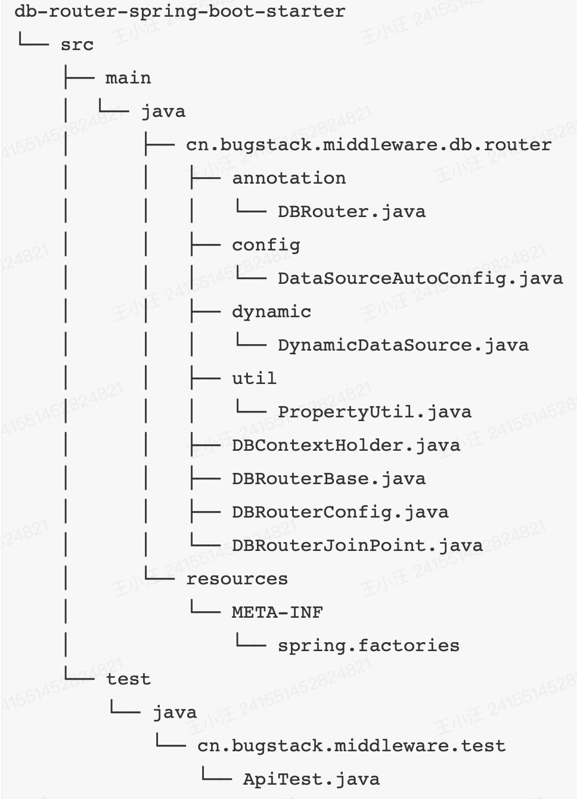

# 库表

## Lottery库

### Activity表

id、activityId、activityName、activityDesc、begin、end、create、updateTime、creator

| 关键字段            | 描述                                                         |
| ------------------- | ------------------------------------------------------------ |
| stock_count         | 库存                                                         |
| stock_surplus_count | 库存剩余                                                     |
| take_count          | 每人可参与次数                                               |
| strategy_id         | 抽奖策略id                                                   |
| state               | 活动状态：1编辑、2提审、3撤审、4通过、5运行(审核通过后worker扫描状态)、6拒绝、7关闭、8开启 |

### award表

id、awardId、awardType、awardName、awarContent、createTime、updateTime

### ruleTree

#### ruleTree表

id、treeName、treeDesc、createTime、updateTime

| 关键字段          | 描述       |
| ----------------- | ---------- |
| tree_root_node_id | 规则树根id |

#### ruleTreeNode表

id、treeId、ruleDesc

| 关键字段   | 描述       |
| ---------- | ---------- |
| node_type  | 1子叶2果实 |
| node_value | 果实值     |
| rule_key   | 规则key    |

#### ruleTreeNodeLine表

id、treeId

| 关键字段         | 描述                                                   |
| ---------------- | ------------------------------------------------------ |
| rule_limit_type  | 限定类型；1:=;2:>;3:<;4:>=;5<=;6:enum[枚举范围];7:果实 |
| rule_limit_value | 限定值                                                 |
| node_id_from     | 树的双亲                                               |
| node_id_to       | 树的子节点                                             |

### strategy

#### strategy表

id、strategyId、strategyDesc、crateTime、updateTime、extInfo扩展信息、

| 关键字段      | 描述                                               |
| ------------- | -------------------------------------------------- |
| strategy_mode | 策略方式（1:单项概率、2:总体概率）                 |
| grant_type    | 发放奖品方式（1:即时、2:定时[含活动结束]、3:人工） |
| grant_date    | 发放时间                                           |

#### strategyDetail表（感觉更适合叫awardDetail）

id、strategyId、createTime、updateTime

| 关键字段                         | 描述                   |
| -------------------------------- | ---------------------- |
| awardId、awardName               |                        |
| award_count、award_surplus_count | 奖品库存和奖品剩余库存 |
| award_rate                       | 中奖率                 |

## Lottery01 / Lottery02

分库分表中的分表。

lottery_01.user_strategy_export_000 、lottery_01.user_strategy_export_001

lottery_01.user_strategy_export_002、lottery_01.user_strategy_export_003

id、uid、activityID、order ID、strategyID、strategyMode、grantType、granDate、grantState、awardId、awardType、awardName、awardContent、uuid、mqState、createTime、updateTime

| 关键字段  | 描述                                          |
| --------- | --------------------------------------------- |
| uuid      | 防重                                          |
| mq_state  | 消息发送状态（0未发送、1发送成功、2发送失败） |
| strategy_ |                                               |
| grant_    |                                               |
| award_    |                                               |
| activity_ |                                               |

### userTakeAcitivy表

id、uId、takeId、activityId、activityName、takeDate、takeCount、strategyId、state、uuid、createTime、updateTime

+ 之前的各种信息的汇总，用于记录用户领取

### userTakeActivityCount表

id、uId、activityId、createTIme、updateTime

| 关键字段    | 描述       |
| ----------- | ---------- |
| total_count | 可领取次数 |
| left_count  | 已领取次数 |

### userStrategyExport表

+ 用户策略计算结果表，用来保存抽奖信息

发奖的各种信息：包括活动ID、订单ID、策略ID、策略方式、发放方式、发放时间、发奖状态、发奖ID、奖品类型、奖品名称、奖品内容、uuid、mq发送状态、等

# 抽奖

cn.itedus.lottery.**domain.strategy**

两种抽奖策略：抽完剔除和抽完不剔除。


```java
//整个抽奖流程
public abstract class AbstractDrawBase extends DrawStrategySupport implements IDrawExec{
  @Override
  public DrawResult doDrawExec(DrawReq req) {
    //获取抽奖策略
    //校验策略是否初始化到内存
    //获取不在抽奖范围内的列表：比如库存为空、风控策略、临时调整等
    //执行抽奖
    //包装结果返回
  }
}
//具体抽奖

```

# 发奖


+ factory中的`DistributionGoodFactory`和`GoodsConfig`实现了工厂模式，把impl下的四种方式放入map中，使用时可直接传入类型号提取实力对象（不再需要new，且map是static类型的，不需要每次都注入）
+ `DistributionBase`作为四种奖品类型的父类提供「更新用户奖品状态」方法，同时四种奖品类型实现了`IDistributionGoods`的「分发奖品」的方法。

四个发放奖品方式中「调用各个类型对应的发放接口」并更新用户领奖结果`updateUserAwardState()`

# 活动领域


## 创建活动：包括添加活动配置、奖品配置、策略配置、策略明细配置

```java
//设置成事务
@Transactional(rollbackFor = Exception.class)
public void createActivity(ActivityConfigReq req) {
    try {
        // 添加活动配置
        // 添加奖品配置
        // 添加策略配置
        // 添加策略明细配置
    } catch (DuplicateKeyException e) {
    }
}
```

## 状态变更


+ 参见设计模式种状态模式

### 状态流转配置

类似上面的方式，把7个状态类注入static Map中，便于后续直接提取不用new

```java
protected Map<Enum<Constants.ActivityState>, AbstractState> stateGroup = new ConcurrentHashMap<>();
@PostConstruct
public void init() {
    stateGroup.put(Constants.ActivityState.ARRAIGNMENT, arraignmentState);
    stateGroup.put(Constants.ActivityState.CLOSE, closeState);
    stateGroup.put(Constants.ActivityState.DOING, doingState);
    stateGroup.put(Constants.ActivityState.EDIT, editingState);
    stateGroup.put(Constants.ActivityState.OPEN, openState);
    stateGroup.put(Constants.ActivityState.PASS, passState);
    stateGroup.put(Constants.ActivityState.REFUSE, refuseState);
}

```

### 状态处理服务

从上面的Map中根据状态码提取响应对象并调用方法。（所有的原始状态的方法调用都在此处统一，不需要调用去状态类里调用方法了）

```java
@Override
public Result arraignment(Long activityId, Enum<Constants.ActivityState> currentStatus) {
    return stateGroup.get(currentStatus).arraignment(activityId, currentStatus);
}
//比如修改a状态和b状态要分别改修到另一状态，他们此时可以调用同一方法（修改状态参数即可）。
//不需要a.arr() b.arr() 只需要map.get.arr()即可。
//设计模式相关
```

# ID生成策略


IDContext类似前面，把policy中的三种策略的实例注入map中去。（策略设计模式）

+ nowFlake使用hutool工具类提供的雪花算法生成
+ ShortCode：2020年为准 + 小时 + 周期 + 日 + 三位随机数
+ RandowNumeric：生成11位的随机数

# 分库分表

[分库分表组件db-router-spring-boot-starter。主要用到的技术点包括：散列算法、数据源切换、AOP切面、SpringBoot Starter 开发等](https://gitcode.net/KnowledgePlanet/db-router-spring-boot-starter)

[实现](https://articles.zsxq.com/id_xq8o4sj295df.html)



+ 垂直拆分：把不同的表拆到不同的数据库
+ 水平拆分：表结构一致，把同一个表拆到不同的数据库


## 分库

### DataSourceAutoConfig.java

```java
public class DataSourceAutoConfig implements EnvironmentAware{
	//attributes是其中某一个数据库的配置信息。最后返回DataSource类型
  private DataSource createDataSource(Map<String, Object> attributes){
    
  }
  //调用上面的private，逐个解析若干个数据库配置。
  //targetDataSources.put(dbInfo, ds); dbInfo是‘db00’。ds是数据库配置
  //dynamicDataSource.setTargetDataSources(targetDataSources);
  //再放入dynamicDataSource，@Bean会自动注入
  @Bean
 	public DataSource createDataSource(){
    
  }
  //分表，DBRouterStrategyHashCode.doRouter是进行分库分表的hash散列过程。结果存入ThreadLocal
  //后续会在DynamicDataSource.determineCurrentLookupKey()中拼接返回生效
  @Bean
  public IDBRouterStrategy dbRouterStrategy(DBRouterConfig dbRouterConfig) {
        return new DBRouterStrategyHashCode(dbRouterConfig);
  }
  //用来获得yml配置信息的，信息会存入dataSourceMap。供createDataSource获取使用
  //以及配置private Map<String, Object> defaultDataSourceConfig;
  @Override
  public void setEnvironment(Environment environment){
    
  }
}
```

```java
//Spring 提供的切换数据源的接口类
public class DynamicDataSource extends AbstractRoutingDataSource {
    @Value("${mini-db-router.jdbc.datasource.default}")
    private String defaultDataSource;
   	
    @Override
    protected Object determineCurrentLookupKey() {
        if (null == DBContextHolder.getDBKey()) {
            return defaultDataSource;
        } else {
            return "db" + DBContextHolder.getDBKey();
        }
    }

}
```

```java
//注解切面
public Object doRouter(ProceedingJoinPoint jp, DBRouter dbRouter) throws Throwable {
    String dbKey = dbRouter.key();//拿到注解的参数（用什么作为索引）
    if (StringUtils.isBlank(dbKey) && StringUtils.isBlank(dbRouterConfig.getRouterKey())) {
        throw new RuntimeException("annotation DBRouter key is null！");
    }
    dbKey = StringUtils.isNotBlank(dbKey) ? dbKey : dbRouterConfig.getRouterKey();
    // 路由属性，从切面获得被注解方法的参数的值。比如用uid索引，拿到的就是uid的值
    String dbKeyAttr = getAttrValue(dbKey, jp.getArgs());
    // 路由策略，用uid进行路由。并存入threadlocal（注意final清除）
    dbRouterStrategy.doRouter(dbKeyAttr);
    // 返回结果
    try {
        return jp.proceed();
    } finally {
       dbRouterStrategy.clear();
    }
}
```

## 分表

+ 需要借用MybatisPlugin来完成对XML中SQL语句的改写

```java
public class  DynamicMybatisPlugin implements Interceptor {
    private Pattern pattern = Pattern.compile("(from|into|update)[\\s]{1,}(\\w{1,})", Pattern.CASE_INSENSITIVE);
    @Override
    public Object intercept(Invocation invocation) throws Throwable {
      //获取 StatementHandler（Mybatis核心接口，负责处理 SQL 语句的准备和执行）
      //判断要不要分表（根据注解的参数值），不分表直接返回继续即可
      //用 StatementHandler获取boundSql
      //用表达式子替换表名字：t=>t_01。也通过ThreadLocal
      //通过反射修改SQL=>replaceSql
      Field field = boundSql.getClass().getDeclaredField("sql");
      field.setAccessible(true);
      field.set(boundSql, replaceSql);
      field.setAccessible(false);
      //返回继续
    }
```

```java
//哈希算法
int idx = (size - 1) & (dbKeyAttr.hashCode() ^ (dbKeyAttr.hashCode() >>> 16));
//dbKeyAttr.hashCode()：获取 dbKeyAttr 对象的哈希值。
//dbKeyAttr.hashCode() >>> 16：将哈希值右移 16 位，用于增加哈希的随机性，减少哈希冲突
//dbKeyAttr.hashCode() ^ (dbKeyAttr.hashCode() >>> 16)：进一步混淆哈希值（异或）
//size - 1 进行与操作，确保结果在 0 到 size-1 之间。 其中size=库*表 数量
int dbIdx = idx / dbRouterConfig.getTbCount() + 1;
int tbIdx = idx - dbRouterConfig.getTbCount() * (dbIdx - 1);
//用混淆哈希值计算库表位置

```

# 活动领取

领取活动后才能继续抽奖

```java
public abstract class BaseActivityPartake extends ActivityPartakeSupport implements IActivityPartake {
  @Override
  public PartakeResult doPartake(PartakeReq req) {
    	//查询是否有领取了但未执行抽奖活动领取单：state=0。有的话直接返回去抽奖即可
      // 查询活动账单
      // 活动信息校验处理【活动库存、状态、日期、个人参与次数】
      // 扣减活动库存【目前为直接对配置库中的 lottery.activity 直接操作表扣减库存，后续优化为Redis扣减】
      // 领取活动信息【个人用户把活动信息写入到用户表】
      // 封装结果【返回的策略ID，用于继续完成抽奖步骤】
  }
	//校验：库存、状态、日期、个人参与次数
  protected abstract Result checkActivityBill(PartakeReq partake, ActivityBillVO bill);
  //扣减活动库存
  protected abstract Result subtractionActivityStock(PartakeReq req);
  //领取活动
  protected abstract Result grabActivity(PartakeReq partake, ActivityBillVO bill);
```

```java
//这个类来实现具体的过程
public class ActivityPartakeImpl extends BaseActivityPartake{
  protected Result grabActivity(PartakeReq partake, ActivityBillVO bill, Long takeId) {
        try {
          	//用db-router-spring-boot-starter组件路由数据源
          	dbRouter.doRouter(partake.getuId());//这里就相当于是用用户id路由的
          	//扣减个人参与次数
          	//写入领取活动记录
        } finally {
						//清理路由
            dbRouter.clear();
        }
    }
}
```

# 抽奖活动流程

```java
@Override
public DrawProcessResult doDrawProcess(DrawProcessReq req) {
    // 1. 领取活动
  		activityPartake.doPartake
    //1.5 领取成功，发送MQ
    	kafkaProducer.sendLotteryActivityPartakeRecord
    // 2. 执行抽奖
        drawExec.doDrawExec
    // 3. 结果落库
        activityPartake.recordDrawOrder
    // 4. 发送MQ，触发发奖流程
        kafkaProducer.sendLotteryInvoice
    // 5. 返回结果
}
```

# 规则引擎量化


```java
@Service("ruleEngineHandle")
public class RuleEngineHandle extends EngineBase {
    @Resource
    private IRuleRepository ruleRepository;
    @Override
    public EngineResult process(DecisionMatterReq matter) {
        // 决策规则树，用树Id获取树结构
        TreeRuleRich treeRuleRich = ruleRepository.queryTreeRuleRich(matter.getTreeId());
        if (null == treeRuleRich) {
            throw new RuntimeException("Tree Rule is null!");
        }
        // 决策节点，treeRuleRich是决策树，matter是一个需要判断的节点
        TreeNodeVO treeNodeInfo = engineDecisionMaker(treeRuleRich, matter);
        // 返回决策结果
        return new EngineResult(matter.getUserId(), treeNodeInfo.getTreeId(), treeNodeInfo.getTreeNodeId(), treeNodeInfo.getNodeValue());
    }
}
```

```java
 protected TreeNodeVO engineDecisionMaker(TreeRuleRich treeRuleRich, DecisionMatterReq matter) {
    TreeRootVO treeRoot = treeRuleRich.getTreeRoot();
    Map<Long, TreeNodeVO> treeNodeMap = treeRuleRich.getTreeNodeMap();
    // 规则树根ID
    Long rootNodeId = treeRoot.getTreeRootNodeId();
    TreeNodeVO treeNodeInfo = treeNodeMap.get(rootNodeId);
    // 节点类型[NodeType]；1子叶、2果实
    while (Constants.NodeType.STEM.equals(treeNodeInfo.getNodeType())) {
        Long nextNode = logicFilter.filter(matterValue, treeNodeInfo.getTreeNodeLineInfoList());
        treeNodeInfo = treeNodeMap.get(nextNode);
    }
    return treeNodeInfo;
}//filter是判断去往哪个方向。
//treeRuleRich的信息是通过DAO查询数据库得到的
//rule_tree_node:判别的是什么--userGender/userAge,又或者是果实
//rule_tree_node_line:如何判别，是大是小是等于，以及对比的标准值。以及子/双亲节点。
```

```java
public Long filter(String matterValue, List<TreeNodeLineVO> treeNodeLineInfoList) {
    for (TreeNodeLineVO nodeLine : treeNodeLineInfoList) {
        if (decisionLogic(matterValue, nodeLine)) {//判断节点方向
            return nodeLine.getNodeIdTo();
        }
    }//若干子分支轮流判断，符合条件则返回应该进入的下一个结点。然后通过上面的while循环继续
    return Constants.Global.TREE_NULL_NODE;
}
private boolean decisionLogic(String matterValue, TreeNodeLineVO nodeLine) {
    switch (nodeLine.getRuleLimitType()) {
        case Constants.RuleLimitType.EQUAL:
            return matterValue.equals(nodeLine.getRuleLimitValue());
        		//略去 大于 小于 大于等于 小于等于
				default:
            return false;
    }
}
```

# 接口封装和对象转换


+ 封装抽奖接口

  + doDraw()：普通抽奖

    ```java
    DrawReq drawReq = new DrawReq();
    drawReq.setuId("xiaofuge");
    drawReq.setActivityId(100001L);
    DrawRes drawRes = lotteryActivityBooth.doDraw(drawReq);
    ```

  + doQuantificationDraw()：量化功能抽奖

    ```java
    QuantificationDrawReq req = new QuantificationDrawReq();
    req.setuId("xiaofuge");
    req.setTreeId(2110081902L);
    req.setValMap(new HashMap<String, Object>() {{
        put("gender", "man");
        put("age", "18");
    }});
    DrawRes drawRes = lotteryActivityBooth.doQuantificationDraw(req);
    ```


# 使用MQ解耦

```java
@Component
public class KafkaProducer {
    private Logger logger = LoggerFactory.getLogger(KafkaProducer.class);
    @Resource
    private KafkaTemplate<String, Object> kafkaTemplate;
    /**
     * MQ主题：中奖发货单
     */
    public static final String TOPIC_INVOICE = "lottery_invoice";
    /**
     * 发送中奖物品发货单消息
     *
     * @param invoice 发货单
     */
    public ListenableFuture<SendResult<String, Object>> sendLotteryInvoice(InvoiceVO invoice) {
        String objJson = JSON.toJSONString(invoice);
        logger.info("发送MQ消息 topic：{} bizId：{} message：{}", TOPIC_INVOICE, invoice.getuId(), objJson);
        return kafkaTemplate.send(TOPIC_INVOICE, objJson);
    }
}
```

```java
@Component
public class LotteryInvoiceListener {
    private Logger logger = LoggerFactory.getLogger(LotteryInvoiceListener.class);
    @Resource
    private DistributionGoodsFactory distributionGoodsFactory;
    @KafkaListener(topics = "lottery_invoice", groupId = "lottery")
    public void onMessage(ConsumerRecord<?, ?> record, Acknowledgment ack, @Header(KafkaHeaders.RECEIVED_TOPIC) String topic) {
        Optional<?> message = Optional.ofNullable(record.value());
        // 1. 判断消息是否存在
        if (!message.isPresent()) {
            return;
        }
        // 2. 处理 MQ 消息
        try {
            // 1. 转化对象（或者你也可以重写Serializer<T>）
            InvoiceVO invoiceVO = JSON.parseObject((String) message.get(), InvoiceVO.class);
            // 2. 获取发送奖品工厂，执行发奖
            IDistributionGoods distributionGoodsService = distributionGoodsFactory.getDistributionGoodsService(invoiceVO.getAwardType());
            DistributionRes distributionRes = distributionGoodsService.doDistribution(new GoodsReq(invoiceVO.getuId(), invoiceVO.getOrderId(), invoiceVO.getAwardId(), invoiceVO.getAwardName(), invoiceVO.getAwardContent()));
            Assert.isTrue(Constants.AwardState.SUCCESS.getCode().equals(distributionRes.getCode()), distributionRes.getInfo());
            // 3. 打印日志
            logger.info("消费MQ消息，完成 topic：{} bizId：{} 发奖结果：{}", topic, invoiceVO.getuId(), JSON.toJSONString(distributionRes));
            // 4. 消息消费完成
            ack.acknowledge();
        } catch (Exception e) {
            // 发奖环节失败，消息重试。所有到环节，发货、更新库，都需要保证幂等。
            logger.error("消费MQ消息，失败 topic：{} message：{}", topic, message.get());
            throw e;
        }
    }
}
```

```java
//使用Producer,根据回调函数设置成功失败的处理
ListenableFuture<SendResult<String, Object>> future = kafkaProducer.sendLotteryInvoice(invoiceVO);
future.addCallback(new ListenableFutureCallback<SendResult<String, Object>>() {
    @Override
    public void onSuccess(SendResult<String, Object> stringObjectSendResult) {
        // 4.1 MQ 消息发送完成，更新数据库表 user_strategy_export.mq_state = 1
        activityPartake.updateInvoiceMqState(invoiceVO.getuId(), invoiceVO.getOrderId(), Constants.MQState.COMPLETE.getCode());
    }
    @Override
    public void onFailure(Throwable throwable) {
        // 4.2 MQ 消息发送失败，更新数据库表 user_strategy_export.mq_state = 2 【等待定时任务扫码补偿MQ消息】
        activityPartake.updateInvoiceMqState(invoiceVO.getuId(), invoiceVO.getOrderId(), Constants.MQState.FAIL.getCode());
    }//注意，发送失败并不会立刻再次发送MQ，而是标记状态。等待定时任务重新发送
});
```

# 活动状态自动扫描

xxl-job自动执行

```java
//两个自动化任务
//简单来说就是扫描Lottery-activity表中的state状态来判断活动是否在进行中/或已经结束。并更改
@XxlJob("lotteryActivityStateJobHandler")
public void lotteryActivityStateJobHandler()
//扫描user_strategy_export
//mq_state = 2 OR ( mq_state = 0 AND now() - create_time > 1800000 )的进行处理
@XxlJob("lotteryOrderMQStateJobHandler")
public void lotteryOrderMQStateJobHandler()
  //它的重新发送如果再次失败，还是设置状态=2等待下次扫描
```

# Redis锁的设计

```java
ActivityBillVO activityBillVO = super.queryActivityBill(req);
//queryActivityBill会首先请求数据库。获得库存和剩余库存。
//常量字符串+activityId作为key查看Rdis中是否有「目前占用库存数」
//如果没有，则剩余库存为数据库库存数。
//如果已经有了，则剩余库存=原库存-redis计数。
subtractionActivityStockByRedis(req.getuId(), req.getActivityId(), activityBillVO.getStockCount());
//这个函数实现更细的锁的粒度
//用常量字符串+activityId作为key。自增1
//如果超过原始库存数则表示失败，需要恢复库存（redis自减）
// 字符串+activityId+目前占用库存数 =》key
//用setNx作为分布式锁（获取不到就阻塞）。后续再判读是否获得了它，没有则代表获锁失败
//成功返回成功代码及其信息，返回锁的key（字符串+activityId+目前占用库存数）、剩余库存（原始库存-redis+1后的值）
//最后删除锁即可
```

# 设计模式

## 抽奖过程：模版模式

>  定义了一个操作的算法骨架，而将一些步骤延迟到子类中。模板方法使得子类可以在不改变算法结构的情况下，重新定义算法中的某些步骤

+ 制作咖啡和茶为例，演示如何使用模板方法模式

  ```java
  //抽象类
  abstract class CaffeineBeverage {
    // 模板方法，定义了算法的骨架
    final void prepareRecipe() {
        boilWater();
        brew();
        pourInCup();
        addCondiments();
    }
  
    // 具体方法
    void boilWater() {
        System.out.println("Boiling water");
    }
    // 抽象方法，子类将实现这些方法
    abstract void brew();
    abstract void addCondiments();
  }
  
  //具体子类
  class Coffee extends CaffeineBeverage {
      @Override
      void brew() {
          System.out.println("Dripping Coffee through filter");
      }
  }
  
  //使用
  CaffeineBeverage tea = new Tea();
  CaffeineBeverage coffee = new Coffee();
  ```

+ 代码复用：比如前面两个步骤是通用的

## 发奖：工厂模式

```java
public class GoodsConfig {
    /** 奖品发放策略组 */
    protected static Map<Integer, IDistributionGoods> goodsMap = new ConcurrentHashMap<>();

    @Resource
    private DescGoods descGoods;
    @Resource
    private RedeemCodeGoods redeemCodeGoods;
    @Resource
    private CouponGoods couponGoods;
    @Resource
    private PhysicalGoods physicalGoods;

    @PostConstruct//在依赖注入完成之后，初始化方法执行之前被调用
    public void init() {
      	//四种奖品的发奖配置到Map中，之后直接get(typeId)拿到对象。
        goodsMap.put(Constants.AwardType.DESC.getCode(), descGoods);
        goodsMap.put(Constants.AwardType.RedeemCodeGoods.getCode(), redeemCodeGoods);
        goodsMap.put(Constants.AwardType.CouponGoods.getCode(), couponGoods);
        goodsMap.put(Constants.AwardType.PhysicalGoods.getCode(), physicalGoods);
    }
}
//使用
public IDistributionGoods getDistributionGoodsService(Integer awardType){
    return goodsMap.get(awardType);
}
```

## 状态模式：stateflow领域

```java
public abstract class AbstractState {
    protected IActivityRepository activityRepository;
  	//代表若干状态
    public abstract Result arraignment(Long activityId, Enum<Constants.ActivityState> currentState);
    public abstract Result checkPass(Long activityId, Enum<Constants.ActivityState> currentState);
    public abstract Result checkRefuse(Long activityId, Enum<Constants.ActivityState> currentState);
    public abstract Result checkRevoke(Long activityId, Enum<Constants.ActivityState> currentState);
    public abstract Result close(Long activityId, Enum<Constants.ActivityState> currentState);
    public abstract Result open(Long activityId, Enum<Constants.ActivityState> currentState);
    public abstract Result doing(Long activityId, Enum<Constants.ActivityState> currentState);
}
//然后各个状态都实现此接口。表示从那个状态执行方法转换为另一状态
//加入有7个状态，则一共有7个类*(7-1)种方法。如下
public class ArraignmentState extends AbstractState {
    public Result arraignment(Long activityId, Enum<Constants.ActivityState> currentState)
    public Result checkPass(Long activityId, Enum<Constants.ActivityState> currentState)
    public Result checkRefuse(Long activityId, Enum<Constants.ActivityState> currentState) 
    public Result checkRevoke(Long activityId, Enum<Constants.ActivityState> currentState)
    public Result close(Long activityId, Enum<Constants.ActivityState> currentState)
    public Result open(Long activityId, Enum<Constants.ActivityState> currentState) 
    @Override//此方法作为参考，前几个类似。
    public Result doing(Long activityId, Enum<Constants.ActivityState> currentState) {
        return Result.buildResult(Constants.ResponseCode.UN_ERROR, "待审核活动不可执行活动中变更");
    }
}
//然后把这些类的实例都注入static map
//然后通过map.get(status).doing() 调用7种类的doing对应方法。
```

## 策略设计模式

```java
@Bean
public Map<Constants.Ids, IIdGenerator> idGenerator(SnowFlake snowFlake, ShortCode shortCode, RandomNumeric randomNumeric) {
    Map<Constants.Ids, IIdGenerator> idGeneratorMap = new HashMap<>(8);
  	//把三种随机ID生成算法注入map
    idGeneratorMap.put(Constants.Ids.SnowFlake, snowFlake);
    idGeneratorMap.put(Constants.Ids.ShortCode, shortCode);
    idGeneratorMap.put(Constants.Ids.RandomNumeric, randomNumeric);
    return idGeneratorMap;
}

```

# 注解

`@PostConstruct` 是 Java 中用于生命周期回调的方法注解，通常在 Spring 框架中使用。它是在依赖注入完成之后，初始化方法执行之前被调用的

## 自定义注解

```java
@Retention(RetentionPolicy.RUNTIME)
@Target({ElementType.TYPE, ElementType.METHOD})
public @interface DBRouter {
    String key() default "";
}
```

```text
RetentionPolicy.SOURCE：注解仅存在于源代码中，编译时会被丢弃，不会保留在编译后的字节码中。
RetentionPolicy.CLASS：注解会被编译器记录在类文件中，但在运行时不可见。这是默认的保留策略。
RetentionPolicy.RUNTIME：注解会被编译器记录在类文件中，并且在运行时通过反射可见。对于需要在程序运行时动态访问的注解，这种策略非常有用。
```

```text
ElementType.TYPE：可以应用于类、接口（包括注解类型）、枚举。
ElementType.FIELD：可以应用于字段（包括枚举常量）。
ElementType.METHOD：可以应用于方法。
ElementType.PARAMETER：可以应用于方法参数。
ElementType.CONSTRUCTOR：可以应用于构造方法。
ElementType.LOCAL_VARIABLE：可以应用于局部变量。
ElementType.ANNOTATION_TYPE：可以应用于注解类型。
ElementType.PACKAGE：可以应用于包。
ElementType.TYPE_PARAMETER：可以应用于类型参数。
ElementType.TYPE_USE：可以应用于使用类型的任何地方。
```

# 
