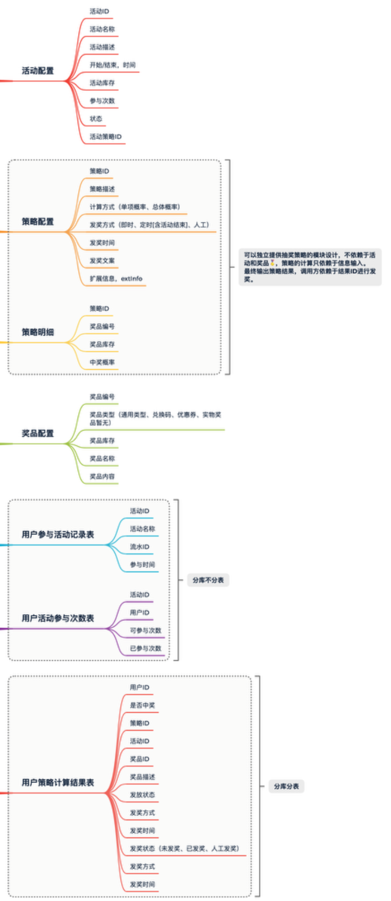
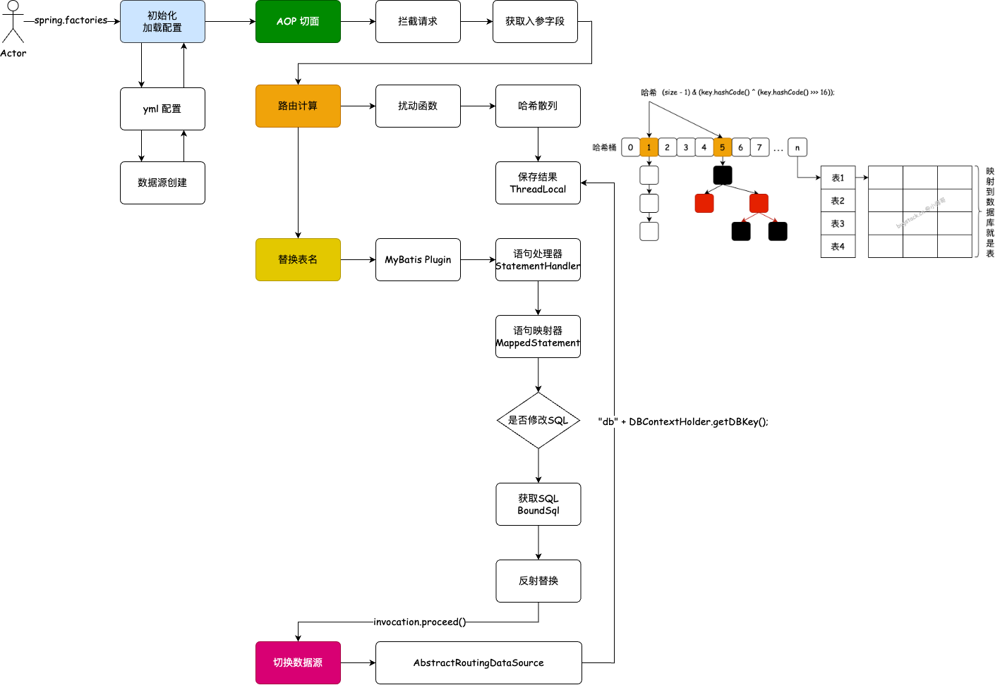
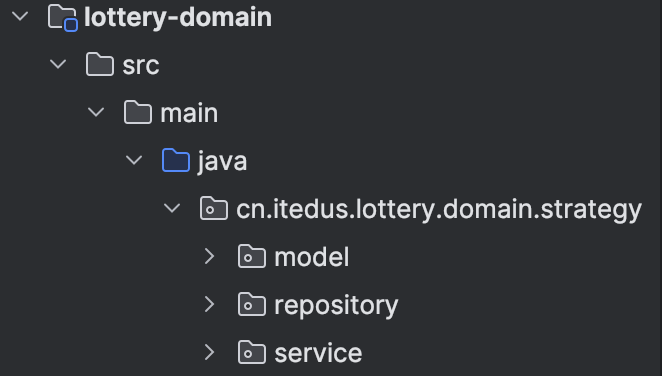
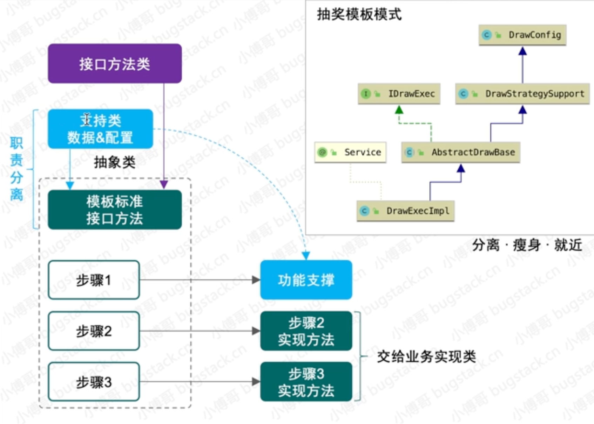
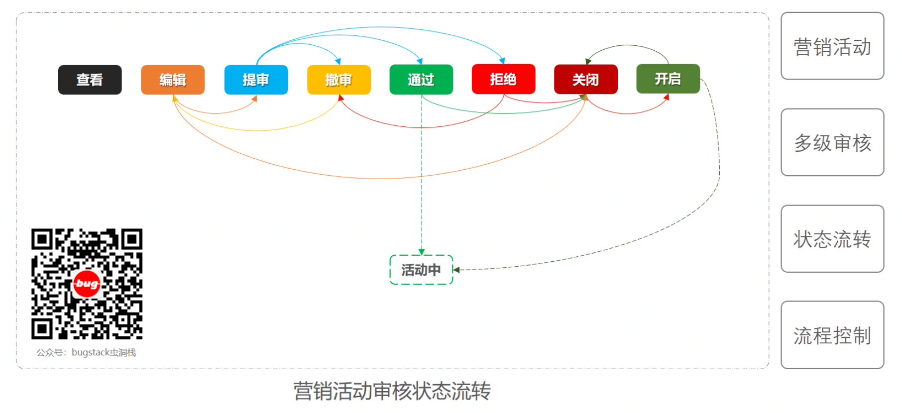
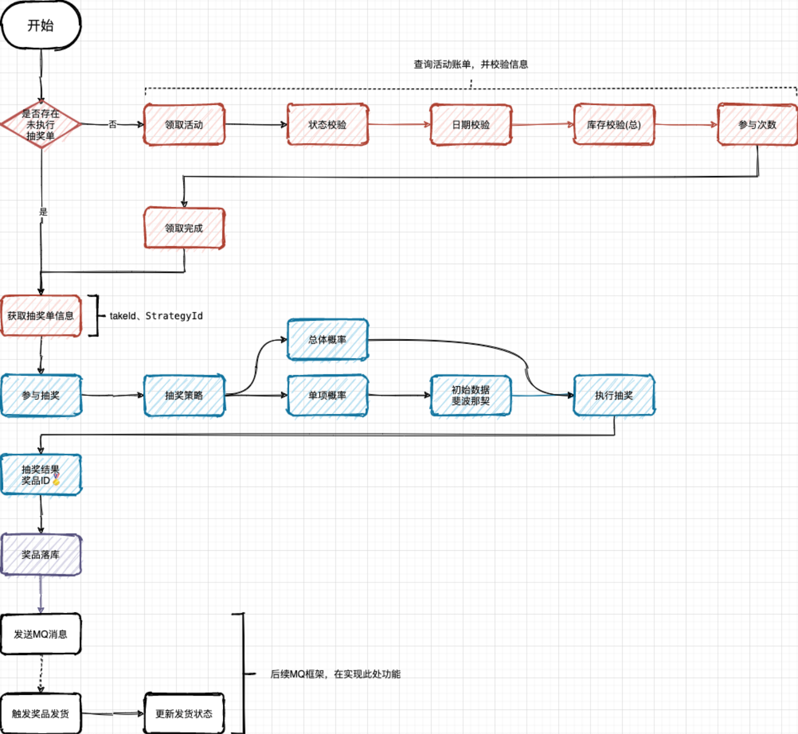
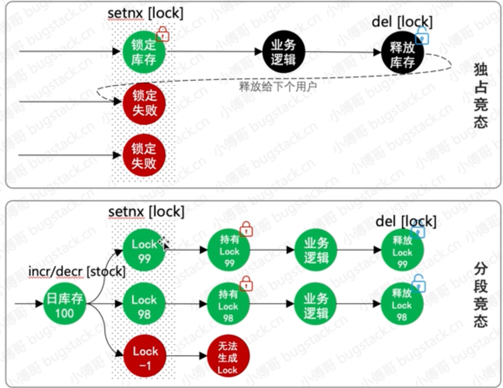

# 整体设计

## 项目结构

1. lottery-interfaces 是整个程序的出口，在 dependencies 会包含所有需要用到的 SpringBoot 配置，也会包括对其他各个模块的引入。yml配置文件也在此
2. 由于 RPC 接口在通信的过程中，需要提供接口的描述文件，也就是接口的定义信息。所以这里你会看到我们会**把所有的 RPC 接口**定义都放到 `lottery-rpc` 模块下，这种方式的使用让外部就只依赖这样一个 pom 配置引入的 Jar 包即可

## Dubbo

1. 广播模式的配置唯一区别在于注册地址，`registry.address = multicast://224.5.6.7:1234`，服务提供者和服务调用者都需要配置相同的📢广播地址。或者配置为 N/A 用于直连模式使用

2. 用于实现 RPC 接口的实现类 ActivityBooth 上有一个注解 @Service，这个注解是来自于 Dubbo 的 `org.apache.dubbo.config.annotation.Service`，也就是这个包下含有此注解配置的类可以被 Dubbo 管理

3. 测试中的@Reference 注解的 url 属性指定直连模式。
4. IActivityBooth 是 RPC 接口，通过 Dubbo 的注解 `@Reference` 进行注入配置。有了这个注解的配置其实调用上就没有太多不同了

### 使用

类似一个注册中心而已，配置即可

```yaml
# 服务端----Dubbo 广播方式配置
dubbo:
  application:
    name: Lottery
    version: 1.0.0
  registry:
    address: N/A #multicast://224.5.6.7:1234
  protocol:
    name: dubbo
    port: 20880
  scan:
    base-packages: cn.itedus.lottery.rpc # 表示这个包下的接口都被接管
```

```java
//cn.itedus.lottery.rpc.IActivityBooth 接口定义
public interface IActivityBooth {
    ActivityRes queryActivityById(ActivityReq req);
}

//cn.itedus.lottery.interfaces.ActivityBooth 接口实现
@Service//这个@Service是来自于 Dubbo 的 org.apache.dubbo.config.annotation.Service
//含有此注解配置的类可以被 Dubbo 管理
public class ActivityBooth implements IActivityBooth {
  ...
}
```

```yaml
# 测试端----Dubbo 广播方式配置
server:
  port: 8081

# Dubbo 广播方式配置
dubbo:
  application:
    name: Lottery
    version: 1.0.0
  registry:
    address: multicast://224.5.6.7:1234
  protocol:
    name: dubbo
    port: 20880

//广播方式不太稳定，可以配置使用直接连接方式
@Reference(interfaceClass = IActivityBooth.class, url = "dubbo://127.0.0.1:20880")
```

## 表设计



活动配置，activity：提供活动的基本配置

策略配置，strategy：用于配置抽奖策略，概率、玩法、库存、奖品

策略明细，strategy_detail：抽奖策略的具体明细配置

奖品配置，award：用于配置具体可以得到的奖品

用户参与活动记录表，user_take_activity：每个用户参与活动都会记录下他的参与信息，时间、次数

用户活动参与次数表，user_take_activity_count：用于记录当前参与了多少次

用户策略计算结果表，user_strategy_export_001~004：最终策略结果的一个记录，也就是奖品中奖信息的内容

## 抽奖策略模块

为了让抽奖策略成为可以独立配置和使用的领域模块，在策略表用不引入活动ID信息的配置。

它只是一种**无业务逻辑的通用共性的功能领域模块**，在**业务组合的过程中可以使用此功能领域提供的标准接口**

> 通过这样的设计实现，就可以满足于不同业务场景的灵活调用，例如：有些业务场景是需要你直接来进行抽奖反馈中奖信息发送给用户，但还有一些因为用户下单支付才满足抽奖条件的场景对应的奖品是需要延时到账的，避免用户在下单后又进行退单，这样造成了刷单的风险

## 分库分表

分库分表操作主要有垂直拆分和水平拆分：

- **垂直拆分**：指按照业务将表进行分类，分布到不同的数据库上，这样也就将数据的压力分担到不同的库上面。最终一个数据库由很多表的构成，每个表对应着不同的业务，也就是专库专用。
- **水平拆分**：如果垂直拆分后遇到单机瓶颈，可以使用水平拆分。相对于垂直拆分的区别是：**垂直拆分是把不同的表拆到不同的数据库中**，而本章节需要实现的**水平拆分，是把同一个表拆到不同的数据库中**。如：user_001、user_002

使用「自研」的工具：[db-router-spring-boot-starter](https://gitcode.net/KnowledgePlanet/db-router-spring-boot-starter) 来实现分库分分表。相关内容有

+ 散列算法、数据源切换、AOP切面、ThreadLocal、SpringBoot-Starter开发 等

+ [实现和使用分库分表](https://gitcode.net/KnowledgePlanet/Lottery/-/wikis/)

  

# domain

lottery-domain 是专门用于开发领域服务的模块。

实现：抽奖策略、活动领域、规则引擎、用户服务等



+ model：用于提供vo、req、res 和 aggregates 聚合对象
+ Repository：数据仓储服务，对Mysql、Redis等数据的统一包装
+ service：领域服务。其中algorithm是抽奖策略、draw是策略包装。对外提供抽奖接口 IDrawExec#doDrawExec

## 抽奖领域

### 策略

两种抽奖算法描述，场景A20%、B30%、C50%

- **总体概率**：如果A奖品抽空后，B和C奖品的概率按照 `3:5` 均分，相当于B奖品中奖概率由 `0.3` 升为 `0.375`
- **单项概率**：如果A奖品抽空后，B和C保持目前中奖概率，用户抽奖扔有20%中为A，因A库存抽空则结果展示为未中奖。*为了运营成本，通常这种情况的使用的比较多*

>  使用`模板方法设计模式`优化类 `DrawExecImpl` 抽奖过程方法实现，主要以抽象类 `AbstractDrawBase` 编排定义流程，定义抽象方法由类 `DrawExecImpl` 做具体实现的方式进行处理



+ DrawConfig：配置抽奖策略，SingleRateRandomDrawAlgorithm、EntiretyRateRandomDrawAlgorithm

+ DrawStrategySupport：提供抽奖策略数据支持，便于查询策略配置、奖品信息。通过这样的方式隔离职责。

+ AbstractDrawBase：抽象类定义模板方法流程，在抽象类的 `doDrawExec` 方法中，处理整个抽奖流程，并提供在流程中需要使用到的抽象方法，由 `DrawExecImpl` 服务逻辑中做具体实现。如果上面的功能都在这里写，这里会越来越冗杂

```java
public class DrawConfig {
    @Resource// 默认按照名称匹配
    private IDrawAlgorithm entiretyRateRandomDrawAlgorithm;
    @Resource
    private IDrawAlgorithm singleRateRandomDrawAlgorithm;

    /** 抽奖策略组 */
    protected static Map<Integer, IDrawAlgorithm> drawAlgorithmGroup = new ConcurrentHashMap<>();
    @PostConstruct
    public void init() {
        drawAlgorithmGroup.put(Constants.StrategyMode.ENTIRETY.getCode(), entiretyRateRandomDrawAlgorithm);
        drawAlgorithmGroup.put(Constants.StrategyMode.SINGLE.getCode(), singleRateRandomDrawAlgorithm);
    }

}
```

```java
public class DrawStrategySupport extends DrawConfig{
    @Resource
    protected IStrategyRepository strategyRepository;//策略表仓库存储
  
    protected StrategyRich queryStrategyRich(Long strategyId){
        return strategyRepository.queryStrategyRich(strategyId);//类似Service的sql查询服务？
    }//查询配置策略
    protected Award queryAwardInfoByAwardId(String awardId){
        return strategyRepository.queryAwardInfo(awardId);
    }//查询奖品信息
}
```

```java
public abstract class AbstractDrawBase extends DrawStrategySupport implements IDrawExec {
  public DrawResult doDrawExec(DrawReq req) {//执行抽奖
        // 1. 获取抽奖策略
        StrategyRich strategyRich = super.queryStrategyRich(req.getStrategyId());
        Strategy strategy = strategyRich.getStrategy();
        // 2. 校验抽奖策略是否已经初始化到内存
        this.checkAndInitRateData(req.getStrategyId(), strategy.getStrategyMode(), strategyRich.getStrategyDetailList());
        // 3. 获取不在抽奖范围内的列表，包括：奖品库存为空、风控策略、临时调整等
    				//抽象方法，被DrawExecImpl实现
        List<String> excludeAwardIds = this.queryExcludeAwardIds(req.getStrategyId());
        // 4. 执行抽奖算法。抽象方法，被DrawExecImpl实现
        String awardId = this.drawAlgorithm(req.getStrategyId(), drawAlgorithmGroup.get(strategy.getStrategyMode()), excludeAwardIds);
        // 5. 包装中奖结果
        return buildDrawResult(req.getuId(), req.getStrategyId(), awardId);
    }
  //若干抽象方法，被DrawExecImpl实现
   protected abstract List<String> queryExcludeAwardIds(Long strategyId);
   protected abstract String drawAlgorithm(Long strategyId, IDrawAlgorithm drawAlgorithm, List<String> excludeAwardIds);
	//若干直接的方法
  private void checkAndInitRateData；//检查「抽奖策略」是否在内存
  private DrawResult buildDrawResult;//包装抽奖结果
}
//其中DrawStrategySupport中的两个方法以 super.xx 形式被调用
//IdrawExec是抽奖执行接口：DrawResult doDrawExec(DrawReq req)需要被实现
```

```java
public class DrawExecImpl extends AbstractDrawBase {
  @Override
    protected List<String> queryExcludeAwardIds(Long strategyId);
  @Override
    protected String drawAlgorithm;
    //它使用了IdrawAlgorithm.randowDraw。 
  	//两种抽奖方法都实现了IdrawAlgorithm。故而可以不考虑具体是哪种，根据实例来自动调用。
}
//实现了上面的若干抽象方法
```

## 发奖领域

award 发奖领域中主要的核心实现在于 service 中的两块功能逻辑实现，分别是：`goods 商品处理`、`factory 工厂🏭`

+ goods：**包装适配**各类奖品的**发放逻辑**，虽然我们目前的抽奖系统仅是给用户返回一个中奖描述，但在实际的业务场景中，是真实的**调用优惠券、兑换码、物流发货等操作**，而这些内容经过封装后就可以在自己的商品类下实现了。

+ factory：工厂模式通过调用方提供发奖类型，**返回对应的发奖服务**。通过这样<u>由具体的子类决定返回结果</u>，并做相应的业务处理。从而不至于让领域层包装太多的频繁变化的业务属性，因为如果你的核心功能域是在做业务逻辑封装，就会就会变得非常庞大且混乱

```java
public interface IDistributionGoods {
    DistributionRes doDistribution(GoodsReq req);
}//货物发放接口
```

```java
public class DistributionBase {
    protected Logger logger = LoggerFactory.getLogger(DistributionBase.class);
    @Resource
    private IAwardRepository awardRepository;

    protected void updateUserAwardState(String uId, String orderId, String awardId, Integer awardState, String awardStateInfo) {
        // TODO 后期添加更新分库分表中，用户个人的抽奖记录表中奖品发奖状态
        logger.info("TODO 后期添加更新分库分表中，用户个人的抽奖记录表中奖品发奖状态 uId：{}", uId);
    }
}
```

```java
public class CouponGoods extends DistributionBase implements IDistributionGoods{
  @Override
    public DistributionRes doDistribution(GoodsReq req){
      //todo：模拟调用优惠券发放接口
      super.updateUserAwardState;
      return new DistributionRes
    }
  @Override
    public Integer getDistributionGoodsName();
}
public class DescGoods extends DistributionBase implements IDistributionGoods;
public class PhysicalGoods extends DistributionBase implements IDistributionGoods;
public class RedeemCodeGoods extends DistributionBase implements IDistributionGoods;
```

```java
//工厂配置
public class GoodsConfig {
    /** 奖品发放策略组 */
    protected static Map<Integer, IDistributionGoods> goodsMap = new ConcurrentHashMap<>();
    @Resource
    private DescGoods descGoods;
    @Resource
    private RedeemCodeGoods redeemCodeGoods;
    @Resource
    private CouponGoods couponGoods;
    @Resource
    private PhysicalGoods physicalGoods;
  	//把配置注入到Map。
    //把四种奖品的发奖，放到一个统一的配置文件类 Map 中，便于通过 AwardType 获取相应的对象，减少 if...else 的使用。
    @PostConstruct
    public void init() {
        goodsMap.put(Constants.AwardType.DESC.getCode(), descGoods);
        goodsMap.put(Constants.AwardType.RedeemCodeGoods.getCode(), redeemCodeGoods);
        goodsMap.put(Constants.AwardType.CouponGoods.getCode(), couponGoods);
        goodsMap.put(Constants.AwardType.PhysicalGoods.getCode(), physicalGoods);
    }
}
```

```java
//工厂使用
@Service
public class DistributionGoodsFactory extends GoodsConfig {
    public IDistributionGoods getDistributionGoodsService(Integer awardType){
        return goodsMap.get(awardType);
    }
}

```

## 活动领域

activity 活动领域层包括：deploy、partake、stateflow

+ deploy：主要添加活动
+ partak：领取

+ stateflow 状态流转运用的状态模式，主要包括抽象出状态抽象类AbstractState 和对应的 event 包下的状态处理，最终使用 StateHandlerImpl 来提供对外的接口服务。

​	**没有使用workfollow的方式**，而是采用自己手写的方式来玩成状态变更

### 添加活动

```java
@Service
public class ActivityDeployImpl implements IActivityDeploy {
    private Logger logger = LoggerFactory.getLogger(ActivityDeployImpl.class);
    @Resource
    private IActivityRepository activityRepository;
  	
  	//添加一个活动，设置成事务的原因是。如果其中有一步失败了（涉及多个表），则回溯。
    @Transactional(rollbackFor = Exception.class)
    @Override
    public void createActivity(ActivityConfigReq req) {
      //添加活动配置
      ActivityVO activity = activityConfigRich.getActivity();
      activityRepository.addActivity(activity);
      // 添加奖品配置
      List<AwardVO> awardList = activityConfigRich.getAwardList();
      activityRepository.addAward(awardList);
      //还有其他的配置，略去
    }
```

### 领取

```java
public interface IActivityPartake {
    PartakeResult doPartake(PartakeReq req);//参与活动
  	Result recordDrawOrder(DrawOrderVO drawOrder);//保存奖品单
}
public class ActivityPartakeSupport {
    @Resource
    protected IActivityRepository activityRepository;
  
    protected ActivityBillVO queryActivityBill(PartakeReq req){
        return activityRepository.queryActivityBill(req);
    }
}
public abstract class BaseActivityPartake extends ActivityPartakeSupport implements IActivityPartake {

    @Override
    public PartakeResult doPartake(PartakeReq req){
    //定义了参与活动的流程
      // 查询是否存在未执行抽奖领取活动单
      ActivityBillVO activityBillVO = super.queryActivityBill(req);//查询账单
      // 活动信息校验处理【活动库存、状态、日期、个人参与次数】
      // 扣减活动库存【目前为直接对配置库中的 lottery.activity 直接操作表扣减库存，后续优化为Redis扣减】
      // 领取活动信息【个人用户把活动信息写入到用户表】
      // 插入领取活动信息【个人用户把活动信息写入到用户表】
      // 封装结果【返回的策略ID，用于继续完成抽奖步骤】
    }
  	protected abstract Result checkActivityBill(PartakeReq partake, ActivityBillVO bill);
    protected abstract Result subtractionActivityStock(PartakeReq req);
    protected abstract Result grabActivity(PartakeReq partake, ActivityBillVO bill);
}
```

```java
@Service
public class ActivityPartakeImpl extends BaseActivityPartake{
  
}
```

用户领取活动时候，新增记录：strategy_id、state 两个字段，这两个字段就是为了处理用户对领取镜像记录的二次处理未执行抽奖的领取单，以及state状态控制事务操作的幂等性。

> 场景：用户领取完活动开始抽奖了，但抽奖过程中系统出错（总之是失败）没有落库。state可以保存其状态为未抽奖。下次用户再抽奖（因为没抽奖成功）的时候就可以从这里开始（而不需要重新领取活动）直接开始抽奖。
>
> 还有就是两个抽奖一起来，如果没有state，都会认为没有进行抽奖，从而两个一起抽奖出冲突。

### 活动流转状态



```java
public abstract class AbstractState {
    @Resource
    protected IActivityRepository activityRepository;
  	//定义了各个状态转变为后七种状态的方法。
  	//比如一个编辑状态的类，实现所有的方法（在各个实现的方法中进行判断：编辑状态是否可以变为目标状态）
  	//所以其实会写很多（7*7）个方法。
    public abstract Result arraignment(Long activityId, Enum<Constants.ActivityState> currentState);
    public abstract Result checkPass(Long activityId, Enum<Constants.ActivityState> currentState);
    public abstract Result checkRefuse(Long activityId, Enum<Constants.ActivityState> currentState);
    public abstract Result checkRevoke(Long activityId, Enum<Constants.ActivityState> currentState);
    public abstract Result close(Long activityId, Enum<Constants.ActivityState> currentState);
    public abstract Result open(Long activityId, Enum<Constants.ActivityState> currentState);
    public abstract Result doing(Long activityId, Enum<Constants.ActivityState> currentState);
}
```

> + 注意事项：
>
> ```java
> //在具体进行状态转化的时候考虑并发情况，比如同时修改，一人通过，一个拒绝
> boolean isSuccess = 
>   activityRepository.alterStatus
>   (activityId, currentState, Constants.ActivityState.PASS);
> //所以currentState作为前置状态进行判别。（通过sql语句中的AND）
> ```
>
> 
>
> ```xml
> <update id="alterState" parameterType="cn.itedus.lottery.domain.activity.model.vo.AlterStateVO">
>     UPDATE activity
>     SET state = #{afterState}
>     WHERE activity_id = #{activityId} AND state = #{beforeState}
> </update>
> ```

#### 状态的使用

```java
//public class StateConfig 中
@Resource
private RefuseState refuseState;
protected Map<Enum<Constants.ActivityState>, AbstractState> stateGroup = new ConcurrentHashMap<>();

@PostConstruct
public void init() {
    stateGroup.put(Constants.ActivityState.ARRAIGNMENT, arraignmentState);
    stateGroup.put(Constants.ActivityState.CLOSE, closeState);
    stateGroup.put(Constants.ActivityState.DOING, doingState);
    stateGroup.put(Constants.ActivityState.EDIT, editingState);
    stateGroup.put(Constants.ActivityState.OPEN, openState);
    stateGroup.put(Constants.ActivityState.PASS, passState);
    stateGroup.put(Constants.ActivityState.REFUSE, refuseState);
}

//使用时变得十分整洁
//public class StateHandlerImpl extends StateConfig implements IStateHandler
@Override
public Result arraignment(Long activityId, Enum<Constants.ActivityState> currentStatus) {
    return stateGroup.get(currentStatus).arraignment(activityId, currentStatus);
}
```

## ID生成策略

> 为什么不使用数据库的自增ID而要自己生成？避免暴漏

```java
1. 雪花算法，用于生成单号
2. 日期算法，用于生成活动编号类，特性是生成数字串较短，但指定时间内不能生成太多
3. 随机算法，用于生成策略ID
public interface IIdGenerator {
  long nextId();
}
@Component
public class SnowFlake implements IIdGenerator{
   @Override
   public long nextId()
}
//省略其他两种算法
```

```java
@Configuration
public class IdContext {
    @Bean
    public Map<Constants.Ids, IIdGenerator> idGenerator(SnowFlake snowFlake, ShortCode shortCode, RandomNumeric randomNumeric) {
        Map<Constants.Ids, IIdGenerator> idGeneratorMap = new HashMap<>(8);
        idGeneratorMap.put(Constants.Ids.SnowFlake, snowFlake);
        idGeneratorMap.put(Constants.Ids.ShortCode, shortCode);
        idGeneratorMap.put(Constants.Ids.RandomNumeric, randomNumeric);
        return idGeneratorMap;
    }
}//注册到Map供调用
```

## 规则量化人群

通过规则引擎过滤性别、年龄、首单消费、消费金额、忠实用户等各类身份来量化出具体可参与的抽奖活动


基于量化决策引擎，筛选用户身份标签，找到符合参与的活动号。拿到活动号后，就可以参与到具体的抽奖活动中。在应用层做一层封装后，由接口层进行调用使用。*也就是用户参与活动之前，要做一层规则引擎过滤*。

可以用if-else但非常不推荐。因为多了以后会非常庞大


### Logic

```java
public interface LogicFilter {
    Long filter(String matterValue, List<TreeNodeLineVO> treeNodeLineInfoList);//决策往左还是往右
    String matterValue(DecisionMatterReq decisionMatter);//获取决策值
}
```

```java
public abstract class BaseLogic implements LogicFilter {

    @Override
    public Long filter(String matterValue, List<TreeNodeLineVO> treeNodeLineInfoList) {
        //
      	for (TreeNodeLineVO nodeLine : treeNodeLineInfoList) {
            if (decisionLogic(matterValue, nodeLine)) {
                return nodeLine.getNodeIdTo();
            }
        }
        return Constants.Global.TREE_NULL_NODE;
    }

    @Override
    public abstract String matterValue(DecisionMatterReq decisionMatter);

    private boolean decisionLogic(String matterValue, TreeNodeLineVO nodeLine) {
        switch (nodeLine.getRuleLimitType()) {
            case Constants.RuleLimitType.EQUAL:
                return matterValue.equals(nodeLine.getRuleLimitValue());
            case Constants.RuleLimitType.GT:
                return Double.parseDouble(matterValue) > Double.parseDouble(nodeLine.getRuleLimitValue());
            case Constants.RuleLimitType.LT:
                return Double.parseDouble(matterValue) < Double.parseDouble(nodeLine.getRuleLimitValue());
            case Constants.RuleLimitType.GE:
                return Double.parseDouble(matterValue) >= Double.parseDouble(nodeLine.getRuleLimitValue());
            case Constants.RuleLimitType.LE:
                return Double.parseDouble(matterValue) <= Double.parseDouble(nodeLine.getRuleLimitValue());
            default:
                return false;
        }
    }
}
```

```java
@Component
public class UserAgeFilter extends BaseLogic {

@Override
public String matterValue(DecisionMatterReq decisionMatter) {
    return decisionMatter.getValMap().get("age").toString();
}
```


### Engine

```java
public interface EngineFilter {
    EngineResult process(final DecisionMatterReq matter);
}
public class EngineConfig {
    protected static Map<String, LogicFilter> logicFilterMap = new ConcurrentHashMap<>();
    @Resource
    private UserAgeFilter userAgeFilter;
    @Resource
    private UserGenderFilter userGenderFilter;

    @PostConstruct
    public void init() {
        logicFilterMap.put("userAge", userAgeFilter);
        logicFilterMap.put("userGender", userGenderFilter);
    }
}//把所有的决策键过滤器注入map供调用使用
```

```java
public abstract class EngineBase extends EngineConfig implements EngineFilter {
    private Logger logger = LoggerFactory.getLogger(EngineBase.class);
    @Override
    public EngineResult process(DecisionMatterReq matter) {
        throw new RuntimeException("未实现规则引擎服务");
    }

    protected TreeNodeVO engineDecisionMaker(TreeRuleRich treeRuleRich, DecisionMatterReq matter) {
        TreeRootVO treeRoot = treeRuleRich.getTreeRoot();
        Map<Long, TreeNodeVO> treeNodeMap = treeRuleRich.getTreeNodeMap();
        // 规则树根ID
        Long rootNodeId = treeRoot.getTreeRootNodeId();
        TreeNodeVO treeNodeInfo = treeNodeMap.get(rootNodeId);
        // 节点类型[NodeType]；1子叶、2果实
        while (Constants.NodeType.STEM.equals(treeNodeInfo.getNodeType())) {
            String ruleKey = treeNodeInfo.getRuleKey();
            LogicFilter logicFilter = logicFilterMap.get(ruleKey);//继承自Config的Map
            String matterValue = logicFilter.matterValue(matter);
            Long nextNode = logicFilter.filter(matterValue, treeNodeInfo.getTreeNodeLineInfoList());
            treeNodeInfo = treeNodeMap.get(nextNode);//Map而已，nextNode是键值。把下一个节点作为判断节点
            logger.info("决策树引擎=>{} userId：{} treeId：{} treeNode：{} ruleKey：{} matterValue：{}", treeRoot.getTreeName(), matter.getUserId(), matter.getTreeId(), treeNodeInfo.getTreeNodeId(), ruleKey, matterValue);
        }
        return treeNodeInfo;
    }
}
```

```java
@Service("ruleEngineHandle")
public class RuleEngineHandle extends EngineBase {
    @Resource
    private IRuleRepository ruleRepository;
    @Override
    public EngineResult process(DecisionMatterReq matter) {
        // 决策规则树，根据treeid找到树冰形成Rich（主要是Map）
        TreeRuleRich treeRuleRich = ruleRepository.queryTreeRuleRich(matter.getTreeId());
        if (null == treeRuleRich) {
            throw new RuntimeException("Tree Rule is null!");
        }
        // 决策节点
        TreeNodeVO treeNodeInfo = engineDecisionMaker(treeRuleRich, matter);//实际的决策过程
        // 决策结果
        return new EngineResult(matter.getUserId(), treeNodeInfo.getTreeId(), treeNodeInfo.getTreeNodeId(), treeNodeInfo.getNodeValue());
    }
}
```


# application

## 抽奖过程



+ 其实就是各个过程的串联。

```java
public interface IActivityProcess {
    DrawProcessResult doDrawProcess(DrawProcessReq req);//抽奖
}
@Service
public class ActivityProcessImpl implements IActivityProcess {
  @Override
  public DrawProcessResult doDrawProcess{
    // 1. 领取活动:activityPartake.doPartake
    // 2. 执行抽奖:drawExec.doDrawExec
    // 3. 结果落库:activityPartake.recordDrawOrde
    // 4. 发送MQ，触发发奖流程
    // 5. 返回结果
  }
}
```

## 门面接口封装

 #

## AOP

分库分表的hash

mybatis拦截器，拦截SQL语句，把表id添加到sql语句后 

```
@XxlJob("lotteryOrderMQStateJobHandler")
public void lotteryOrderMQStateJobHandler() throws Exception {
    // 验证参数
    String jobParam = XxlJobHelper.getJobParam();
    if (null == jobParam) {
        logger.info("扫描用户抽奖奖品发放MQ状态[Table = 2*4] 错误 params is null");
        return;
    }
//这里是从xxl-job处来填写（获得）要扫描哪些库的。不是在配置文件中 。格式为1,2,3这种
//后续再分割
```

## Redis的竞争库存



独占竞态：一个拿到以后即便还有库存，其他也无法拿到

分段竞态：还有库存就可以拿到锁。降低了锁的颗粒度。实际操作也并不复杂，只是把`活动ID+库存扣减后的值`一起作为分布式锁的Key

> `lua脚本`、zk、jvm层，都可以处理，但经过验证 lua脚本会有一定的耗时，并发较高时会有问题

# 面试题

1. 表的设计

   尽可能做到职责隔离，对应系统的具体实现上要拆分出；活动、算法、规则、策略、用户、订单等领域
