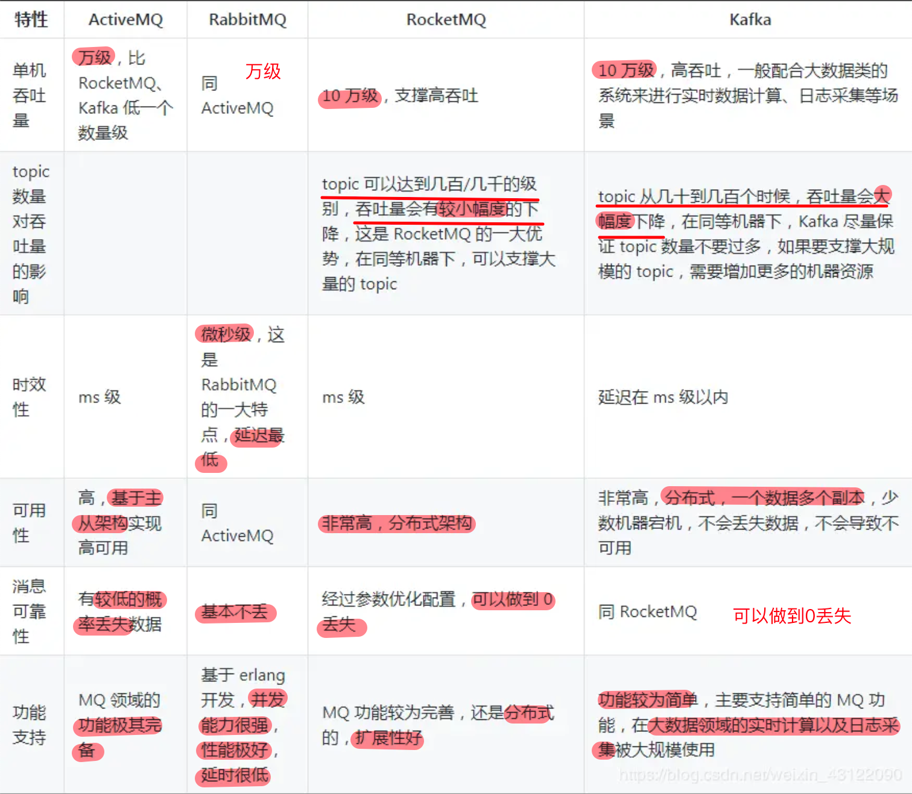
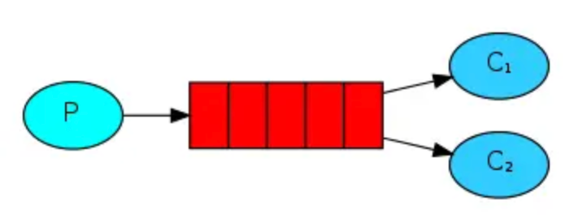
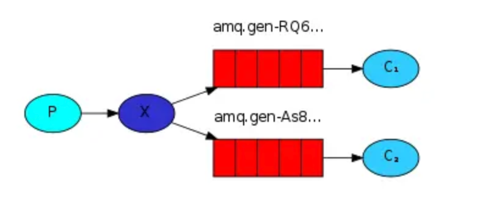

### MQ的优点

+ **异步处理** - 相比于传统的串行、并行方式，提高了系统吞吐量。

+ **应用解耦** - 系统间通过消息通信，不用关心其他系统的处理。
  + A 系统压根儿不需要去考虑要给谁发送数据，不需要维护这个代码，也不需要考虑人家是否调用成功、失败超时等情况。

+ **流量削锋** - 可以通过消息队列长度控制请求量；可以缓解短时间内的高并发请求。

+ **日志处理** - 解决大量日志传输。

+ **消息通讯** - 消息队列一般都内置了高效的通信机制，因此也可以用在纯的消息通讯。比如实现点对点消息队列，或者聊天室等

### 消息队列缺点

1. 降低系统可用性：如果消息队列挂了
2. 系统复杂度提高：要考虑更多问题，比如一致性问题、保证消息不被重复消费、可靠传输等
3. 一致性问题：BCD三个系统，BD成功，C失败了怎么办

### 消息中间件对比

**RabbitMQ**，他的好处在于可以**支撑高并发、高吞吐、性能很高**，同时有非常完善**便捷的后台管理界面可以使用**。还**支持集群化、高可用部署架构、消息高可靠支**持，**功能较为完善**。缺点是基于erlang开发，难以进行深层次的源码定制和改造

RocketMQ基于Java开发，阿里开源

**Kafka**提供的消息中间件的**功能明显较少**，但它的优势在于专为**超高吞吐量**的**实时日志采集、实时数据同步、实时数据计算**等场景来设计。

### MQ的常见问题，如何解决

#### 消息顺序问题

> 假如生产者产生了 2 条消息：M1、M2，假定 M1 发送到 S1，M2 发送到 S2，如果要保证 M1 先于 M2 被消费，怎么做？

+ 保证M1、M2发送到同一MQ Server。但有缺陷
  + 并行度受到影响
  + 更多的异常处理（消费端有问题会阻塞整个流程）
  + 不关注乱序的应用大量存在
  + 队列无序不意味着消息无序，从业务层面保证消息顺序更合理

#### 消息重复问题

> 根本原因，网络不可达

消费端处理消息的业务逻辑保持幂等性。只要**保持幂等性**，不管来多少条重复消息，最后处理的结果都一样。保证每条消息都有唯一编号且保证消息处理成功与去重表的日志同时出现。**利用一张日志表来记录已经处理成功的消息的 ID**，如果新到的消息 ID 已经在日志表中，那么就不再处理这条消息。

# RabbitMQ

最大的特点是消费不需要确保提供方存在，实现服务之间的高度解耦

### 使用场景

+ 服务间异步通信
+ 顺序消费
+ 定时任务
+ 请求削峰

### 基本概念

+ Broker：消息队列服务器实体
+ Exchange：消息交换机
+ Queue：消息队列载体
+ Binding：把exchange和queue绑定
+ RoutingKey：路由关键字、exchange根据它进行消息投递
+ VHost：可以理解为虚拟broker
+ Producer：消息生产者
+ Consumer：消息消费者
+ Channel：消息通道，每个channel代表一个会话任务

## 工作模式

### simple模式

最简单的收发模式。消息被拿走就删除（可设置手动ack以避免消费者没被正确处理）

### work模式

资源竞争，多个消费者同时监听同一队列，谁先拿到消息谁负责消费。

+ 高并发下，默认会产生某个消息被多个消费者共同使用，可设置syncronize保证一条消息只被一个消费者使用

### publish/subscribe发布订阅

共享资源，每个消费者监听自己的队列。

生产者将消息发给broker，由exchange将消息转发到绑定此交换机的每个队列

### routing路由模式

根据消息的路由键将消息路由到队列的交换机。每个队列都会绑定到交换机，并且指定一个绑定键（Binding Key）。<u>当生产者发送消息时，会指定一个特定的路由键（Routing Key），交换机会根据路由键将消息发送到与之匹配的队列</u>。

> 路由模式中，**一个消息可以被发送到多个队列，也可以被多个消费者接收**，这取决于交换机和队列之间的绑定关系以及路由键的匹配规则。

#### topic主题模式（路由模式的一种）

其实就是加入了通配符，能进行模糊匹配。

\#”匹配路由键的一个或多个词，“*”匹配路由键的一个词（一个词指两个.之间的）

## 八股问题

### 如何确保消息的顺序性

+ 拆分成多个queue，每个queue配一个consumer
+ 只有一个queue也是一个consumer，但<u>由consumer内部内存队列排队</u>，然后分发给底层worker处理

### 消息如何分发

若该队列至少有一个消费者订阅，消息将以循环（round-robin）的方式发送给消费者

### 消息怎么路由

消息将拥有一个路由键（routing key），在消息创建时设定。RabbitMQ 会将消息的路由键与队列的路由键进行匹配。

1. fanout

   消息广播到所有绑定的队列上

2. direct

   路由键完全匹配，投递到相应队列

3. topic

   可以使用通配符

### 消息基于什么传输

TCP 连接的创建和销毁开销较大，且并发数受系统资源限制，会造成性能瓶颈使用信道的方式来传输数据。

信道是建立在真实的 TCP 连接内的虚拟连接，且每条 TCP 连接上的信道数量没有限制

### 如何确保消息正确发送到MQ以及确保接收方消费了消息

#### 发送方确认模式

1. 将信道设置为confirm模式，**所有在信道上发布的消息都会被指派一个唯一的 ID**。
2. 一旦消息被投递到目的队列后，或者消息被写入磁盘后（可持久化的消息），信道会发送一个确认给生产者（包含消息唯一 ID）
3. 如果 RabbitMQ 发生内部错误从而导致**消息丢失**，会发送一条 **nack**（未确认）消息
4. 发送方确认模式是异步的，生产者应用程序在等待确认的同时，可以继续发送消息。

#### 接收方确认机制

消费者接收每一条消息后都必须进行确认（消息接收和消息确认是两个不同操作）。只有**消费者确认了消息，RabbitMQ 才能安全地把消息从队列中删除。**

这里并没有用到超时机制，RabbitMQ 仅通过 Consumer 的连接中断来确认是否需要重新发送消息。也就是说，**只要连接不中断**，**RabbitMQ 给了 Consumer 足够长的时间来处理消息**。保证数据的最终一致性；

#### 特殊情况

+ 消费者接收到消息，在确认之前断开了连接或取消订阅，RabbitMQ 会认为消息没有被分发，然后重新分发给下一个订阅的消费者。（可能**存在消息重复消费的隐患**，需要去重）

+ 如果消费者接收到消息却没有确认消息，连接也未断开，则 RabbitMQ 认为该消费者繁忙，将不会给该消费者分发更多的消息。

### 如果保证消息的可靠传输

#### 生产者丢失消息

RabbitMQ提供transaction和confirm模式来确保生产者不丢消息。

**transaction机制**就是说：发送消息前，开启事务（channel.txSelect()）,然后发送消息，如果发送过程中出现什么**异常**，事务就会回滚（channel.txRollback()）,如果**发送成功则提交**事务（channel.txCommit()）。然而，这种方式有个缺点：**吞吐量下降**；

**confirm模式**用的居多：一旦channel进入confirm模式，所有在该信道上发布的消息都将会被指派一个唯一的ID（从1开始），一旦消息被投递到所有匹配的队列之后，rabbitMQ就会发送一个ACK给生产者（包含消息的唯一ID），这就使得生产者知道消息已经正确到达目的队列了。如果rabbitMQ没能处理该消息，则会发送一个Nack消息给你，你可以进行重试操作。

#### 消息队列丢数据

一般是开启持久化磁盘的配置，这个**持久化配置可以和confirm机制配合使用**，你可以在消息持久化磁盘后，再给生产者发送一个Ack信号。

+ 如何持久化
  + 将queue的持久化标识durable设置为true,则代表是一个持久的队列
  + 发送消息的时候将deliveryMode=2

#### 消费者丢失消息

消费者丢数据一般是因为采用了自动确认消息模式，改为手动确认消息即可

### 为什么不应该对所有消息都持久化

+ 首先，必然性能下降

+ message 的持久化机制用在 RabbitMQ 的内置 cluster 方案时会出现“坑爹”问题。

  > 1. 如果**消息设置了持久化**属性（persistent），但**队列没有设置持久化**属性（durable），并且**队列所在的节点出现故障**后，直到队列被重建之前，**发送到该队列的消息将会丢失**（被黑洞化）。
  > 2. 如果**消息设置了持久化**属性，并且**队列也设置了持久化**属性，但是**队列所在的节点出现故障并且无法重启**，那么队列将无法在其他节点上重建。在这种情况下，**直到队列所在的节点重新启动，才能恢复队列的使用。在此期间发送到该队列的消息也将被丢失（被黑洞化）**

### 如何保证高可用，RabbitMQ的集群

#### 单机模式

玩具，自己玩玩的

#### 普通集群

多台机器上启动多个 RabbitMQ 实例，每个机器启动一个。

创建的 queue，只会放在一个 RabbitMQ 实例上，但是每个实例都**同步 queue 的元数据**（**元数据可以认为是 queue 的一些配置信息**，<u>通过元数据，可以找到 queue 所在实例</u>）

消费的时候，实际上如果连接到了另外一个实例，那么那个实例会从 queue 所在实例上拉取数据过来

> 此方案主要是提高吞吐量的，就是说让集群中多个节点来服务某个 queue 的读写操作

#### 镜像集群

这种模式，才是所谓的 RabbitMQ 的高可用模式。

创建的 queue，无论元数据还是 queue 里的消息都会存在于多个实例上，每个 RabbitMQ 节点都有这个 queue 的一个完整镜像。

> 性能开销、带宽压力大

### 如何解决消息队列的延迟、过期失效、消息积压

#### 消息积压：临时扩容

修复消费者问题恢复其速度，临时将 queue 资源和 consumer 资源扩大 10 倍，以正常的 10倍速度来消费数据。消费完积压数据后，恢复原本架构。

#### 消息积压导致的过期失效：RabbitMQ可以设置过期时间，积压后过期被清理

批量重导：就是大量积压的时候，我们当时就直接丢弃数据，等过了高峰期以后，将丢失的那批数据，写个临时程序，一点一点的查出来，然后重新灌入 mq 里面去，把白天丢的数据给他补回来。

#### 消息队列满了

写临时消费程序，然后闲时采用上一个批量重导方案。

### 设计MQ的思路

1. 应支持可伸缩性：

   在需要的时候可以快速扩容，设计分布式系统。

   > 参照一下 kafka 的设计理念，broker -> topic -> partition，每个 partition 放一个机器，就存一部分数据。如果现在资源不够了，简单啊，给 topic 增加 partition，然后做数据迁移，增加机器，就可以存放更多数据，提供更高的吞吐量了

2. 持久化

   顺序写磁盘

3. 可用性

4. 是否能0丢失：可以但复杂