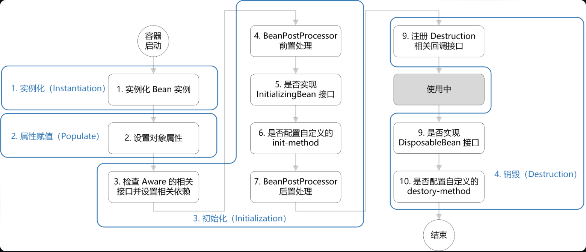
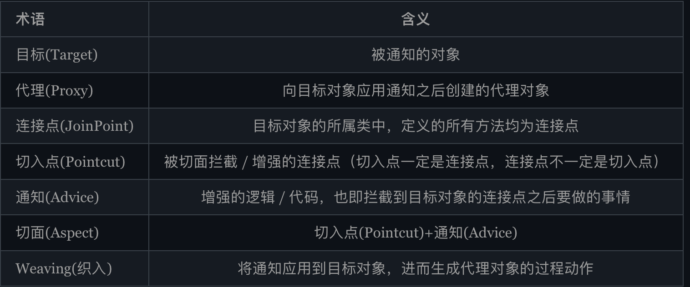
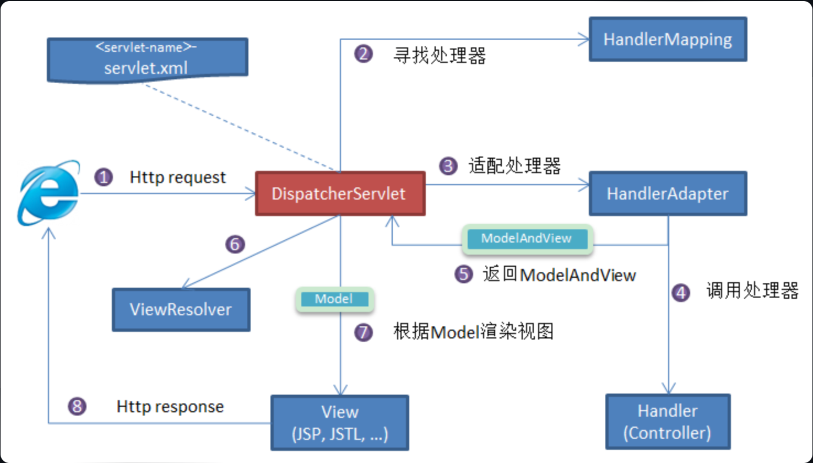

# 基础

1. spring支持IOC（控制反转）、AOP（面向切面编程）

2. **IoC（Inversion of Control:控制反转）** 是一种设计思想，而不是一个具体的技术实现。IoC 的思想就是将原本在程序中手动创建对象的控制权，交由 Spring 框架来管理

3. **Bean** 代指的就是那些被 IoC 容器所管理的对象。

   ```java
   <!-- Constructor-arg with 'value' attribute -->
   <bean id="..." class="...">
      <constructor-arg value="..."/>
   </bean>
   ```

4. 声明为Bean的注解

   1. Component：通用的注解，可标注任意类为 `Spring` 组件
   2. Repository：对应持久层即 Dao 层，主要用于数据库相关操作
   3. Service：对应服务层
   4. Controller：对应 Spring MVC 控制层

5. @component 和 @Bean 的区别是什么？

   + `@Component` 注解作用于**类**，而`@Bean`注解作用于**方法**

   + `@Component`通常是通过**类路径扫描**来自动侦测以及自动装配到 Spring 容器中

     `@Bean` 注解通常是我们在**标有该注解的方法中定义产生这个 bean**,`@Bean`告诉了 Spring 这是某个类的实例，当我需要用它的时候还给我

   + `@Bean` 注解比 `@Component` 注解的自定义性更强，而且很多地方我们只能通过 `@Bean` 注解来注册 bean

     ```java
     @Bean
     public OneService getService(status) {
         case (status)  {
             when 1:
                     return new serviceImpl1();
             when 2:
                     return new serviceImpl2();
             when 3:
                     return new serviceImpl3();
         }
     }
     //此例子无法使用@Component实现
     ```

6. 进入@Bean的注解有哪些

   1. `@Autowired`
   2. `@Resource`
   3. `@Inject`

7. @Autowired 和 @Resource 的区别是什么？

   + `@Autowired`默认byType；`@Resource`默认byName
   + `@Autowired` 是 Spring 提供的注解，`@Resource` 是 JDK 提供的注解
   + `@Autowired` **支持**在**构造函数**、方法、字段和**参数**上使用。`@Resource` 主要用于**字段和方法**上的注入，不支持在构造函数或参数上使用。

   `@Autowired` 属于 Spring 内置的注解，**默认的注入方式为`byType`**（根据类型进行匹配）,会优先根据接口类型去匹配并注入 Bean （接口的实现类）。**当一个接口存在多个实现类的话**，`byType`这种方式就<u>无法正确注入</u>对象。这种情况下，**注入方式会变为 `byName`**（根据名称进行匹配）。

   ```java
   //假设有SmsService 接口有两个实现类: SmsServiceImpl1和 SmsServiceImpl2，且它们都已经被 Spring 容器所管理
   
   // 报错，byName 和 byType 都无法匹配到 bean
   @Autowired
   private SmsService smsService;
   // 正确注入方式1: SmsServiceImpl1 对象对应的 bean
   @Autowired
   private SmsService smsServiceImpl1;
   // 正确注入方式2:  SmsServiceImpl1 对象对应的 bean
   // smsServiceImpl1 就是我们上面所说的名称
   @Autowired
   @Qualifier(value = "smsServiceImpl1")
   private SmsService smsService;
   ```

   `@Resource`属于 JDK 提供的注解，**默认注入方式为 byName**。如果无法通过名称匹配到对应的 Bean 的话，注入方式会变为byType

8. Bean的作用域

   **singleton** : IoC 容器中只有唯一的 bean 实例。Spring 中的 bean 默认都是单例的，是对单例设计模式的应用。

   **prototype** : 每次获取都会创建一个新的 bean 实例。也就是说，连续 `getBean()` 两次，得到的是不同的 Bean 实例。

   **request** （仅 Web 应用可用）: 每一次 HTTP 请求都会产生一个新的 bean（请求 bean），该 bean 仅在当前 HTTP request 内有效。

   **session** （仅 Web 应用可用） : 每一次来自新 session 的 HTTP 请求都会产生一个新的 bean（会话 bean），该 bean 仅在当前 HTTP session 内有效。

   **application/global-session** （仅 Web 应用可用）：每个 Web 应用在启动时创建一个 Bean（应用 Bean），该 bean 仅在当前应用启动时间内有效。

   **websocket** （仅 Web 应用可用）：每一次 WebSocket 会话产生一个新的 bean

9. Bean是否线程安全

   几乎所有场景的 Bean 作用域都是使用默认的 singleton ，重点关注 singleton 作用域即可。

   singleton 作用域下，IoC 容器中只有唯一的 bean 实例，可能会存在资源竞争问题。（prototype 作用域下，不存在线程安全问题）如果这个 bean 是有状态的话，那就存在线程安全问题。**不过，大部分 Bean 实际都是无状态**（没有定义可变的成员变量，比如 Dao、Service）

   > 解决办法：两种
   >
   > 1. 在 Bean 中尽量避免定义可变的成员变量。
   > 2. 在类中定义一个 `ThreadLocal` 成员变量，将需要的可变成员变量保存在 `ThreadLocal` 中（推荐的一种方式）

10. Bean的生命周期

    1. **创建**Bean的实例：使用 Java 反射 API 来创建 Bean 的实例
    2. Bean的属性**赋值**/填充：为 Bean **设置相关属性和依赖**，例如*`@Autowired` 等注解注入的对象、`@Value`注入的值、`setter`方法或构造函数注入依赖和值、`@Resource`注入的各种资源*
    3. Bean**初始化**：
       1. 如果实现了其他 `*.Aware`接口，就调用相应的方法。如：实现了 `BeanNameAware` 接口，调用 `setBeanName()`方法
       2.  实现了`InitializingBean`接口，执行`afterPropertiesSet()`方法
       3. 如果有和加载这个 Bean 的 Spring 容器相关的 `BeanPostProcessor` 对象，执行`postProcessBeforeInitialization()` 方法和`postProcessAfterInitialization()` 方法
    4. **销毁**Bean：销毁并不是说要立马把 Bean 给销毁掉，而是把 Bean 的销毁方法先记录下来

    > 整体上可以简单分为四步：**实例化 —> 属性赋值 —> 初始化 —> 销毁**。
    >
    > 初始化这一步涉及到的步骤比较多，包含 **`Aware` 接口的依赖注入**、**`BeanPostProcessor` 在初始化前后的处理**以及 **`InitializingBean` 和 `init-method`** 的初始化操作。
    >
    > 销毁这一步会注册相关销毁回调接口，最后**通过`DisposableBean` 和 `destory-method` 进行销毁**。

    + Aware 接口能让 Bean 能拿到 Spring 容器资源

      `BeanNameAware`：注入当前 bean 对应 beanName；

      `BeanClassLoaderAware`：注入加载当前 bean 的 ClassLoader；

      `BeanFactoryAware`：注入当前 `BeanFactory` 容器的引用

    

# AOP



1. **Spring AOP 属于运行时增强，而 AspectJ 是编译时增强**。

   Spring AOP 已经集成了 AspectJ。当切面太多的话，最好选择 AspectJ ，它比 Spring AOP 快很多

2. 通知类型

   **Before**（前置通知）

   **After** （后置通知）

   **AfterReturning**（返回通知）

   **AfterThrowing**（异常通知）

   **Around** （环绕通知）

3. 多个切面的执行顺序

   1. @Order：值越小优先级越高。

   2. 切面实现`Ordered` 接口，重写 `getOrder` 方法。

      ```java
      @Component
      @Aspect
      public class LoggingAspect implements Ordered {//
          @Override
          public int getOrder() {
              // 返回值越小优先级越高
              return 1;
          }
      }
      ```

# Spring MVC

1. 核心组件有哪些

   - **`DispatcherServlet`**：**核心的中央处理器**，负责接收请求、分发，并给予客户端响应。
   - **`HandlerMapping`**：**处理器映射器**，**根据 URL 去匹配**查找能处理的 `Handler` ，并会将请求涉及到的拦截器和 `Handler` 一起封装。
   - **`HandlerAdapter`**：**处理器适配器**，根据 `HandlerMapping` 找到的 `Handler` ，**适配执行对应的 `Handler`**；
   - **`Handler`**：**请求处理器**，**处理实际请求**的处理器。返回ModelAndView
   - **`ViewResolver`**：**视图解析器**，根据 `Handler` 返回的逻辑视图 / 视图，**解析并渲染真正的视图**，并传递给 `DispatcherServlet` 响应客户端

   

   

# Spring循环依赖

Spring 框架通过使用三级缓存（其实就是三个Map）来解决这个问题，确保即使在循环依赖的情况下也能正确创建 Bean。

**一级缓存（singletonObjects）**：存放**最终形态**的 Bean（已经实例化、属性填充、初始化），单例池，为“Spring 的单例属性”⽽⽣。一般情况我们获取 Bean 都是从这里获取的，但是并不是所有的 Bean 都在单例池里面，例如原型 Bean 就不在里面。

**二级缓存（earlySingletonObjects）**：存放**过渡** Bean（半成品，尚未属性填充），也就是三级缓存中`ObjectFactory`产生的对象，与三级缓存配合使用的，可以防止 AOP 的情况下，每次调用`ObjectFactory#getObject()`都是会产生新的代理对象的。

**三级缓存（singletonFactories）**：存放`ObjectFactory`，`ObjectFactory`的`getObject()`方法（最终调用的是`getEarlyBeanReference()`方法）可以**生成原始 Bean 对象或者代理对象**（如果 Bean 被 AOP 切面代理）。**三级缓存只会对单例 Bean 生效**。

> 创建过程：
>
> 先去 **一级缓存 `singletonObjects`** 中获取，存在就返回；
>
> 如果不存在或者对象正在创建中，于是去 **二级缓存 `earlySingletonObjects`** 中获取；
>
> 如果还没有获取到，就去 **三级缓存 `singletonFactories`** 中获取，通过执行 `ObjectFacotry` 的 `getObject()` 就可以获取该对象，获取成功之后，从三级缓存移除，并将该对象加入到二级缓存中
>
> 流程**举例**：A包括B，B包括A。创建A，缺B。去创建B，但A也没好。去**三级缓存**中调用`getObject()`方法获取**A的前期暴露对象**（由`getEarlyBeanReference()`生成，然后把**前期暴露对象放入二级缓存**，然后B借用它来创建）

> 在没有 AOP 的情况下，确实可以只使用一级和三级缓存来解决循环依赖问题。当涉及到 AOP 时，二级缓存就显得非常重要了，因为它确保了即使在 Bean 的创建过程中有多次对早期引用的请求，也始终只返回同一个代理对象，从而避免了同一个 Bean 有多个代理对象的问题

## @Lazy

如果一个 **Bean 没有被标记为懒加载**，那么它会在 Spring IoC 容器**启动的过程中被创建和初始化**。如果一个 Bean **被标记为懒加载**，那么它不会在 Spring IoC 容器启动时立即实例化，而是在**第一次被请求时才创建**。这可以帮助**减少应用启动时的初始化时间**，也**可以解决循环依赖问题**（但不建议）

# 事务

1. 编程式事物
2. 声明式事务

## Spring 事务中哪几种事务传播行为：

**`TransactionDefinition.PROPAGATION_REQUIRED`**

1. **`REQUIRED`**：默认，如果当前存在事务，则**加入**该事务；如果当前没有事务，则创建一个新的事务
2. **`REQUIRES_NEW`**：如果当前存在事务，则把当前事务**挂起**。即一定会新开启自己的事务
3. **`NESTED`**：如果当前存在事务，则创建一个事务作为当前事务的**嵌套**事务来运行
4. **`MANDATORY`**：如果当前存在事务，则**加入**该事务，如果当前**没有事务，则抛出异常**
5. **`SUPPORTS`**、**`NOT_SUPPORTED`**、**`NEVER`**：这三种导致事务不会发生回滚
   1. SUPPORTS：如果当前存在事务，则加入该事务；如果**当前没有事务**，则以**非事务**的方式继续运行
   2. NOT_SUPPORTED：以**非事务**方式运行，如果当前**存在事务，则把当前事务挂起**。
   3. NEVER：以非事务方式运行，如果当前存在事务，则抛出异常

## 隔离级别

**`TransactionDefinition.ISOLATION_DEFAULT`**

1. **`DEFAULT`**：默认级别
2. **`READ_UNCOMMITTED`**：**最低隔离级别**，允许读取**尚未提交**的数据变更。**可能会导致脏读、幻读或不可重复读**
3. **`READ_COMMITTED`**：允许读取并发事务已经提交的数据，**可以阻止脏读**，但是幻读或不可重复读仍有可能发生
4. **`REPEATABLE_READ`**：多次读取结果一致，**可以阻止脏读和不可重复读**
5. **`SERIALIZABLE`**：**最高隔离级别**，都可以阻止

> 脏读：读取了另一个事务未提交的数据
>
> 幻读：第二次读取的结果与第一次读取的结果不一致（**新插入导致**）
>
> 不可重复读：第二次读取的结果与第一次读取的结果不一致（**数据修改导致**）

## 异常

`@Transactional` 注解默认回滚策略是只有在遇到`RuntimeException`(运行时异常) 或者 `Error` 时才会回滚事务，而不会回滚 `Checked Exception`（受检查异常）

如果想要修改默认的回滚策略，可以使用 `@Transactional` 注解的 `rollbackFor` 和 `noRollbackFor` 属性来指定哪些异常需要回滚。

```java
@Transactional(rollbackFor = Exception.class)
public void someMethod() {
}//所有异常都回滚

@Transactional(noRollbackFor = CustomException.class)
public void someMethod() {
}//指定的异常不会回滚
```

# Spring Security

## 控制访问请求权限的方法

`permitAll()`：无条件允许任何形式访问，不管你登录还是没有登录。

`anonymous()`：允许**匿名**访问，也就是没有登录才可以访问。

`denyAll()`：无条件决绝任何形式的访问。

`authenticated()`：只允许**已认证**的用户访问。（仅仅身份验证）

`fullyAuthenticated()`：只允许**已经登录**或者通过 remember-me 登录的用户访问。

+ 比`authenticated()`更严格。完全身份验证意味着用户不仅仅通过了身份验证，还必须通过了其他安全检查，例如输入了密码、输入了验证码等

`hasRole(String)` : 只允许**指定角色**访问。

`hasAnyRole(String)` : 指定一个或者多个角色，满足其一的用户即可访问。

`hasAuthority(String)`：只允许具有**指定权限**的用户访问

`hasAnyAuthority(String)`：指定一个或者多个权限，满足其一的用户即可访问。

`hasIpAddress(String)` : 只允许**指定 ip** 的用户访问。

总之：匿名、已认证、已登陆、指定角色、指定权限、指定IP

## 密码加密

加密算法实现类的接口是 `PasswordEncoder` ，如果你想要自己实现一个加密算法的话，也需要实现 `PasswordEncoder` 接口。

```java
public interface PasswordEncoder {
    // 加密也就是对原始密码进行编码
    String encode(CharSequence var1);
    // 比对原始密码和数据库中保存的密码
    boolean matches(CharSequence var1, String var2);
    // 判断加密密码是否需要再次进行加密，默认返回 false
    default boolean upgradeEncoding(String encodedPassword) {
        return false;
    }
}//三个必须实现的接口
//官方推荐使用基于 bcrypt 强哈希函数的加密算法实现类
```

