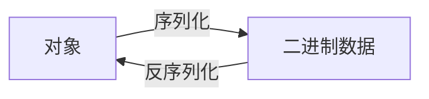

# 学习

## 结构


## 命令

+ 创建名为'test'的分区，分区数量是3个，副本2个。反正不知道为什么和zookeeper的2181没啥关系（不强制要求zookeeper？）

`./kafka-topics.sh --bootstrap-server localhost:9092 --create --topic test --partitions 3 --replication-factor 2`  

+ 消费者监听消息

`./kafka-console-consumer.sh --bootstrap-server localhost:9092,localhost:9093,localhost:9094 --topic test`

> 参数 `--bootstrap-server` 指定了要连接的 Kafka 集群的地址，其中包括多个 broker 的地址列表,一旦启动，这个消费者将持续监听指定主题中的消息，并将它们输出到控制台

+ 进入消息发送

` ./kafka-console-producer.sh --broker-list localhost:9092,localhost:9093,localhost:9094 --topic test`

进入到`>`窗口，即可直接输入信息回车发送。上面的即可收到

> `--broker-list localhost:9092,localhost:9093,localhost:9094`: 指定了 Kafka 集群的 broker 地址和端口。这里列出了三个 broker，以逗号分隔。Kafka 生产者会自动选择其中一个 broker 来发送消息，如果选择的 broker 不可用，它会尝试连接其他的 broker
>
> broker 是 Kafka 集群的节点，负责接收、存储和处理消息。每个 broker 都是一个独立的 Kafka 服务器，可以运行在单独的物理机器或虚拟机上。broker都有一个唯一的标识符

## 配置项

### 必须项

`broker.id` `log.dirs` `zookeeper.connect` 

### 监听器

+ listeners：用来制定broker启动时的本机监听端口，给服务器端使用


+ advertised.listeners：对外发布的访问IP和端口，注册到zookeeper中，给客户端使用。
  + 默认不用配置，如果没配置，从用listeners的配置

## 内外网配置


此时`advertised.listeners` 就需要配置成公网IP。且broker的EXTERNAL配置成0.0.0.0来监听所有9093端口。最后客户端如果在内网就用9092，不在就用9093访问broker。

再次强调，配置`advertised.listeners` 就必须需要配置成公网IP


## kafka消息模型

### 点对点

1. 分区Partition是最小的秉性单位

2. 一个消费者可以消费多个分区

3. 一个分区可以被多个消费者【组】里的消费者消费

   一个不能被同一消费者组的多个消费者消费

   > 原因，需要引入锁机制

+ 于是，点对点。就是消费者独自在一个组即可

### 发布-订阅模式

### 分区与消息顺序

**同一个生产者**发送到**同一分区**的消息，先发送的offset比后发送的offset小（发送到不同分区不保证）

+ **kafka只保证分区「内」的消息顺序**，不保证分区间的消息顺序

### 消息传递语义

+ 最多一次：可能丢失，永不重复发送
  + 消费者：先提交位置，再读消息。没收到也认为拿到了
+ 最少一次：不会丢失，可能重复发送
  + 消费者：先读消息，再提交位置（offset）。没收到确认回执offset就再发
+ 精确一次：**保证消息被传递到服务端且在服务端不重复**

> 过程类似计算机网络中的方法

## 生产者API

[生产者API文档](https://kafka.apache.org/37/javadoc/org/apache/kafka/clients/producer/KafkaProducer.html)

```java
Properties props = new Properties();//java.util.Proerties
props.put("bootstrap.servers", "localhost:9092");
//props.put("linger.ms", 1);
props.put("key.serializer", "org.apache.kafka.common.serialization.StringSerializer");
props.put("value.serializer", "org.apache.kafka.common.serialization.StringSerializer");

Producer<String, String> producer = new KafkaProducer<>(props);
for (int i = 0; i < 20; i++)
    producer.send(new ProducerRecord<String, String>("my-topic", Integer.toString(i), Integer.toString(i)));
//生产者.send() 异步发送。要实现同步发送，获得send()的返回值后.get()。
//消息放入缓冲区（buffer.memory）后立即返回，不等发送给Broker（由后台另一个线程完成）
producer.close();
```

```java
// 消息分批发送
Properties props = new Properties();//java.util.Proerties
props.put("bootstrap.servers", "localhost:9092");
//配置批量发送，下面两行
props.put("batch.size",16384);//一批最大的大小
props.put("linger.ms", 1000);//延迟时间1s（1s内的所有消息合成一批）
props.put("key.serializer", "org.apache.kafka.common.serialization.StringSerializer");
props.put("value.serializer", "org.apache.kafka.common.serialization.StringSerializer");

Producer<String, String> producer = new KafkaProducer<>(props);
for (int i = 0; i < 20; i++){
    producer.send(new ProducerRecord<String, String>("my-topic", Integer.toString(i), Integer.toString(i)));// 三个函数分别是：主题，分区（key），value
    try {
        Thread.sleep(100);//每发送一条消息休眠0.1秒。20条共需要2秒发完。会被分成两批
    } catch (InterruptedException e) {
        throw new RuntimeException(e);
    }
}
producer.close();
```

```java
// 配合使用构成不同的消息传递语义：最多一次、最少一次、精确一次
props.put("acks","all");
props.put("retries",0);//发送失败的重试此时，默认0次
```

`acks` 这是指生产者在成功写入消息到 Kafka 服务器的副本时所需的确认级别。具体取值可以是：

+ `"0"`：生产者不需要等待服务器的确认，直接将消息发送出去。这是最快的方式，但是有丢失消息的风险，因为消息可能在发送过程中丢失。
+ `"1"`：生产者在写入消息到分区的 leader 副本后就会收到确认。这种设置能够确保至少一次传递，但如果 leader 副本在确认之后发生故障，消息可能会丢失。
+ `"all"`：生产者在消息写入到分区的 leader 副本并且所有 ISR（In-Sync Replicas，同步副本）都收到确认之后，才会收到确认。这种设置提供了最高的消息传递保证，但会降低性能。

1. 最多一次

   `acks=0` `acks=1`

2. 最少一次

   `acks=-1/all`   `retires>0`

## 消费者API

[消费者API文档](https://kafka.apache.org/37/javadoc/org/apache/kafka/clients/consumer/KafkaConsumer.html)

```xml
<dependency>
    <groupId>org.apache.kafka</groupId>
    <artifactId>kafka-clients</artifactId>
    <version>3.7.0</version>
</dependency>
```

### 最多一次

```java
//自动提交，最多提交一次
Properties props = new Properties();
props.setProperty("bootstrap.servers", "localhost:9092");
props.setProperty("group.id", "test");
props.setProperty("enable.auto.commit", "true");
props.setProperty("auto.commit.interval.ms", "1000");//自动提交
props.setProperty("key.deserializer", "org.apache.kafka.common.serialization.StringDeserializer");
props.setProperty("value.deserializer", "org.apache.kafka.common.serialization.StringDeserializer");
KafkaConsumer<String, String> consumer = new KafkaConsumer<>(props);
consumer.subscribe(Arrays.asList("foo", "bar"));//foo、bar 是要消费的主题
while (true) {
    ConsumerRecords<String, String> records = consumer.poll(Duration.ofMillis(100));
    //一旦poll()，就认为消息被消费完了（不管实际）
    for (ConsumerRecord<String, String> record : records)
        System.out.printf("offset = %d, key = %s, value = %s%n", record.offset(), record.key(), record.value());
}
```

### 最少一次

```java
//手动提交，至少一次
Properties props = new Properties();
props.setProperty("bootstrap.servers", "localhost:9092");
props.setProperty("group.id", "test");
props.setProperty("enable.auto.commit", "false");//关闭自动提交
props.setProperty("key.deserializer", "org.apache.kafka.common.serialization.StringDeserializer");
props.setProperty("value.deserializer", "org.apache.kafka.common.serialization.StringDeserializer");
KafkaConsumer<String, String> consumer = new KafkaConsumer<>(props);
consumer.subscribe(Arrays.asList("foo", "bar"));
final int minBatchSize = 200;
List<ConsumerRecord<String, String>> buffer = new ArrayList<>();
while (true) {
    ConsumerRecords<String, String> records = consumer.poll(Duration.ofMillis(100));//这里是一次性poll了100条数据，有时需要一条一条来。看下面的代码
    for (ConsumerRecord<String, String> record : records) {
        buffer.add(record);
    }
    if (buffer.size() >= minBatchSize) {
        insertIntoDb(buffer);//模拟的数据处理逻辑（自定义的函数功能）
        consumer.commitSync();//批量提交
        buffer.clear();
    }
}
```

```java
try {
   while(running) {
       ConsumerRecords<String, String> records = consumer.poll(Duration.ofMillis(Long.MAX_VALUE));//尽可能多地获取数据
       for (TopicPartition partition : records.partitions()) {
           List<ConsumerRecord<String, String>> partitionRecords = records.records(partition);
           for (ConsumerRecord<String, String> record : partitionRecords) {
               System.out.println(record.offset() + ": " + record.value());
           }
           //逐条进行提交
           long lastOffset = partitionRecords.get(partitionRecords.size() - 1).offset();
           consumer.commitSync(Collections.singletonMap(partition, new OffsetAndMetadata(lastOffset + 1)));
       }
   }
} finally {
 consumer.close();
}
```

### 手动指定消费区和位置

消费者默认从最新位置开始消费（即先于消费者 生产的消息不会被消费，故而，运行消费者后，再次生产才会有效果）

```java
// 手动地指定消费区，不指定一个broker里可能有多个区
String topic = "foo";
TopicPartition partition0 = new TopicPartition(topic, 0);
TopicPartition partition1 = new TopicPartition(topic, 1);
consumer.assign(Arrays.asList(partition0, partition1));
// 手动地指定消费位置
seek(TopicPartition, long).
```

### 精确一次

+ 需要生产者和消费者一起配置完成

1. 生产者

   `enable.idempotence=true` `retires=Integer.MAX_VALUE(可省略不写)`  `Acts=all`

2. 消费者

   通过offset来防止重复消费不是一个好办法，通常在消息中加入**唯一ID**（比如订单ID），业务处理时通过**判断ID来防止重复**

## 事务

```java
Properties props = new Properties();
props.put("bootstrap.servers", "localhost:9092");
props.put("transactional.id", "my-transactional-id");
Producer<String, String> producer = new KafkaProducer<>(props, new StringSerializer(), new StringSerializer());

producer.initTransactions();

try {
    producer.beginTransaction();
    for (int i = 200; i < 300; i++) {
        producer.send(new ProducerRecord<>("my-topic", Integer.toString(i), Integer.toString(i)));
        if(i==280){
            throw new KafkaException("为了测试事务而抛出的异常");
        }
        producer.commitTransaction();
    }
} catch (ProducerFencedException | OutOfOrderSequenceException | AuthorizationException e) {
    // We can't recover from these exceptions, so our only option is to close the producer and exit.
    producer.close();
} catch (KafkaException e) {
    // For all other exceptions, just abort the transaction and try again.
    producer.abortTransaction();
}
producer.close();
```

+ 需要注意的是，默认情况下的消费者仍然**可以收到一部分**消息。但是这部分消息**会被标注为「未提交」**

1. **脏读**（默认）：可以读到未提交的信息。`read_uncommitted`
2. `read_committed` 不会读取到未提交的信息。 

+ 可以在命令行中加  `--isolation-level` 配置来设置隔离级别

## 序列化



+ 可以节省空间，提高网络传输效率
+ 跨平台、跨语言

Kafka提供了9种基本类型的序列化和反序列化。在`org.apache.kafka.common.serialization`包下
### 自定义序列化

实现`org.apache.kafka.common.serialization` 下的 `Interface Serializer<T>` 和`Interface Deserializer<T>`接口

#### 常用消息格式

1. CSV：适合简单消息

2. JSON：可读性高（ElasticSearch支持好）、占用空间大

   > Elasticsearch 是一个开源的分布式搜索和分析引擎，主要用于全文搜索、日志和事件数据分析、实时数据分析等场景

3. 序列化消息

   + Avro：Hadoop、Hive支持好。大数据那块
   + Protobuf

#### Avro和Schema

自定义序列化主要用Avro。[avro 文档](https://avro.apache.org/docs/1.11.1/getting-started-java/)

```xml
<dependency>
  <groupId>org.apache.avro</groupId>
  <artifactId>avro</artifactId>
  <version>1.11.1</version>
</dependency>

<plugin>
  <groupId>org.apache.avro</groupId>
  <artifactId>avro-maven-plugin</artifactId>
  <version>1.11.1</version>
  <executions>
    <execution>
      <phase>generate-sources</phase>
      <goals>
        <goal>schema</goal>
      </goals>
      <configuration>
        <sourceDirectory>${project.basedir}/src/main/avro/</sourceDirectory>
        <outputDirectory>${project.basedir}/src/main/java/</outputDirectory>
      </configuration>
    </execution>
  </executions>
</plugin>
<!--插件用于生成代码，注意configuration里的目录-->
```


+ 注意。avro的位置应该和上面pom里插件的配置位置一样。

```json
//注意修改包名。并在Maven的插件中的avro-avro:schema 双击运行。在target中生成了java文件
{"namespace": "example.avro", 
 "type": "record",
 "name": "User",
 "fields": [
     {"name": "name", "type": "string"},
     {"name": "favorite_number",  "type": ["int", "null"]},
     {"name": "favorite_color", "type": ["string", "null"]}
 ]
}
```


把生成的代码移动到main的包下。注意自己写的User去序列化是不成功的

#### 生产者

```java
//自己实现的序列化类
public class AvroSerializer implements Serializer {
    public static final StringSerializer Default=new StringSerializer();
    @Override
    public byte[] serialize(String topic, Object o) {
        if(topic.equals("my-topic")){
            try {
                return User.getEncoder().encode((User) o).array();
            } catch (IOException e) {
                throw new RuntimeException(e);
            }
        }
        return Default.serialize(topic,o.toString());
    }//还有其他默认的实现
```

```java
Properties props = new Properties();//java.util.Proerties
props.put("bootstrap.servers", "localhost:9092");
props.put("linger.ms", 0);
props.put("key.serializer", "org.apache.kafka.common.serialization.StringSerializer");
props.put("value.serializer", "com.example.kafkademo.AvroSerializer");//这是自己实现的序列化类
User user3 = User.newBuilder()
        .setName("Charlie")
        .setFavoriteColor("blue")
        .setFavoriteNumber(null)
        .build();//生成的User类
Producer<String, Object> producer = new KafkaProducer<>(props);//注意范型第二个是Object
for (int i = 0; i < 20; i++){
    producer.send(new ProducerRecord<String, Object>("my-topic", Integer.toString(i), user3));
}
producer.close();
```

#### 消费者

```java
public class AvroDeserializer implements Deserializer {
    public static final StringDeserializer Default=new StringDeserializer();//其他的解码器
    @Override
    public Object deserialize(String topic, byte[] bytes) {
        if(topic.equals("my-topic")){
            try {
                return User.getDecoder().decode(bytes);
            } catch (IOException e) {
                throw new RuntimeException(e);
            }
        }
        return Default.deserialize(topic,bytes);
    }
```

```java
Properties props = new Properties();
props.setProperty("bootstrap.servers", "localhost:9092");
props.setProperty("group.id", "test");
props.setProperty("enable.auto.commit", "true");
props.setProperty("auto.commit.interval.ms", "1000");
props.setProperty("key.deserializer", "org.apache.kafka.common.serialization.StringDeserializer");
props.setProperty("value.deserializer", "com.example.kafkademo.AvroDeserializer");//自己实现的反序列化类
KafkaConsumer<String, User> consumer = new KafkaConsumer<>(props);
consumer.subscribe(Arrays.asList("my-topic"));
while (true) {
    ConsumerRecords<String, User> records = consumer.poll(100);
    //这里不是Duration.ofMillis(100)，但是GPT说他们是一样的（待验证）。都是等待消息的超时时间
    //一旦poll()，就认为消息被消费完了（不管实际）
    for (ConsumerRecord<String, User> record : records)
        System.out.printf("====>offset = %d, key = %s, value = %s%n", record.offset(), record.key(), record.value());
}
```

## Record-Header


+ 需要把所有事件放在同一主题的同一分区中，因此使用用户ID作为Key，使它们位于同一分区


### 解决方案：

#### Schema Registry

一个独立于Kafka之外的组件

1. 生产者发送之前先将「消息」 的结构发给Schema Registry。由它返回一个唯一的ID。
2. 生产者将唯一ID和数据一起发送到kafka中
3. 消费者从kafka拿到数据后，解析出唯一ID。
4. 消费者再根据此ID到Schema Registry中读取其结构，再根据此结构解析出数据

+ 数据强依赖于Schema Registry（本来为了去中心化，结果Schema Registry又成了中心）
+ 并且破坏了数据本身。

### RecordHeader

#### 生产者

```java
Properties props = new Properties();
props.put("bootstrap.servers", "localhost:9093");
props.put("linger.ms", 1);
props.put("key.serializer", StringSerializer.class.getName());
props.put("value.serializer", AvroSerializer.class.getName());

User user = User.newBuilder().setFavoriteNumber(1).setUserId(10001l).setName("jeff").setFavoriteColor("red").build();
ProductOrder order = ProductOrder.newBuilder().setOrderId(2000l).setUserId(user.getUserId()).setProductId(101l).build();

Producer<String, Object> producer = new KafkaProducer<>(props);
// 发送user消息
for (int i = 0; i < 10; i++) {
    Iterable<Header> headers = Arrays.asList(new RecordHeader("schema", user.getClass().getName().getBytes()));
    producer.send(new ProducerRecord<String, Object>("my-topic", null, "" + user.getUserId(), user, headers));//用的是带有header的5个参数的那个。主题，分区键，消息键，消息，头部信息
}
// 发送order消息
for (int i = 10; i < 20; i++) {
    Iterable<Header> headers = Arrays.asList(new RecordHeader("schema", order.getClass().getName().getBytes()));
    producer.send(new ProducerRecord<String, Object>("my-topic", null, "" + order.getUserId(), order, headers));
}

System.out.println("send successful");
producer.close();
```

```java
public byte[] serialize(String topic, Headers headers, Object o) {

    if (o == null) {
        return null;
    }

    // 从header中读取schema
    String className = null;
    for (Header header : headers) {
        if (header.key().equals("schema")) {
            className = new String(header.value());
        }
    }

    // 使用schema中的className进行序列化
    if (className != null) {
        try {//存储反射获得的东西
            BinaryMessageEncoder encoder = (BinaryMessageEncoder) ENCODERS.get(className);
            if (encoder == null) {
                Class cls = Class.forName(className);
                Method method = cls.getDeclaredMethod("getEncoder");
                encoder = (BinaryMessageEncoder) method.invoke(cls);
                ENCODERS.put(className, encoder);
            }
            return encoder.encode(o).array();
        } catch (Exception e) {
            throw new RuntimeException(e);
        }
    }

    // 如果header中没有schema信息，则根据topic对应的类型进行序列化
    return this.serialize(topic, o);
}
```


#### 消费者

```java
Properties props = new Properties();
        props.setProperty("bootstrap.servers", "localhost:9093");
        props.setProperty("group.id", "group-1");
        props.setProperty("enable.auto.commit", "true");
        props.setProperty("auto.commit.interval.ms", "1000");
        props.setProperty("key.deserializer", StringDeserializer.class.getName());
        props.setProperty("value.deserializer", AvroDeserializer.class.getName());

        KafkaConsumer<String, Object> consumer = new KafkaConsumer<>(props);
        consumer.subscribe(Arrays.asList("my-topic"));
        while (true) {
            ConsumerRecords<String, Object> records = consumer.poll(100);
            // 打印消息
            for (ConsumerRecord<String, Object> record : records) {
                System.out.printf("offset = %d, key = %s, value = %s%n", record.offset(), record.key(), record.value());
                for (Header header : record.headers()) {
                    System.out.println("headers -->" + header.key() + ":" + new String(header.value()));
                }
            }
        }
```

+ 实现带有Header的deserialize函数

```java
private static final Map DECODERS = new HashMap<>();
public Object deserialize(String topic, Headers headers, byte[] bytes) {
    if (bytes == null) {
        return null;
    }

    // 从header中读取schema,
    String className = null;
    for (Header header : headers) {
        if (header.key().equals("schema")) {
            className = new String(header.value());
        }
    }

    // 使用schema中的className进行反序列化
    if (className != null) {
        try {
          	//反射比较损耗性能，用static的Map保存下来。
            BinaryMessageDecoder decoder = (BinaryMessageDecoder) DECODERS.get(className);
            if (decoder == null) {
              	//用反射获得decoder
                Class cls = Class.forName(className);
                Method method = cls.getDeclaredMethod("getDecoder");
                decoder = (BinaryMessageDecoder) method.invoke(cls);
                DECODERS.put(className, decoder);
            }
            return decoder.decode(bytes);
        } catch (Exception e) {
            throw new RuntimeException(e);
        }
    }

    // 如果header中没有schema信息，则根据topic对应的类型反序列化
    return this.deserialize(topic, bytes);
}
```

## Kafka冷读（追赶读）副作用产生的原理

### 冷读如何产生

