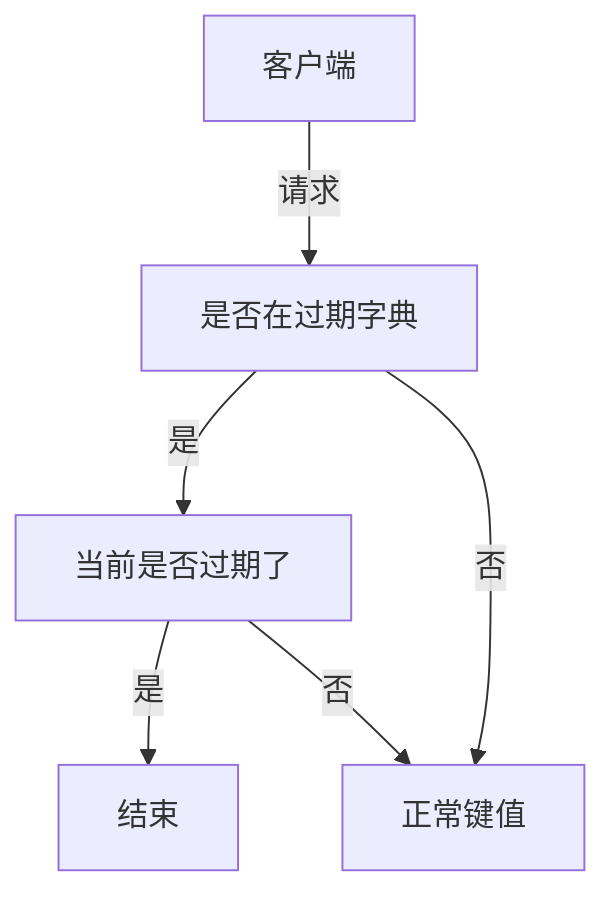

# 数据类型篇


## String

### 内部实现

1. Key-value结构。value最多512M。

2. String 类型的底层的数据结构实现主要是 int 和 SDS（简单动态字符串）

   1. **SDS 不仅可以保存文本数据，还可以保存二进制数据**。 SDS 不光能存放文本数据，而且能保存图片、音频、视频、压缩文件这样的二进制数据
   2. **SDS 获取字符串长度的时间复杂度是 O(1)**。SDS 结构里用 `len` 属性记录了字符串长度
   3. **Redis 的 SDS API 是安全的，拼接字符串不会造成缓冲区溢出**，拼接字符串空间不够会自动扩容

3. 字符串对象的内部编码（encoding）有 3 种 ：**int、raw和 embstr**。

   1. 如果一个字符串对象保存的是整数值，并且这个整数值可以用`long`类型来表示，那么字符串对象会将整数值保存在字符串对象结构的`ptr`属性里面（将`void*`转换成 long），并将字符串对象的编码设置为`int`。

      

   2. 如果字符串对象保存的是一个字符串，并且这个**字符申的长度小于等于 32 字节**（redis 2.+版本），那么字符串对象将使用一个简单动态字符串（SDS）来保存这个字符串，并将对象的编码设置为`embstr`， `embstr`编码是专门用于保存短字符串的一种优化编码方式：

      

   3. 字符串的长度大于 32 字节（redis 2.+版本），那么字符串对象将使用一个简单动态字符串（SDS）来保存这个字符串，并将对象的编码设置为`raw`：

      

   4. `embstr`和`raw`编码都会使用`SDS`来保存值，但不同之处在于`embstr`会通过一次内存分配函数来分配一块**连续的内存空间**来保存`redisObject`和`SDS`，而`raw`编码会通过调用两次内存分配函数来分别分配**两块空间**来保存`redisObject`和`SDS`
      
      1. 因为`embstr`编码的字符串对象的所有数据都保存在一块连续的内存里面可以更好的利用 CPU 缓存提升性能。
      2. 但是 embstr 也有缺点的，如果字符串的长度增加需要重新分配内存时，整个redisObject和sds都需要**重新分配空间**，所以**embstr编码的字符串对象实际上是只读的**。任何修改程序都会先将embstr对象的编码从embstr转换成raw，然后再执行修改命令。

### 常用指令

SETNX：不存在就插入

TTL：查看过期时间

EXPIRE：设置过期时间

### 应用场景

#### 缓存对象

#### 常规计数：

Redis 处理命令是单线程，所以执行命令的过程是原子的。比如计算访问次数、点赞、转发、库存数量等等

#### 分布式锁：

1. SET 命令有个 NX 参数可以实现「key不存在才插入」，可以用它来实现分布式锁，一般而言，还会对分布式锁加上过期时间

   `SET lock_key unique_value NX PX 10000` ，其中px 10000表示10秒

2. 而解锁的过程就是将 lock_key 键删除，但不能乱删，要保证执行操作的客户端就是加锁的客户端。所以，**解锁的时候，我们要先判断锁的 unique_value 是否为加锁客户端**，是的话，才将 lock_key 键删除

   ```lua
   // 释放锁时，先比较 unique_value 是否相等，避免锁的误释放
   if redis.call("get",KEYS[1]) == ARGV[1] then
       return redis.call("del",KEYS[1])
   else
       return 0
   end
   ```

#### 共享Session信息

> 通常我们在开发后台管理系统时，会使用 Session 来保存用户的会话(登录)状态，这些 Session 信息会被保存在服务器端，但这只适用于单系统应用，如果是分布式系统此模式将不再适用。
>
> 例如用户一的 Session 信息被存储在服务器一，但第二次访问时用户一被分配到服务器二，这个时候服务器并没有用户一的 Session 信息，就会出现需要重复登录的问题，问题在于分布式系统每次会把请求随机分配到不同的服务器。

​	解决：所有服务器都请求同一台Redis

​	

## List

从头部或尾部向 List 列表添加元素。列表的最大长度为 `2^32 - 1`

### 内部实现

1. **在 Redis 3.2 版本之后，List 数据类型底层数据结构就只由 quicklist 实现了，替代了双向链表和压缩列表**

   1. 但在之前是由**双向链表或压缩列表**实现的

   + 如果列表的元素个数小于 `512` 个（默认值，可由 `list-max-ziplist-entries` 配置），列表每个元素的值都小于 `64` 字节（默认值，可由 `list-max-ziplist-value` 配置），Redis 会使用**压缩列表**作为 List 类型的底层数据结构；（512个、64字节）

   + 如果列表的元素不满足上面的条件，Redis 会使用**双向链表**作为 List 类型的底层数据结构

### 常用指令

```shell
# 将一个或多个值value插入到key列表的表头(最左边)，最后的值在最前面。
# 即：按照左到右的顺序 依次 进行插入
LPUSH key value [value ...] 
RPUSH key value [value ...]# 将一个或多个值value插入到key列表的表尾(最右边)
LPOP key     # 移除并返回key列表的头元素
RPOP key # 移除并返回key列表的尾元素

# 返回列表key中指定区间内的元素，区间以偏移量start和stop指定，从0开始
LRANGE key start stop

# 从key列表表头弹出一个元素，没有就阻塞timeout秒，如果timeout=0则一直阻塞
BLPOP key [key ...] timeout
BRPOP key [key ...] timeout # 从key列表表尾弹出一个元素。。。
```

### 应用场景

#### 消息队列

> 消息队列在存取消息时，必须要满足三个需求，分别是**消息保序、处理重复的消息和保证消息可靠性**。
>
> Redis 的 List 和 Stream 两种数据类型，就可以满足消息队列的这三个需求

1. 如何满足保序性

​	使用List实现队列，没有通知消息，消费者需要一直读RPOP。

​	为了解决这个问题，Redis提供了 BRPOP 命令。**BRPOP命令也称为阻塞式读取，客户端在没有读到队列数据时，自动阻塞，直到有新的数据写入队列，再开始读取新数据**

2. 如何**处理重复**

   + 每个消息都有一个全局的 ID。
   + 消费者要记录已经处理过的消息的 ID

   但是 **List 并不会为每个消息生成 ID 号，所以我们需要自行为每个消息生成一个全局唯一ID**

   `LPUSH mq "111000102:stock:99"`就把一条全局 ID 为 111000102、库存量为 99 的消息插入了消息队列

3. 保证消息可靠性

   > 当消费者程序从 List 中读取一条消息后，List 就不会再留存这条消息了。如果消费者程序在处理消息的过程出现了故障或宕机，就会导致消息没有处理完成，那么，消费者程序再次启动后，就没法再次从 List 中读取消息了。

   为了留存消息，List 类型提供了 `BRPOPLPUSH` 命令，这个命令的**作用是让消费者程序从一个 List 中读取消息，同时，Redis 会把这个消息再插入到另一个 List（可以叫作备份 List）留存**

4. 缺陷

   **List 不支持多个消费者消费同一条消息**，因为一旦消费者拉取一条消息后，这条消息就从 List 中删除了，无法被其它消费者再次消费。

   要实现一条消息可以被多个消费者消费，那么就要将多个消费者组成一个消费组，使得多个消费者可以消费同一条消息，但是 **List 类型并不支持消费组的实现**。

   > 从Rdis5.0开始可以用Stream实现

## Hash

key - value集合，其中 value 的形式如： `value=[{field1，value1}，...{fieldN，valueN}]`

Hash 特别适合用于存储对象。整体上是：（key，field， value）结构

### 内部实现

**在 Redis 7.0 中，压缩列表数据结构已经废弃了，交由 listpack 数据结构来实现了**。

在此之前，Hash 类型的底层数据结构是由**压缩列表或哈希表**实现的：

+ 如果哈希类型元素个数小于 `512` 个（默认值，可由 `hash-max-ziplist-entries` 配置），所有值小于 `64` 字节（默认值，可由 `hash-max-ziplist-value` 配置）的话，Redis 会使用**压缩列表**作为 Hash 类型的底层数据结构； #同List， 512 *64  都用压缩列表
+ 如果哈希类型元素不满足上面条件，Redis 会使用**哈希表**作为 Hash 类型的 底层数据结构。

### 常用指令

```shell
HSET key field value    # 存储一个哈希表key的键值
HGET key field   		# 获取哈希表key对应的field键值

HMSET key field value [field value...]  # 在一个哈希表key中存储多个键值对
HMGET key field [field ...]       # 批量获取哈希表key中多个field键值
HDEL key field [field ...]     # 删除哈希表key中的field键值

HLEN key       # 返回哈希表key中field的数量:hash_len
HGETALL key   # 返回哈希表key中所有的键值:hash_get_all

HINCRBY key field n    # 为哈希表key中field键的值加上增量n  hash_incr_by       
```

### 应用场景

#### 缓存对象

```shell
# 存储一个哈希表uid:1的键值
> HMSET uid:1 name Tom age 15
2
# 存储一个哈希表uid:2的键值
> HMSET uid:2 name Jerry age 13
2
# 获取哈希表用户id为1中所有的键值
> HGETALL uid:1
1) "name"
2) "Tom"
3) "age"
4) "15"
```


以购物车为例：**以用户 id 为 key，商品 id 为 field，商品数量为 value**，恰好构成了购物车的3个要素。但是当前仅仅是将商品ID存储到了Redis 中，在回显**商品具体信息**的时候，还需**要拿着商品 id 查询一次数据库**，获取完整的商品的信息。

## Set

无序并唯一的键值集合，一个集合最多可以存储 `2^32-1` 个元素。Set 类型除了支持集合内的增删改查，同时还支持多个集合**取交集、并集、差集**

### 内部实现

Set 类型的底层数据结构是由**哈希表或整数集合**实现的：

+ 如果集合中的元素都是整数且元素个数小于 `512` （默认值，`set-maxintset-entries`配置）个，Redis 会使用**整数集合**作为 Set 类型的底层数据结构；
+ 如果集合中的元素不满足上面条件，则 Redis 使用**哈希表**作为 Set 类型的底层数据结构。

### 常用指令

```shell
SADD key member [member ...] # 往集合key中存入元素，元素存在则忽略，若key不存在则新建
SREM key member [member ...]  # 从集合key中删除元素
####要记一下
SMEMBERS key # 获取集合key中所有元素成员： set_members
SCARD key # 获取集合key中的元素个数: set_card
SISMEMBER key member # 判断member元素是否存在于集合key中 sis_member
SRANDMEMBER key [count] # 从集合key中随机选出count个元素，元素不从key中删除:s_rand_member
SPOP key [count] # 从集合key中随机选出count个元素，元素从key中删除

SINTER key [key ...] # 交集运算 s_inter
	SINTERSTORE destination key [key ...] # 交集结果存入 新集合destination中,s_inter_store
SUNION key [key ...] # 并集运算 s_union
	SUNIONSTORE destination key [key ...] # 将并集结果存入新集合destination中
SDIFF key [key ...] # 差集运算 s_diff
	SDIFFSTORE destination key [key ...] # 将差集结果存入新集合destination中
```

### 应用场景

Set 类型比较适合用来数据去重和保障数据的唯一性

> 这里有一个潜在的风险。**Set 的差集、并集和交集的计算复杂度较高，在数据量较大的情况下，如果直接执行这些计算，会导致 Redis 实例阻塞**。

#### 点赞

Set 类型可以保证一个用户只能点一个赞。

```shell
# uid:1 用户对文章 article:1 点赞
> SADD article:1 uid:1
# uid:1 取消了对 article:1 文章点赞。
> SREM article:1 uid:1
```

#### 共同关注

Set 类型支持交集运算，所以可以用来计算共同关注的好友、公众号等。

```shell
# uid:1 用户关注公众号 id 为 5、6、7、8、9
> SADD uid:1 5 6 7 8 9
(integer) 5
# uid:2  用户关注公众号 id 为 7、8、9、10、11
> SADD uid:2 7 8 9 10 11
(integer) 5
# 获取共同关注
> SINTER uid:1 uid:2
1) "7"
2) "8"
3) "9"
```

#### 抽奖活动

```shell
>SADD lucky Tom Jerry John Sean Marry Lindy Sary Mark
(integer) 5
# 抽取2个二等奖，但同一个人可以同时中一等奖和二等奖
> SRANDMEMBER lucky 2
1) "Mark"
2) "Jerry"
# 抽取二等奖2个 ，但一等奖用户不可能再中二等奖
> SPOP lucky 2 #一等奖也是用SPOP抽的情况下
1) "Jerry"
2) "Mark"
```

## Zset

**有序**集合类型，相比于 Set 类型多了一个排序属性 score（分值）

ZSet 类型**不支持差集运算**

有序集合保留了集合**不能有重复成员**的特性（**但分值可以重复**）

### 内部实现

**在 Redis 7.0 中，压缩列表数据结构已经废弃了，交由 listpack 数据结构来实现了。**

Zset 类型的底层数据结构是由**压缩列表或跳表**实现的

+ 如果有序集合的元素个数小于 `128` 个，并且每个元素的值小于 `64` 字节时，Redis 会使用**压缩列表**作为 Zset 类型的底层数据结构； # 注意，这里是128
+ 如果有序集合的元素不满足上面的条件，Redis 会使用**跳表**作为 Zset 类型的底层数据结构；

```shell
ZADD key score member [[score member]...]    # 往有序集合key中加入带分值元素
ZREM key member [member...]            # 往有序集合key中删除元素      
ZSCORE key member   # 返回有序集合key中元素member的分值： z_score 最后拿到的是分值
ZCARD key  # 返回有序集合key中元素个数 z_card

ZINCRBY key increment member  # 为有序集合<key中元素member>的<分值>加上increment
ZRANGE key start stop [WITHSCORES] # 正序获取有序集合key从start下标到stop下标的元素
	ZREVRANGE key start stop [WITHSCORES] # 倒序获取 ,多了REV

ZRANGEBYSCORE key min max [WITHSCORES] [LIMIT offset count] # 返回有序集合中指定分数区间内的<成员>，分数由低到高排序。   多了SCORE

###不要在分数不一致的 SortSet 集合中去使用 ZRANGEBYLEX和 ZREVRANGEBYLEX 指令，因为获取的结果会不准确。
ZRANGEBYLEX key min max [LIMIT offset count] # 返回指定成员区间内的成员，按字典正序排列, 分数必须相同。 z_range_bu_lex
	ZREVRANGEBYLEX key max min [LIMIT offset count] # 返回指定成员区间内的成员，按字典倒序排列, 分数必须相同
	

# 并集计算( <相同元素分值相加> )，numberkeys一共多少个key，WEIGHTS每个key对应的分值乘积
ZUNIONSTORE destkey numberkeys key [key...] 
# 交集计算(相同元素分值相加)，numberkeys一共多少个key，WEIGHTS每个key对应的分值乘积
ZINTERSTORE destkey numberkeys key [key...]
```

### 应用场景

#### 排行榜

比如文章点赞排行

#### 电话姓名排序

注意，他们的**score都是相同的**

```shell
> ZRANGEBYLEX phone [132 (133  # 有开有闭    - + 分别表示无穷
1) "13200111100"
2) "13210414300"
3) "13252110901"
```

```shell
> zadd names 0 Toumas 0 Jake 0 Bluetuo 0 Gaodeng 0 Aimini 0 Aidehua 
(integer) 6
#获取名字中大写字母A开头的所有人 
> ZRANGEBYLEX names [A (B
1) "Aidehua"
2) "Aimini"
```

## BitMap

### 内部实现

Bitmap 本身是用 **String 类型作为底层数据结构**实现的。String 类型是会保存为二进制的字节数组，所以，Redis 就把字节数组的每个 bit 位利用起来，用来表示一个元素的二值状态

```shell
SETBIT key offset value  # 设置值，其中value只能是 0 和 1
GETBIT key offset  # 获取值

# 获取指定范围内值为 1 的个数
# start 和 end 以《字节为单位》
BITCOUNT key start end

# BitMap间的运算
# operations 位移操作符，枚举值
  AND 与运算 &
  OR 或运算 |
  XOR 异或 ^
  NOT 取反 ~
# result 计算的结果，会存储在该key中
# key1 … keyn 参与运算的key，可以有多个，空格分割，not运算只能一个key
# 当 BITOP 处理不同长度的字符串时，《较短的那个字符串所缺少的部分会被看作 0》。返回值是保存到 destkey 的字符串的长度（以字节byte为单位），和输入 key 中最长的字符串长度相等。
BITOP [operations] [result] [key1] [keyn…]

BITPOS [key] [value] # 返回指定key中第一次出现指定value(0/1)的位置 。bit_pos
```

### 应用场景

#### 签到统计

```shell
#记录该用户 6 月 3 号已签到 2表示第3位。[0 1 2]
SETBIT uid:sign:100:202206 2 1
#检查该用户 6 月 3 日是否签到
GETBIT uid:sign:100:202206 2 
#6月首次打卡时间，返回值+1
BITPOS uid:sign:100:202206 1
```

#### 判断用户登录状态

```shell
# 表示ID=10086的用户状态为1（登录状态）。login_status记录所有用户的状态
SETBIT login_status 10086 1
```

#### 连续七天签到

每天的日期作为一个key（有七个），偏移作为用户id。（类上上面）

```shell
# 与操作
BITOP AND destmap bitmap:01 bitmap:02 bitmap:03 # 。。。省略其他4个bitmap，&结果在destmap
# 统计 bit 位 =  1 的个数
BITCOUNT destmap
```

## HyperLogLog

简单来说 HyperLogLog **提供不精确的去重计数**。计算基数所需的内存空间总是固定的、并且是很小的。**每个 HyperLogLog 键只需要花费 12 KB 内存，就可以计算接近 `2^64` 个不同元素的基数**

### 内部实现

数学相关，过于复杂

### 常用命令

```shell
PFADD key element [element ...] # 添加指定元素到 HyperLogLog 中
PFCOUNT key [key ...] # 返回给定 HyperLogLog 的基数估算值。

PFMERGE destkey sourcekey [sourcekey ...] # 将多个 HyperLogLog <合并>为一个 HyperLogLog
```

### 应用场景

#### 统计网页UV（Unique Visitors）

把每个用户PFADD即可

## GEO

主要用于存储地理位置信息，并对存储的信息进行操作

### 内部实现

GEO 本身并没有设计新的底层数据结构，而是直接使用了 Sorted Set 集合类型。使用 GeoHash 编码方法实现了经纬度到 Sorted Set 中元素权重分数的转换

```shell
# 存储指定的地理空间位置，可以将一个或多个经度(longitude)、纬度(latitude)、位置名称(member)添加到指定的 key 中。
GEOADD key longitude latitude member [longitude latitude member ...]

# 从给定的 key 里返回所有指定名称(member)的位置（经度和纬度），不存在的返回 nil。
GEOPOS key member [member ...]

# 返回两个给定位置之间的距离。
GEODIST key member1 member2 [m|km|ft|mi]

# 根据用户给定的经纬度坐标来获取指定范围内的地理位置集合。 IUS 获取范围内
GEORADIUS key longitude latitude radius m|km|ft|mi [WITHCOORD] [WITHDIST] [WITHHASH] [COUNT count] [ASC|DESC] [STORE key] [STOREDIST key]
```

### 应用场景

#### 打车

## Stream

Redis Stream 是 Redis 5.0 版本新增加的数据类型，**Redis 专门为消息队列设计的数据类型**。

在 Redis 5.0 Stream 没出来之前，消息队列的实现方式都有着各自的缺陷，例如：

+ 发布订阅模式，不能持久化也就无法可靠的保存消息，并且对于离线重连的客户端不能读取历史消息的缺陷；
+ List 实现消息队列的方式不能重复消费，一个消息消费完就会被删除，而且生产者需要自行实现全局唯一 ID。

Stream支持消息的持久化、支持自动生成全局唯一 ID、支持 ack 确认消息的模式、支持消费组模式等

### 常见命令

```shell
XADD：插入消息，保证有序，可以自动生成全局唯一 ID；
XLEN ：查询消息长度；
XREAD：用于读取消息，可以按 ID 读取数据；
XDEL ： 根据消息 ID 删除消息；
DEL ：删除整个 Stream；
XRANGE ：读取区间消息
XREADGROUP：按消费组形式读取消息；
XPENDING 和 XACK：
XPENDING 命令可以用来查询每个消费组内所有消费者「已读取、但尚未确认」的消息；
XACK 命令用于向消息队列确认消息处理已完成；
```

### 应用场景

#### 消息队列

1. 插入

```shell
# * 表示让 Redis 为插入的数据自动生成一个全局唯一的 ID
# 往名称为 mymq 的消息队列中插入一条消息，消息的键是 name，值是 xiaolin
> XADD mymq * name xiaolin
"1654254953808-0" #这是生成的全局唯一ID：前半部分是服务器时间（精确到毫秒）后半部分是此毫秒内的消息序号

```

2. 读取

```shell
# 从 ID 号为 1654254953807-0 的消息开始，读取后续的所有消息（示例中一共 1 条）。
> XREAD STREAMS mymq 1654254953807-0
1) 1) "mymq"
   2) 1) 1) "1654254953808-0"
         2) 1) "name"
            2) "xiaolin"
# 要注意的是：是输入消息 ID 的<<<下一条>>>信息开始读取，不是查询输入ID的消息
```

3. 读取，没有数据时阻塞

```shell
# 命令最后的“$”符号表示读取最新的消息
> XREAD BLOCK 10000 STREAMS mymq $ #10000ms=>10s
(nil)
(10.00s)
```

---

以上功能List也可以实现，一下是Stream独有的

4. 消费组

```shell
# 创建两个消费组，这两个消费组消费的消息队列是 mymq
# 创建一个名为 group1 的消费组，0-0 表示从第一条消息开始读取。
> XGROUP CREATE mymq group1 0-0
OK
# 创建一个名为 group2 的消费组，0-0 表示从第一条消息开始读取。
> XGROUP CREATE mymq group2 0-0
OK
```

```shell
# 消费组 group1 内的消费者 consumer1 从 mymq 消息队列中读取所有消息
# 命令最后的参数“>”，表示从第一条尚未被消费的消息开始读取。
> XREADGROUP GROUP group1 consumer1 STREAMS mymq >
1) 1) "mymq"
   2) 1) 1) "1654254953808-0"
         2) 1) "name"
            2) "xiaolin"
```

**消息队列中的消息一旦被消费组里的一个消费者读取了，就不能再被该消费组内的其他消费者读取了，即同一个消费组里的消费者不能消费同一条消息**。

但是，**不同消费组的消费者可以消费同一条消息（但是有前提条件，创建消息组的时候，不同消费组指定了相同位置开始读取消息）**。

>  基于 Stream 实现的消息队列，如何保证消费者在发生故障或宕机再次重启后，仍然可以读取未处理完的消息？
>
> Streams 会自动使用内部队列（也称为 PENDING List）留存消费组里每个消费者读取的消息，直到消费者使用 XACK 命令通知 Streams“消息已经处理完成”。**消费者可以在重启后，用 XPENDING 命令查看已读取、但尚未确认处理完成的消息**

```shell
# 使用XACK删除消息，但注意，消除的仅仅是自己这一组的消息。其他组仍然可以读
> XACK mymq group2 1654256265584-0
(integer) 1
```

##### 如何保证不丢失数据

+ Redis 生产者会不会丢消息？生产者会不会丢消息，**取决于生产者对于异常情况的处理是否合理**。 从消息被生产出来，然后提交给 MQ 的过程中，只要能正常收到 （ MQ 中间件） 的 ack 确认响应，就表示发送成功，所以只要处理好返回值和异常，如果返回异常则进行消息重发，那么这个阶段是不会出现消息丢失的。
+ Redis **消费者会不会丢消息？不会**，因为 Stream （ MQ 中间件）会自动使用内部队列（也称为 PENDING List）留存消费组里每个消费者读取的消息，但是未被确认的消息。消费者可以在重启后，用 XPENDING 命令查看已读取、但尚未确认处理完成的消息。**等到消费者执行完业务逻辑后，再发送消费确认 XACK 命令，也能保证消息的不丢失**。
+ Redis 消息中间件会不会丢消息？会，Redis 在以下 2 个场景下，都会导致数据丢失：
  + AOF 持久化配置为每秒写盘，但这个写盘过程是异步的，Redis 宕机时会存在数据丢失的可能
  + 主从复制也是异步的，[主从切换时，也存在丢失数据的可能 (opens new window)](https://xiaolincoding.com/redis/cluster/master_slave_replication.html#redis-主从切换如何减少数据丢失)。

##### 消息可堆积吗？

 Redis 的 Stream 提供了可以指定队列最大长度的功能，当指定队列最大长度时，队列长度超过上限后，旧消息会被删除，只保留固定长度的新消息。但 Kafka、RabbitMQ 专业的消息队列它们的数据都是存储在磁盘上，当消息积压时，无非就是多占用一些磁盘空间。

##### Redis 发布/订阅机制为什么不可以作为消息队列？

发布订阅机制存在以下缺点，都是跟丢失数据有关：

1. 发布/订阅机制没有基于任何数据类型实现，所以不具备「数据持久化」的能力。Redis宕机重启全部丢失
2. 发布订阅模式是“发后既忘”的工作模式，如果有订阅者离线重连之后不能消费之前的历史消息
3. 当消费端有一定的消息积压时，消费端会被强行断开

+ 发布/订阅机制只适合即时通讯的场景，比如[构建哨兵集群 (opens new window)](https://xiaolincoding.com/redis/cluster/sentinel.html#哨兵集群是如何组成的)的场景采用了发布/订阅机制。

# Redis数据结构篇

## 键值对

Redis使用Hash来保存所有的键值对


## SDS


+ **flags，用来表示不同类型的 SDS**。一共设计了 5 种类型，分别是 sdshdr5、sdshdr8、sdshdr16、sdshdr32 和 sdshdr64。这 5 种类型的主要**区别就在于，它们数据结构中的 len 和 alloc 成员变量的数据类型不同**
  + sdshdr16 类型的 len 和 alloc 的数据类型都是 uint16_t，表示字符数组长度和分配空间大小不能超过 2 的 16 次方。
  + 同理sdshdr32 则都是 uint32_t，表示表示字符数组长度和分配空间大小不能超过 2 的 32 次方。
+ **len，记录了字符串长度** ；**alloc，分配给字符数组的空间长度**
+ **buf[]，字符数组，用来保存实际数据**

**当判断出缓冲区大小不够用时，Redis 会自动将扩大 SDS 的空间大小**，以满足修改所需的大小

+ 如果所需的 sds 长度**小于 1 MB**，那么最后的扩容是按照**翻倍扩容**来执行的，即 2 倍的newlen

+ 如果所需的 sds 长度**超过 1 MB**，那么最后的扩容长度应该是 newlen **+ 1MB**。

>  除了设计不同类型的结构体，Redis 在编程上还**使用了专门的编译优化来节省内存空间**，即在 struct 声明了 `__attribute__ ((packed))` ，它的作用是：**告诉编译器取消结构体在编译过程中的优化对齐，按照实际占用字节数进行对齐**。比如char和int。对齐情况下为8Byte。优化后为6Byte

## 链表

List 对象的底层实现之一就是链表

+ list 结构为链表提供了**链表头指针 head、链表尾节点 tail、链表节点数量 len**、以及可以**自定义实现的 dup、free、match 函数**。

##  *压缩列表

被设计成一种内存紧凑型的数据结构，占用一块连续的内存空间，不仅可以利用 CPU 缓存，而且会针对不同长度的数据，进行相应编码，这种方法可以有效地**节省内存开销**。但缺点如下

+ 不能保存过多的元素，否则查询效率就会降低；
+ 新增或修改某个元素时，压缩列表占用的内存空间需要重新分配，甚至可能引发连锁更新的问题


在压缩列表中，如果我们要查找定位**第一个元素和最后一个元素**是复杂度**O(1)**，可以通过表头三个字段（zllen）的长度直接定位。而**查找其他元素时，就没有这么高效了，只能逐个查找，此时的复杂度就是 O(N) 了，因此压缩列表不适合保存过多的元素**。


+ 其中prevlen和encoding的长度不是固定的，和它存储的数值大小有关。
  + 压缩列表里的每个节点中的 prevlen 属性都记录了「前一个节点的长度」，而且 prevlen 属性的空间大小跟前一个节点长度值有关，比如：
    + 如果**前一个节点的长度小于 254 字节**，那么 prevlen 属性需要用 **1 字节的空间**来保存这个长度值；
    + 如果**前一个节点的长度大于等于 254 字节**，那么 prevlen 属性需要用 **5 字节的空间**来保存这个长度值；
  + encoding 属性的空间大小跟数据是字符串还是整数，以及字符串的长度有关，如下图（下图中的 content 表示的是实际数据，即本文的 data 字段）：
    + 如果**当前节点的数据是整数**，则 encoding 会使用 **1 字节的空间**进行编码，也就是 encoding 长度为 1 字节。通过 encoding 确认了整数类型，就可以确认整数数据的实际大小了，比如如果 encoding 编码确认了数据是 int16 整数，那么 data 的长度就是 int16 的大小。
    + 如果**当前节点的数据是字符串，根据字符串的长度大小**，encoding 会使用 <u>**1 字节/2字节/5字节的空间**</u>进行编码，encoding 编码的前两个 bit 表示数据的类型，后续的其他 bit 标识字符串数据的实际长度，即 data 的长度

### 连锁更新问题

前一个节点的长度超过了254导致本节点的prelen要进行扩展才能存的下254。于是prelen扩展了两个字节。导致本节点的总体长度也发生了变化，于是下一个节点的prelen也要更新，恰恰此时本节点的长度也是刚刚增加到254，于是下一个节点的prelen也要扩展。如此往复，导致连锁更新

## Hash表

之前版本中，Hash对象的底层实现是压缩列表（现在替换为listPack）。

+ Hash节点的结构：值的那一部分是[联合体]定义的，它可以是指针也可以是真正的值。（当值是普通数值时节省空间）

  ```c
  typedef struct dictEntry {
      //键值对中的键
      void *key;
    
      //键值对中的值
      union {
          void *val;
          uint64_t u64;
          int64_t s64;
          double d;
      } v;
      //指向下一个哈希表节点，形成链表
      struct dictEntry *next;
  } dictEntry;
  ```

### 哈希冲突

1. 链式哈希：

2. rehash： dictht结构体里定义了两个哈希表

   在正常服务请求阶段，插入的数据，都会写入到「哈希表 1」，此时的「哈希表 2 」 并没有被分配空间。

   **随着数据逐步增多，触发了 rehash 操作**，这个过程分为三步：

   + 给「哈希表 2」 分配空间，一般会比「哈希表 1」 **大一倍**（两倍的意思）；
   + 将「哈希表 1 」的数据迁移到「哈希表 2」 中；
   + 迁移完成后，「哈希表 1 」的空间会被释放，并把「哈希表 2」 设置为「哈希表 1」，然后在「哈希表 2」 新创建一个空白的哈希表，为下次 rehash 做准备。（表2变表1）

   > **如果「哈希表 1 」的数据量非常大，那么在迁移至「哈希表 2 」的时候，因为会涉及大量的数据拷贝，此时可能会对 Redis 造成阻塞，无法服务其他请求**。

3. 渐进式rehash

   + 给「哈希表 2」 分配空间；
   + 在 rehash 进行期间，**每次哈希表元素进行新增、删除、查找或者更新操作时**，Redis 除了会执行对应的操作之外，还会顺序将「哈希表 1 」中**索引位置上的所有 key-value 迁移到「哈希表 2」 上**（这个桶上的都迁走）；且所有的新增都会直接进入hash表2
   + 随着处理客户端发起的哈希表操作请求数量越多，最终在某个时间点会把「哈希表 1 」的所有 key-value 迁移到「哈希表 2」，从而完成 rehash 操作。

   > 但引入一个问题：**hash表1查不到，就需要到hash表2中查找**。

4. Rehash触发和《负载因子》相关：

   + 当**负载因子大于等于 1** ，并且 Redis 没有在执行 bgsave 命令或者 bgrewiteaof 命令，也就是**没有执行 RDB 快照或没有进行 AOF 重写的时候**，就会进行 rehash 操作。

   + 当**负载因子大于等于 5 时**，此时说明哈希冲突非常严重了，不管有没有有在执行 RDB 快照或 AOF 重写，都会**强制进行 rehash** 操作。

## 整数集合

整数集合是Set对象的底层实现之一（当Set只包含整数元素且数量不多时）

```c
typedef struct intset {
    //编码方式
    uint32_t encoding;
    //集合包含的元素数量
    uint32_t length;
    //保存元素的数组
    int8_t contents[];
} intset;
//虽然最后的contents是int8_t。但它的类型取决于encoding属性。（8相当于单位，实际可能是16/32/64）
```

### 整数集合的升级：（不支持降级）

新元素的类型（int32_t）比整数集合现有所有元素的类型（int16_t）都要长时，整数集合需要先进行升级。

+ 整数集合升级的过程不会重新分配一个新类型的数组，而是在原本的数组上扩展空间，然后在将每个元素按间隔类型大小分割。其中扩展后的空间全部以新元素的大小为标准。
+ 且之前的16位元素都要扩展成32位。（从后往前）

## 跳表

只有Zset使用，跳表支持平均复杂度O(logN)的查找。**Zset结构体里有两个数据结构：跳表（用于支持范围查询）和哈希表（只用于支持常熟复杂度获取元素权重）**，Zset 对象在执行数据插入或是数据更新的过程中，会依次在跳表和哈希表中插入或更新相应的数据，从而保证了跳表和哈希表中记录的信息一致


注意：上面是跳表节点。且zskiplistLevel是数组。是几级节点就有几个。

**跨度实际上是为了计算这个节点在跳表中的排位**。跳表中的节点都是按序排列的，那么计算某个节点排位的时候，从头节点点到该结点的查询路径上，将沿途访问过的所有层的跨度累加起来，得到的结果就是目标节点在跳表中的排位。


### 查询过程

查找一个跳表节点的过程时，跳表会从头节点的最高层开始，逐一遍历每一层

+ 如果当前节点的权重「**小于**」要查找的权重时，跳表就会访问该层上的**下一个节点**。
+ 如果当前节点的权重「**等于**」要查找的权重时，并且当前节点的 SDS 类型数据「小于」要查找的数据时，跳表就会访问该层上的下一个节点。
+ 如果上面两个条件都不满足，或者下一个节点为空时，跳表就会使用目前遍历到的节点（不是比较正在比较大小的那个）的 level 数组里的下一层指针，然后沿着下一层指针继续查找，这就相当于跳到了下一层接着查找

### 层数设置

跳表的相邻两层的节点数量的比例会影响跳表的查询性能，**跳表的相邻两层的节点数量最理想的比例是 2:1，查找复杂度可以降低到 O(logN)**。但如何保证呢？

> 如果采用新增节点或者删除节点时，来调整跳表节点以维持比例的方法的话，会带来额外的开销。
>
> Redis 则采用一种巧妙的方法是，**跳表在创建节点的时候，随机生成每个节点的层数**，并没有严格维持相邻两层的节点数量比例为 2 : 1 的情况。
>
> 具体的做法是，**跳表在创建节点时候，会生成范围为[0-1]的一个随机数，如果这个随机数小于 0.25（相当于概率 25%），那么层数就增加 1 层，然后继续生成下一个随机数，直到随机数的结果大于 0.25 结束，最终确定该节点的层数**。（比如3层的节点就是连续出了两次小的数字（0.25以下）。
>
> 这样的做法，相当于每增加一层的概率不超过 25%，层数越高，概率越低，层高最大限制是 64。**如果层高最大限制是 32，那么在创建跳表「头节点」的时候，就会直接创建 32 层高的头节点（Redis 7.0 定义为 32，Redis 5.0 定义为 64，Redis 3.0 定义为 32）**。

### 为什么用跳表但不用平衡树（AVL也是查找lgN）

1. 内存占用更少：

   AVL每个节点包含2个指针，跳表每个节点包含1/(1-p)个指针，当p=1/4时，每个节点包含1.33个指针。少于AVL

2. 范围查找时，跳表比AVL更简单：未改造的AVL的中序遍历更难一些。而跳表只需要到第一层顺序遍历即可

3. 跳表更容易实现

## quicklist

压缩列表有连锁更新的风险，quicklist 解决办法，**通过<u>控制每个链表节点中的压缩列表的大小</u>或者元素个数，来规避连锁更新的问题。因为压缩列表元素越少或越小，连锁更新带来的影响就越小，从而提供了更好的访问性能。**

```c
//主要区别在于节点结构
typedef struct quicklistNode {
    //前一个quicklistNode
    struct quicklistNode *prev;     //前一个quicklistNode
    //下一个quicklistNode
    struct quicklistNode *next;     //后一个quicklistNode
    //quicklistNode指向的压缩列表
    unsigned char *zl;              
    //压缩列表的的字节大小
    unsigned int sz;                
    //压缩列表的元素个数
    unsigned int count : 16;        //ziplist中的元素个数 
    ....
} quicklistNode;
```


> quicklist 会控制 quicklistNode 结构里的压缩列表的大小或者元素个数，来规避潜在的连锁更新的风险，但是这并没有完全解决连锁更新的问题

## listPack

目的是替代压缩列表。结构如下

**listpack 没有压缩列表中记录前一个节点长度的字段了，listpack 只记录当前节点的长度，当我们向 listpack 加入一个新元素的时候，不会影响其他节点的长度字段的变化，从而避免了压缩列表的连锁更新问题**。

> 压缩列表的节点entry的prelen是保存前一个节点长度是为了从后往前遍历（知道节点长度就知道前一个节点的偏移量）。改成len之后只存了自己的长度，但实际上仍有办法从后向前（复杂算法，向左逐个字节解析来完成）

# 持久化篇

Redis有两种持久化技术，分别是AOF和RDB快照。默认方式是RDB快照

## AOF：存储命令

AOF：Append Only File

+ Redis先执行操作，然后记录到日志。好处如下
  + 避免额外的检查开销：比如命令语法有问题先写日志就不行
  + 不会阻塞当前命令的执行
    + 风险如下
      + 如果命令执行了但没写入就宕机了，出问题
      + 不会阻塞当前指令，但可能影响下一个指令（命令和写日志都是主进程完成）。他们之间是同步的 

### 写回策略


1. Redis 执行完写操作命令后，会将命令追加到 `server.aof_buf` 缓冲区；
2. 然后通过 write() 系统调用，将 aof_buf 缓冲区的数据写入到 AOF 文件，此时数据并没有写入到硬盘，而是拷贝到了内核缓冲区 page cache，等待内核将数据写入硬盘；
3. 具体内核缓冲区的数据什么时候写入到硬盘，由内核决定。

在 `redis.conf` 配置文件中的 `appendfsync` 配置项可以有以下 3 种参数可填：

+ **Always**（用于高可靠），这个单词的意思是「总是」，所以它的意思是**每次写操作命令执行完后**，同步将 AOF 日志数据写回硬盘；**最大程度保证数据不丢失，但影响主进程性能，主进程来完成fsync函数，会阻塞**。
+ **Everysec**，这个单词的意思是「每秒」，所以它的意思是每次写操作命令执行完后，先将命令写入到 AOF 文件的内核缓冲区，然后**每隔一秒将缓冲区里的内容写回到硬盘，创建异步任务来执行fsync函数**；
+ **No**（用于高性能），意味着**不由 Redis 控制写回硬盘的时机**，转交给操作系统控制写回的时机，也就是每次写操作命令执行完后，先将**命令写入到 AOF 文件的内核缓冲区**，再**由操作系统决定何时将缓冲区内容写回硬盘**。

> 其实这三种策略只是在控制fsync()函数的调用时机

### 重写机制

为了避免AOF文件过大（导致恢复数据很慢，64M），提供了AOF重写。（重写就是只记录最新的值，中间的修改过程不记录了）。

> 为什么新的AOF完成后替换旧文件，因为如果直接写入旧文件而且重写失败，会造成污染可能造成无法恢复

Redis的AOF**重写过程由后台子进程**来完成（注意是进程，不是线程，因为线程共享内存要加锁）。子进程会带有主进程的数据副本（原本是共享内存但只读，但不管谁写都会另外复制一份）。即一开始子进程只复制**页表**（主进程阻塞），此时子进程是只读的，当发生数据变化时，才进行**修改部分的 物理内存的复制（主进程阻塞）**


+ 在重写 AOF 期间，当 Redis 执行完一个写命令之后，它会**同时将这个写命令写入到 「AOF 缓冲区」和 「AOF 重写缓冲区」**。
  + 也就是说，在 bgrewriteaof 子进程执行 AOF 重写期间，主进程需要执行以下三个工作:
    + 执行客户端发来的命令；
    + 将执行后的写命令追加到 「AOF 缓冲区」；
    + 将执行后的写命令追加到 「AOF 重写缓冲区」；

当子进程完成AOF重写后，向主进程发送信号。**主进程**收到信号后，完成以下工作：

+ 将 **AOF 重写缓冲区**中的所有内容追加到新的 AOF 的文件中，使得新旧两个 AOF 文件所保存的数据库状态一致；

+ **新的 AOF 的文件进行改名**，**覆盖**现有的 AOF 文件。

## RDB快照

全量快照，顾名思义，记录某一时刻的所有的数据信息。**数据恢复效率比AOF高**。

提供了两个命令：`save主进程生成`  `bgsave子进程生成`

```text
#可通过配置文件实现自动执行的bgsave。注意，虽然是‘save’ 但执行的是bgsave
save 900 1      #900秒内至少1次修改
save 300 10			#300秒内至少10次修改
save 60 10000		#60秒内至少10000次修改
```

创建 bgsave 子进程后，由于共享父进程的所有内存数据，于是就可以直接读取主线程（父进程）里的内存数据，并将数据写入到 RDB 文件。

当主线程（父进程）对这些共享的内存数据也都是只读操作，那么，主线程（父进程）和 bgsave 子进程相互不影响。

但是，如果主线程（父进程）要**修改共享数据里的某一块数据**（比如键值对 `A`）时，就会发生写时复制(copy-on-write)，于是这块数据的**物理内存就会被复制一份（键值对 `A'`）**，然后**主线程在这个数据副本（键值对 `A'`）进行修改操作**。与此同时，bgsave **子进程**可以继续把**原来的数据**（键值对 `A`）**写入到 RDB 文件**。（那么极端情况下，**如果所有的共享内存都被修改，则此时的内存占用是原先的 2 倍。**）

> 注意：相当于bgsave锁定了某个时刻的数据。在复制期间的变化并不写入。新修改的数据写在复制的内存中

## 混合持久化：RDB和AOF合体

```text
# 配置文件开启
aof-use-rdb-preamble yes
```

使用了混合持久化，AOF 文件的**前半部分是 RDB 格式的全量数据，后半部分是 AOF 格式的增量数据**。

> 在 AOF 重写日志时，`fork` 出来的重写**子进程**会先将与主线程共享的**内存数据以 RDB 方式写入到 AOF 文件**，然后主线程处理的操作命令会被记录在重写缓冲区里，**重写缓冲区里的增量命令会以 AOF 方式写入到 AOF 文件**，写入完成后通知主进程将新的含有 RDB 格式和 AOF 格式的 AOF 文件替换旧的的 AOF 文件

## Redis中大Key对持久化的影响

Always策略：主线程调用fsync函数，会导致阻塞

Everysec策略：异步执行fsync函数，不影响主线程

### 对AOF和RDB的影响

1. 当AOF写入很大的key，AOF日志文件大小会很大，**很快触发AOF重写机制**
2. 大Key导致占用内存变大，页表变大，**在执行《fork页表》时阻塞主线程时间变长**。需要对此进行优化
   1. 单个实例的内存占用控制在 10 GB 以下，这样 fork 函数就能很快返回。
   2. 如果 Redis 只是当作纯缓存使用，不关心 Redis 数据安全性问题，可以考虑关闭 AOF 和 AOF 重写，这样就不会调用 fork 函数了。
   3. 在**主从架构中**，要适当调大 repl-backlog-size，避免因为 repl_backlog_buffer 不够大，导致**主节点**频繁地使用**全量同步的方式**，全量同步的时候，是会创建 RDB 文件的，也就是会调用 fork 函数。

3. 某个Key占用内存变大，**父进程对共享内存中的大 Key 进行了修改，那么内核就会发生写时复制，会把物理内存复制一份，由于大 Key 占用的物理内存是比较大的，那么在复制物理内存这一过程中，也是比较耗时的，于是父进程（主线程）就会发生阻塞**。

   1. 创建子进程的途中，由于要复制父进程的**页表**等数据结构，阻塞的时间跟页表的大小有关，**页表越大，阻塞的时间也越长**；
   2. 创建完子进程后，如果子进程或者父进程修改了共享数据，就会发生写时复制，这期间会拷贝物理内存，如果内存越大，自然阻塞的时间也越长；

   > 如果 **Linux 开启了内存大页，会影响 Redis 的性能**。如果采用大页(2MB)，即使只修改100B数据，Redis也要拷贝2MB的大页
   >

+ **不要使用 DEL 命令删除大Key，因为该命令删除过程会阻塞主线程，而是用 unlink 命令（Redis 4.0+）删除大 key，因为该命令的删除过程是异步的，不会阻塞主线程。**

## 总结

1. 影响持久化
   1. 复制页表
   2. 复制内存
2. 阻塞Redis（大Key操作比较耗时）
3. 网络阻塞
4. 客户端超时（Redis在处理，但处理比较久。导致客户端以为超时）
5. 内存分布不均匀。

# 功能篇

## 过期删除和内存淘汰的区别

### 过期删除

```shell
expire <key> <n> #设置 key 在 n 秒后过期
pexpire <key> <n> #设置 key 在 n 毫秒后过期
expireat <key> <n> #设置 key 在某个时间戳（精确到秒）之后过期
pexpireat <key> <n> #设置 key 在某个时间戳（精确到毫秒）之后过期

set <key> <value> ex <n>  #设置键值对的时候，同时指定过期时间（精确到秒）；
set <key> <value> px <n>  #设置键值对的时候，同时指定过期时间（精确到毫秒）；
setex <key> <n> <valule>  #设置键值对的时候，同时指定过期时间（精确到秒）。

persist <key>   #取消 key1 的过期时间
```

+ 如何判定 key 已过期了？

每当我们对一个 key 设置了过期时间时，Redis 会把该 key 带上过期时间存储到一个**过期字典**（expires dict）中，也就是说「过期字典」保存了数据库中所有 key 的过期时间。字典实际上是哈希表（可以O(1)时间查询）



#### 过期删除策略

1. 定时删除

   1. 设置Key的过期时间时，同时创建一个定时事件，时间到达时，时间处理器自动执行key的删除操作
   2. 可以保证过期key被及时删除，内存尽快被释放。对内存最友好
   3. 占用CPU时间，对CPU不友好

2. 惰性删除：

   1. 不主动删除过期键，访问Key时检测是否过期，过期则删
   2. 对CPU时间最友好
   3. 对内存不友好

   + expireIfNeeded函数实现
   + 如果过期，同步删除还是异步删除根据`lazyfree_lazy_expire` 参数配置决定

3. 定期删除

   1. 每隔一段时间**「随机」**从数据库中取出**一定数量**的 key 进行检查，并删除其中的过期key。
   2. 对CPU和内存都相对友好一点，反之
   3. 难以确定删除操作执行的时长和频率。容易滑向两端（定期删除、惰性删除）

#### Redis实际的过期策略

**Redis 选择「惰性删除+定期删除」这两种策略配和使用**

+ 定期删除：在 Redis 中，默认**每秒进行 10 次**过期检查一次数据库，此配置可通过 Redis 的配置文件 redis.conf 进行配置，配置键为 hz 它的默认值是 hz 10。**每次检查20个**
+ 如果本轮检查的**已过期 key 的数量，超过 5 个**（20/4），也就是「已过期 key 的数量」占比「随机抽取 key 的数量」大于 25%，**则立刻再抽20个**；如果已过期的 key 比例小于 25%，则停止继续删除过期 key，然后等待下一轮再检查。**但设置了时间上限：25ms**

### 内存淘汰策略

共有8种，大体分为**不进行数据淘汰**和**进行数据淘汰**两种策略，**默认策略为不进行数据淘汰**

1. 不进行数据淘汰：**noeviction**

   当运行内存超过最大设置内存时，不淘汰任何数据，这时如果有**新的数据写入**，**会报错通知禁止写入**。如果没用数据写入的话，只是单纯的查询或者删除操作的话，还是可以正常工作。

2. 进行数据淘汰

   1. 从设置了过期时间的数据中淘汰

      + **volatile-random**：**随机淘汰**设置了过期时间的任意键值；
      + **volatile-ttl**：优先**淘汰更早过期的键值**。
      + **volatile-LRU**（Redis3.0 之前，默认的内存淘汰策略）：淘汰所有设置了过期时间的键值中，**最久未使用的键值**；Least Recently Used
      + **volatile-LFU**（Redis 4.0 后新增的内存淘汰策略）：淘汰所有设置了过期时间的键值中，**最少使用的键值**；Least Frequently Used

   2. 从所有数据范围内进行淘汰	

      + **allkeys-random**：随机淘汰任意键值;
      + **allkeys-LRU**：淘汰整个键值中最久未使用的键值；
      + **allkeys-LFU**（Redis 4.0 后新增的内存淘汰策略）：淘汰整个键值中最少使用的键值。

   3. LRU和LFU

      1. LRU由链表实现：用到的数据扔到表头，淘汰从末尾开始。但Redis不使用此实现

         Redis 实现的是一种**近似 LRU 算法**，目的是为了更好的节约内存，它的**实现方式是在 Redis 的对象结构体中添加一个额外的字段，<u>用于记录此数据的最后一次访问时间</u>**，位于对象头的**24bits**用来记录访问时间戳

         当 Redis 进行内存淘汰时，会使用**随机采样的方式来淘汰数据**，它是随机取 5 个值（此值可配置），然后**淘汰最久没有使用的那个**。

         + 节省空间、不用移动数据位置提高缓存性能
         + 无法解决**缓存污染**问题：某个大量数据被使用后即使不再使用页必然会在内存中待较长一段时间

      2. LFU：

         24bits分为两段（16bits记录访问时间戳ldt、8bits记录访问频次logc。其中logc初始值为5）

         > 在每次 key 被访问时，会先对 logc 做一个衰减操作，衰减的值跟前后访问时间的差距有关系，如果上一次访问的时间与这一次访问的时间差距很大，那么衰减的值就越大，这样实现的 LFU 算法是根据**访问频率**来淘汰数据的，而不只是访问次数。访问频率需要考虑 key 的访问是多长时间段内发生的。key 的先前访问距离当前时间越长，那么这个 key 的访问频率相应地也就会降低，这样被淘汰的概率也会更大。
         >
         > 对 logc 做完衰减操作后，就开始对 logc 进行增加操作，增加操作并不是单纯的 + 1，而是根据概率增加，如果 logc 越大的 key，它的 logc 就越难再增加。

         redis.conf 提供了两个配置项，用于调整 LFU 算法从而控制 logc 的增长和衰减：

         + `lfu-decay-time` 用于调整 logc 的衰减速度，它是一个以分钟为单位的数值，默认值为1，lfu-decay-time 值越大，衰减越慢；
         + `lfu-log-factor` 用于调整 logc 的增长速度，lfu-log-factor 值越大，logc 增长越慢。

```bash
# 查看当前内存淘汰策略
127.0.0.1:6379> config get maxmemory-policy
1) "maxmemory-policy"
2) "noeviction"
```

#### 修改内存淘汰策略

+ 方式一：通过“**`config set maxmemory-policy <策略>`**”**命令设置**。它的优点是设置之后**立即生效，不需要重启 Redis 服务**，缺点是重启 Redis 之后，设置就会失效（即配置文件并没有修改）
+ 方式二：通过修改 Redis **配置文件**修改，设置“**`maxmemory-policy <策略>`**”，它的优点是重启 Redis 服务后配置不会丢失，缺点是必须重启 Redis 服务，设置才能生效。

# 高可用篇

## 主从复制如何实现

主服务器可以进行读写操作，当发生写操作时自动将写操作同步给从服务器，而从服务器一般是只读，并接受主服务器同步过来写操作命令，然后执行这条命令。

### 第一次同步

```text
# 服务器 B 执行这条命令，B变为A的从服务器
replicaof <服务器 A 的 IP 地址> <服务器 A 的 Redis 端口号>
```


#### *第一阶段：建立链接、协商同步*

执行了 **replicaof** 命令后，**从服务器就会给主服务器发送 `psync` 命令**，表示要进行数据同步。psync 命令包含两个参数，分别是**主服务器的 runID** 和**复制进度 offset**。

+ runID，每个 Redis 服务器在启动时都会自动生产一个随机的 ID 来唯一标识自己。当从服务器和主服务器第一次同步时，因为不知道主服务器的 run ID，所以将其设置为 "?"。
+ offset，表示复制的进度，第一次同步时，其值为 -1。

主服务器收到 psync 命令后，会用 **`FULLRESYNC` 作为响应命令**返回给对方。并且这个响应命令会带上**两个参数：主服务器的 runID 和主服务器目前的复制进度 offset**。从服务器收到响应后，会记录这两个值。FULLRESYNC 响应命令的意图是采用**全量复制**的方式，也就是主服务器会把所有的数据都同步给从服务器。所以，第一阶段的工作时为了全量复制做准备。

#### *第二阶段：主服务器同步数据给从服务器*

接着，**主服务器会执行 bgsave 命令来生成 RDB 文件**，然后把文件发送给从服务器。**从服务器**收到 RDB 文件后，会**先清空当前的数据，然后载入 RDB 文件**。这里有一点要注意，主服务器生成 RDB 这个过程是不会阻塞主线程的，因为 bgsave 命令是产生了一个子进程来做生成 RDB 文件的工作，是异步工作的，这样 Redis 依然可以正常处理命令。但是，这期间的写操作命令并没有记录到刚刚生成的 RDB 文件中，这时主从服务器间的数据就不一致了。那么为了保证主从服务器的数据一致性，**主服务器在下面这三个时间间隙中将收到的写操作命令，写入到 replication buffer 缓冲区里**：（总结来说就是从主服务器生成RDB到从服务器加载完毕）

+ 主服务器生成 RDB 文件期间；
+ 主服务器发送 RDB 文件给从服务器期间；
+ 「从服务器」加载 RDB 文件期间；

#### *第三阶段：主服务器发送新写操作命令给从服务器*

**主服务器将 replication buffer 缓冲区里所记录的写操作命令发送给从服务器**，从服务器执行来自主服务器 replication buffer 缓冲区里发来的命令，这时主从服务器的数据就一致了。至此，主从服务器的第一次同步的工作就完成了。

### 命令传播

第一次同步狗，**维持一个TCP长连接**。主服务器通过这个连接将**写操作命令**传递给从服务器，从服务器执行。

### 分摊主服务器压力

如果从服务器非常多，主服务器忙于使用fork创建子进程，**阻塞**主线程。且大量占用主服务器的**带宽**。由此，从服务器可以有自己的从服务器（命令与之前一样，如果目标服务器也是从服务器则形成从服务器的从服务器）


### 增量复制

> 主从服务器在完成第一次同步后，就会基于长连接进行命令传播。可是，网络总是不按套路出牌的嘛，说延迟就延迟，说断开就断开。**如果主从服务器间的网络连接断开了**，那么就无法进行命令传播了，这时从服务器的**数据**就**没办法**和主服务器保持**一致**了，客户端就**可能**从「从服务器」读到**旧数据**。在以前，断开后会进行全量复制，但显然开销过大

+ **repl_backlog_buffer**，是一个「**环形**」缓冲区（**默认1M**），用于主从服务器断连后，从中找到差异的数据。**在主服务器进行命令传播时，不仅会将写命令发送给从服务器，还会将写命令写入到 repl_backlog_buffer 缓冲区里**，因此 这个缓冲区里会保存着最近传播的写命令。
+ **replication offset**，标记上面那个缓冲区的同步进度，主从服务器都有各自的偏移量，主服务器使用 master_repl_offset 来记录自己「*写*」到的位置，从服务器使用 slave_repl_offset 来记录自己「*读*」到的位置。


复制主要有三个步骤：

+ 从服务器在恢复网络后，会发送 psync 命令给主服务器，此时的 psync 命令里的 offset 参数不是 -1，而是自己的偏移量 slave_repl_offset。
  + 主服务器根据自己的 master_repl_offset 和 slave_repl_offset 之间的差距，然后来决定对从服务器执行哪种同步操作。
  + 如果**差距过大**（数据不在buffer环内了）就仍然采用**全量同步**。
+ 主服务器收到该命令后，然后用 CONTINUE 响应命令告诉从服务器接下来采用增量复制的方式同步数据；
+ 然后主服务将主从服务器断线期间，所执行的写命令发送给从服务器，然后从服务器执行这些命令。

**为了避免在网络恢复时，主服务器频繁地使用全量同步的方式（主服务器写入比读取更快导致环形被覆盖），我们应该调整下 repl_backlog_buffer 缓冲区大小，尽可能的大一些**。

```tex
repl-backlog-size 1mb
```

最小大小可根据如下公式估算：$ second * writeSizePerSecond$

+ second：从服务器端线后重新连接上主服务器所需的平均时间。

+ writeSizePerSecond：主服务器平均每秒产生的写命令数据量大小 .

## 为什么要有哨兵

**监控、选主、通知**。它的作用是实现**主从节点故障转移**。它会监测主节点是否存活，如果发现主节点挂了，它就会选举一个从节点切换为主节点，并且把新主节点的相关信息通知给从节点和客户端。哨兵其实是一个运行在特殊模式下的 Redis 进程，所以它也是一个节点。

哨兵会**每隔 1 秒**给**所有主从节点**发送 **PING 命令**。如果主节点或者从节点没有在规定的时间内响应哨兵的 PING 命令，哨兵就会将它们标记为**主观下线**。（客观下线只用于主节点）有时主节点并没有故障，只是压力较大或者网络阻塞导致没有及时响应PING命令。为了减少误判，用多个节点部署成**哨兵集群**（*最少需要三台机器来部署哨兵集群*）。

当一个哨兵判断主节点为「主观下线」后，就会向其他哨兵发起命令，其他哨兵收到这个命令后，就会根据自身和主节点的网络状况，做出赞成投票或者拒绝投票的响应。当这个哨兵的**赞同票数达到哨兵配置文件中的 quorum 配置项设定的值**后，这时主节点就会被该哨兵标记为「客观下线」。

+ 即：有一个哨兵觉得下线了，就让其他哨兵一起ping。然后投票

由于哨兵成集群形式存在，也需要竞选谁来完成主从故障转移：**哨兵判定【客观下线】才能成为候选者**。哨兵再从**候选者**中选出Leader（来完成**主从切换**）

+ 第一，拿到全部哨兵（包括故障的哨兵）**半数**以上的赞成票；
+ 第二，拿到的票数同时还需要大于等于哨兵配置文件中的 quorum 值。

且当有两个（不可能多个）候选者都能满足时，先满足的人成为Leader。

**quorum 的值建议设置为哨兵个数的二分之一加 1**，例如 3 个哨兵就设置 2，5 个哨兵设置为 3，而且**哨兵节点的数量应该是奇数**。（避免能判断客观下线但无法主从切换这种无用操作）

### 主从故障转移过程

#### 选出新节点

1. 过滤掉网络状况不好的，避免不久后再次故障转移

   Redis 有个叫 **down-after-milliseconds** 配置项，其 down-after-milliseconds 是主从节点断连的最大连接超时时间。如果在 down-after-milliseconds 毫秒内，主从节点都没有通过网络联系上，我们就可以认为主从节点断连了。如果发生断连的次数超过了 10 次，就说明这个从节点的网络状况不好，不适合作为新主节点。

2. 优先级

   Redis 有个叫 slave-priority 配置项，可以给从节点设置优先级。

3. 复制进度

   相同优先级下，从节点的 slave_repl_offset 最接近 master_repl_offset，说明它的复制进度是最靠前的，于是就可以将它选为新主节点

4. ID号

   如果复制进度也相同，ID 号小的从节点胜出

+ 在选举出从节点后，**哨兵 leader 向被选中的从节点发送 `SLAVEOF no one` 命令**，让这个从节点解除从节点的身份，将其变为新主节点。在发送 `SLAVEOF no one` 命令之后，**哨兵 leader** 会以**每秒一次的频率向被升级的从节点发送 `INFO` 命令**（<u>没进行故障转移之前，`INFO` 命令的频率是每十秒一次</u>），并观察命令回复中的角色信息，当**被升级节点的角色信息从原来的 slave 变为 master** 时，哨兵 leader 就知道被选中的从节点已经**顺利升级**为主节点了。

#### 其他从节点指向新主节点

向「从节点」发送 `SLAVEOF` 命令来实现


#### 通知客户端主节点已更换

**通过 Redis 的发布者/订阅者机制来实现**。每个哨兵节点提供发布者/订阅者机制，客户端可以从哨兵订阅消息。

客户端和哨兵建立连接后，客户端会订阅哨兵提供的频道。**主从切换完成后，哨兵就会向 `+switch-master` 频道发布新主节点的 IP 地址和端口的消息，这个时候客户端就可以收到这条信息，然后用这里面的新主节点的 IP 地址和端口进行通信了**。

#### 旧主节点变为从节点

**故障转移操作最后要做的是，继续监视旧主节点，当旧主节点重新上线时，哨兵集群就会向它发送 `SLAVEOF` 命令，让它成为新主节点的从节点**

### 哨兵集群如何组成

**哨兵节点之间是通过 Redis 的发布者/订阅者机制来相互发现的**。在主从集群中，主节点上有一个名为`__sentinel__:hello`的频道，不同哨兵就是通过它来相互发现，实现互相通信的。


+ 哨兵 A 把自己的 IP 地址和端口的信息发布到`__sentinel__:hello` 频道上
+ 哨兵 B 和 C 订阅了该频道。那么此时，哨兵 B 和 C 就可以从这个频道直接获取哨兵 A 的 IP 地址和端口号。然后，哨兵 B、C 可以和哨兵 A 建立网络连接。

#### 哨兵集群如何知道从节点信息

**主节点知道所有「从节点」的信息**，所以**哨兵会每 10 秒一次**的频率**向主节点发送 INFO 命令来获取所有从节点的信息**。并建立连接，且之后仍然会请求主节点获得最新的从节点信息。


> *1、第一轮投票：判断主节点下线*
>
> 当哨兵集群中的某个哨兵判定主节点下线（主观下线）后，就会向其他哨兵发起命令，其他哨兵收到这个命令后，就会根据自身和主节点的网络状况，做出赞成投票或者拒绝投票的响应。
>
> 当这个哨兵的赞同票数达到哨兵配置文件中的 quorum 配置项设定的值后，这时主节点就会被该哨兵标记为「客观下线」。
>
> *2、第二轮投票：选出哨兵 leader*
>
> 某个哨兵判定主节点客观下线后，该哨兵就会发起投票，告诉其他哨兵，它想成为 leader，想成为 leader 的哨兵节点，要满足两个条件：
>
> - 第一，拿到半数以上的赞成票；
> - 第二，拿到的票数同时还需要大于等于哨兵配置文件中的 quorum 值。
>
> *3、由哨兵 leader 进行主从故障转移*
>
> 选举出了哨兵 leader 后，就可以进行主从故障转移的过程了。该操作包含以下四个步骤：
>
> - 第一步：在已下线主节点（旧主节点）属下的所有「从节点」里面，挑选出一个从节点，并将其转换为主节点，选择的规则：
>   - 过滤掉已经离线的从节点；
>   - 过滤掉历史网络连接状态不好的从节点；
>   - 将剩下的从节点，进行三轮考察：优先级、复制进度、ID 号。在每一轮考察过程中，如果找到了一个胜出的从节点，就将其作为新主节点。
> - 第二步：让已下线主节点属下的所有「从节点」修改复制目标，修改为复制「新主节点」；
> - 第三步：将新主节点的 IP 地址和信息，通过「发布者/订阅者机制」通知给客户端；
> - 第四步：继续监视旧主节点，当这个旧主节点重新上线时，将它设置为新主节点的从节点；

# 缓存篇

## 什么是缓存雪崩、击穿、穿透

### 缓存雪崩


当**大量缓存数据在同一时间过期(失效)或者 Redis 故障宕机**时，如果此时有大量的用户请求，都无法在 Redis 中处理，于是**全部请求都直接访问数据库**，从而导致数据库的压力骤增，严重的会造成数据库宕机，从而形成一系列连锁反应，造成整个系统崩溃，这就是 **缓存雪崩**的问题。

#### 大量数据同时过期

1. 均匀设置过期时间

   对缓存数据设置过期时间时，**给这些数据的过期时间加上一个随机数**

2. 互斥锁

   **如果发现访问的数据不在 Redis 里，就加个互斥锁，保证同一时间内只有一个请求来构建缓存**。实现互斥锁的时候，最好设置**超时时间**

3. 后台更新缓存

   业务线程不再负责更新缓存，缓存也不设置有效期，而是**让缓存“永久有效”，并将更新缓存的工作交由后台线程定时更新**。当内存紧张导致某些数据缓存被淘汰时，业务以为数据丢失了。解决办法：

   1. 后台线程不仅负责定时更新缓存，而且也负责**频繁地检测缓存是否有效**，检测到缓存失效了，原因可能是系统紧张而被淘汰的，于是就要马上从数据库读取数据，并更新到缓存。但检测时间总归是有间隔，体验一般。
   2. 在业务线程发现缓存数据失效后（缓存数据被淘汰），**通过消息队列发送一条消息通知后台线程更新缓存**，后台线程收到消息后，在更新缓存前可以判断缓存是否存在，存在就不执行更新缓存操作；不存在就读取数据库数据，并将数据加载到缓存。

​	业务刚上线的时候，我们最好提前把数据缓起来，而不是等待用户访问才来触发缓存构建，这就是所谓的**缓存预热**，后台更新缓存的机制刚好也适合干这个事情

#### Redis故障宕机

1. 服务熔断或请求限流机制

   **服务熔断**：暂停业务应用对缓存服务的访问，直接返回错误。保证数据库系统的正常运行

   **请求限流机制**：只将少数请求发送到数据库处理，更多的请求在入口处直接拒绝

2. 构建Redis缓存高可靠集群

### 缓存击穿

热点数据是频繁地被访问的数据。如果缓存中的**某个热点数据过期**了，此时大量的请求访问了该热点数据，就无法从缓存中读取，直接访问数据库，数据库很容易就被高并发的请求冲垮，这就是**缓存击穿**的问题。可以视作缓存雪崩的子集，解决办法也类似

1. 互斥锁
2. 不设置过期时间

### 缓存穿透

当用户访问的数据，**既不在缓存中，也不在数据库中**，导致请求在访问缓存时，发现缓存缺失，再去访问数据库时，发现数据库中也没有要访问的数据，没办法构建缓存数据，来服务后续的请求。那么当有**大量**这样的请求到来时，数据库的压力骤增，这就是**缓存穿透**的问题。

#### 形成原因和解决方案

1. 业务操作失误：数据被误删
2. 黑客攻击：故意访问不存在的数据

+ 非法请求的限制

  在 API 入口处我们要判断求请求参数是否合理，请求参数是否含有非法值、请求字段是否存在，如果判断出是恶意请求就直接返回错误，避免进一步访问缓存和数据库。

+ 缓存空值或者默认值

+ **使用布隆过滤器快速判断数据是否存在，避免通过查询数据库来判断数据是否存在。**

  即使发生了缓存穿透，大量请求只会查询 Redis 和布隆过滤器，而不会查询数据库，保证了数据库能正常运行，Redis 自身也是支持布隆过滤器的。

  > 布隆过滤器：
  >
  > 布隆过滤器由「初始值都为 0 的位图数组」和「 N 个哈希函数」两部分组成。当我们在写入数据库数据时，在布隆过滤器里做个标记，这样下次查询数据是否在数据库时，只需要查询布隆过滤器，如果查询到数据没有被标记，说明不在数据库中。
  >
  > + 第一步，使用 N 个哈希函数分别对数据做哈希计算，得到 N 个哈希值；
  > + 第二步，将第一步得到的 N 个哈希值对位图数组的长度取模，得到每个哈希值在位图数组的对应位置。
  > + 第三步，将每个哈希值在位图数组的对应位置的值设置为 1；
  > + **当应用要查询数据 x 是否数据库时，通过布隆过滤器只要查到位图数组的第 1、4、6 位置的值是否全为 1，只要有一个为 0，就认为数据 x 不在数据库中**

  **查询布隆过滤器说数据存在，并不一定证明数据库中存在这个数据，但是查询到数据不存在，数据库中一定就不存在这个数据**

  ### 雪崩、击穿、穿透总结

  

## 数据库和缓存如何保持一致性

1. **无论是「先更新数据库，再更新缓存」，还是「先更新缓存，再更新数据库」，这两个方案都存在并发问题，当两个请求并发更新同一条数据的时候，可能会出现缓存和数据库中的数据不一致的现象**


2. **旁路缓存**：不更新缓存，而是删除缓存中的数据。然后，到读取数据时，发现缓存中没了数据之后，再从数据库中读取数据，更新到缓存中。又分为「写策略」、「读策略」

   

   1. 写策略

      1. 先删缓存，再更新数据库：仍会出问题。

         + **延迟双测**：

           ```text
           #删除缓存
           redis.delKey(X)
           #更新数据库
           db.update(X)
           #睡眠， A 的睡眠时间就需要大于请求 B 「从数据库读取数据 + 写入缓存」的时间
           Thread.sleep(N)  
           #再删除缓存
           redis.delKey(X)
           ```

      2. **先更新数据库，再删缓存**：也会有问题，**但实际中，出现概率不高，因为缓存的写入远远快于数据库的写入**，很难出现请求B更新完数据库并删了缓存，请求A才更新完缓存的情况

         

         + 但是当删除缓存失败时，可能导致数据不能立刻更新（直到数据过期）。如何保证两个操作都成功执行呢？

           + 重试机制
             + 引入消息队列，把第二个操作（删除缓存）的数据加入消息队列，由消费者来操作数据。
               + 如果缓存删除失败，从消息队列中重新读取数据，再次执行
               + 删除成功，移出消息队列
           + 订阅MySQL bingo,再操作缓存。（Canal中间件的原理）
             + 数据库更新成功，会产生binlog日志。
             + 订阅binlog日志，执行缓存删除。
               + Canal模拟Mysql主从复制的交互协议，伪装成mysql的从节点，发送dump请求。

         + 且删除缓存会导致缓存命中率减低。

           **如果我们的业务对缓存命中率有很高的要求，我们可以采用「更新数据库 + 更新缓存」的方案，因为更新缓存并不会出现缓存未命中的情况**。

           但双更新策略前面说过：两个更新请求并发执行时，会出现数据不一致问题。

           + 更新缓存前**加分布式锁**，保证同一时间只运行一个请求更新缓存
           + 更新完缓存时，给缓存加上**较短的过期时间**。

3. 为什么是删除缓存，而不是更新缓存

   删除更加轻量级，出问题概率更小。
