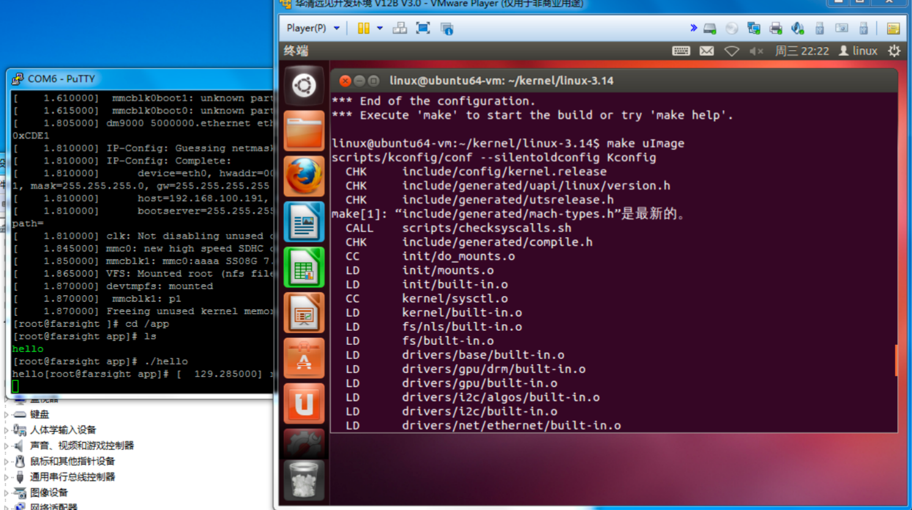

# 实验一

## 实验目的

将基础环境搭建成功

## 实验结果


## 实验总结

跟着教程成功地将基础环境搭建在物理机上

# 实验二

## 实验过程

遇到ping不通实验箱的问题，最终选择切换设备，成功ping通实验箱。


## 实验成果


## 实验总结

通过此次试验，成功地讲虚拟机与实验箱连接成功。中间遇到了较多问题，逐个排除后最终认为与物理机的系统版本有关。最终选择调换物理机进行试验。调换后整个实验十分顺利。

# 实验三

### 配置内核

`$ make menuconfig`

`System Type --->`

`(2) S3C UART to use for low-level messages`


### 编译内核

```bash
$ make uImage
$ cp u-boot-2013.01/tools/mkimage /usr/bin
```



### 生成设备树


### 以太网驱动移植

```bash
$ cd ~/kernel/ linux-3.14
$ vim arch/arm/boot/dts/exynos4412-fs4412.dts
```


## 实验现象


## 实验总结

+ 通过此实验学会了 **内核的配置和编译**。
+ 通过这个实验能够了解如何在内核中添加网卡驱动及网络功能的基本配置

# 实验四

# 实验五

